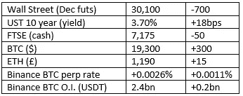

# 好奇的密码 2022 年 9 月 23 日评论

> 原文：<https://medium.com/coinmonks/curious-cryptos-commentary-23rd-september-2022-986821721c5f?source=collection_archive---------40----------------------->

**TL；博士**

摩根大通及其消息不灵通的首席执行官。

**市场抢购**

**市场包装**

这是美联储连续第三次加息 75 个基点。

为量化宽松(QE)和它更丑陋的兄弟，现代货币理论(MMT)辩护的人，请站出来，向我们解释为什么你要让富人更富，让穷人更穷。

你真可耻。

**偶然系列——需要更多的辩护者**

现在，被称为普京的精神病杀人犯已经用核毁灭威胁了世界，仅仅因为他奴役乌克兰 4500 万人民的个人野心已经失败，苏联的辩护者——他们主要居住在伊斯灵顿——现在还能承认他们的严重错误吗？

不，我想没有。

**好奇的 Cryptos 评论——杰米·戴蒙，摩根大通首席执行官**

作为 cryptos 的长期批评者，戴蒙本周在国会作证时加倍下注:

“我非常怀疑加密代币，你称之为货币，就像比特币一样。他们是去中心化的庞氏骗局。”

他抛出了通常的比喻，即密码只被洗钱者、毒贩、性贩子、恐怖分子等使用。就好像他完全不知道 100 美元和 500 欧元的存在。

然而，令人困惑的是，在今年早些时候写给股东的一封信中，戴蒙写道:

“去中心化金融和区块链是真实的新技术，可以以公共和私人的方式部署，无论是否得到许可。摩根大通处于这一创新的最前沿。”

…

众所周知，戴蒙几年前曾宣布，如果他的交易员中有人买入 BTC，他将立即解雇他们。尚不清楚他是否会兑现这一威胁。但显而易见的是，这种威胁显然超越了他作为首席执行官的权力的合理界限，只能被描述为欺凌行为。摩根大通的人力资源部对此有何看法？

此后，摩根大通为其机构客户群推出了一系列加密产品，包括一款定制产品，甚至还有他们自己的(集中式)加密硬币。

**好奇密码的评论——摩根大通的密码分析师**

和他们自己的老板一样思维混乱。

CCC 的长期读者记得，摩根大通的分析师团队提前将 2021 年 7 月 19 日描述为 BTC 的“死亡日”。当时，BTC 的交易价格约为 31，000 美元，当天标志着一路上涨至近 70，000 美元的开始。

快速回溯，下一项研究的目标价格为每 BTC 15 万美元，今年早些时候，该团队还假设:

“在未来几年，元宇宙可能会以某种方式渗透到每个行业，市场机会估计超过 1 万亿美元的年收入。”

该公司对元宇宙将释放的价值深信不疑，拥有自己的休息室，名为“缟玛瑙”。

…

元宇宙、Web3、去中心化金融(DeFi)以及加密革命创造的所有其他机会，必须以某种方式由戴蒙的“去中心化庞氏骗局”提供动力。

他给国会的证词具有误导性，而且信息不灵通。我真不知道会有什么结果。

**合规材料**

触发警报警告——如果任何读者在读完我的评论后，觉得自己“真的在颤抖”(正如一名达勒姆大学的学生所声称的，他无法在情绪上应对 Rod Liddle 提出的不同观点),那么我只能建议你不要读，或者不要颤抖。这完全取决于你。

Cryptos——我的任何评论都不应该被视为参与 cryptos 的建议。我可能在不知道的情况下胡说八道。任何加密投资都必须被视为极高的风险，并被视为在出售前价值为零。

股票——只是为了说明这不是股票咨询服务。CCC 团队不提供任何形式的财务建议。本注释中对资产价格的任何引用都是为了简单地给出注释的上下文，并为与密码相关的某些股票的表现增添色彩。

为避免疑问，本通讯不是煽动购买密码，购买股票，甚至出售家庭成员希望购买密码或股票。

请注意，所有版权归好奇密码有限公司所有。

礼貌地请求分享和复制，你的愿望就会实现。

这封信或我们网站的新订户总是最受欢迎的。

【www.curiouscryptos.com 号

【https://medium.com/@mark_curiouscryptos 

> 交易新手？尝试[加密交易机器人](/coinmonks/crypto-trading-bot-c2ffce8acb2a)或[复制交易](/coinmonks/top-10-crypto-copy-trading-platforms-for-beginners-d0c37c7d698c)