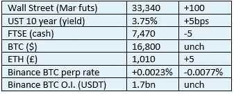

# 《好奇的密码》2022 年 12 月 24 日评论——FTX

> 原文：<https://medium.com/coinmonks/curious-cryptos-commentary-24th-december-2022-ftx-2f948ff9f7c2?source=collection_archive---------37----------------------->

**TL；博士**

FTX 最新恶作剧的快速更新。

**市场抢购**

**市场包装**

我开始认为，我的自动 BTC 价格饲料必须打破。

**好奇的 Cryptos 评论——FTX 惨败更新**

CCC 试图避免小报式的方法来处理所有加密的事情，但是围绕 FTX 事件已经有了一些重大的进展，保持对事情的掌控是很好的。

FTX 联合创始人、前首席执行官萨姆·班克曼-弗里德(Sam Bankman-Fried)已被引渡到美国，接受一系列指控罪行的审判，其中包括一项电信欺诈，这本身就意味着一项高额监禁处罚。

在保证支付 2.5 亿美元保释金、没收旅行证件并同意住在加州父母家中后，他被释放出狱。对于一个声称自己只剩下最后 10 万美元的人来说，这种债券似乎有点牵强。根据法庭文件，他父母的房子已经被抵押。有消息称这栋房子只值 400 万美元，所以和我们所知道的其他关于班克曼-弗里德的事情一样，没有一件是合理的。

阿拉米达研究公司的前首席执行官卡罗琳·埃里森，对该行业的知识和掌握完全为零(在你不同意我的观点之前，先看看这篇采访吧[https://twitter.com/i/status/1591137605613408256](https://twitter.com/i/status/1591137605613408256))已经与当局达成了辩诉交易。通过这样做，她避免了对班克曼-弗里德的所有指控，并将只面临一项刑事税收违规指控。与其冒着被判 100 年以上监禁且不得假释的风险，她可能根本不会进监狱。

她为达成这样的交易所做的证词是致命的:

“我了解到，FTX 高管对阿拉米达的 FTX.com 账户实施了特殊设置，允许阿拉米达以各种法定货币和加密货币保持负余额。”

“实际上，这种安排允许阿拉米达获得无限的信贷额度，而无需提交抵押品，无需为负余额支付利息，也不受追加保证金通知或 FTX.com 清算协议的约束。”

“如果阿拉米达的 FTX 账户在某种货币上有大量负结余，这意味着阿拉米达在借入 FTX 客户存入交易所的资金。”

她表示，她和班克曼-弗里德同意误导 FTX 的贷款人、投资者和储户。

王微是 FTX 和阿拉米达研究公司的联合创始人和前首席技术官，他发现自己的处境与埃里森相似。面对类似的长期监禁的可能性，他也与当局达成了辩诉交易。他已经证实，在班克曼-弗里德的指导下，IT 系统发生了变化，以允许阿拉米达获得 FTX 客户的资金，并在财务报告中掩盖这一情况。引用他的话说“我知道我做的是错的”。

在最后的转折中，该案件的法官已经回避，因为她的丈夫是 2021 年为 FTX 提供咨询的律师事务所的合伙人。

**合规材料**

触发警报警告。

如果任何读者在读完我的评论后觉得他们“真的在颤抖”(这是一名达勒姆大学的学生提出的说法，他无法在情感上——当然也无法在智力上——应对罗德·利德尔表达的不同观点)，那么我只能建议你不要读，或者不要颤抖。这取决于你。

Cryptos——我的任何评论都不应该被视为参与 cryptos 的建议。我可能在不知道的情况下胡说八道。任何加密投资都必须被视为极高的风险，并被视为在出售前价值为零。

股票——只是为了说明这不是股票咨询服务。CCC 团队不提供任何形式的财务建议。本注释中对资产价格的任何引用都是为了简单地给出注释的上下文，并为与密码相关的某些股票的表现增添色彩。

为避免疑问，本通讯不是煽动购买密码，购买股票，甚至出售家庭成员希望购买密码或股票。

请注意，所有版权归好奇密码有限公司所有。

礼貌地要求偶尔分享和复制，你的愿望就会实现。

这封信或我们网站的新订户总是最受欢迎的。

www.curiouscryptos.com

【medium.com/@mark_curiouscryptos 

> *加入 Coinmonks* [*电报频道*](https://t.me/coincodecap) *和* [*Youtube 频道*](https://www.youtube.com/c/coinmonks/videos) *了解加密交易和投资*

# 另外，阅读

*   [Bookmap 点评](https://coincodecap.com/bookmap-review-2021-best-trading-software) | [美国 5 大最佳加密交易所](https://coincodecap.com/crypto-exchange-usa)
*   [加密交易机器人](/coinmonks/crypto-trading-bot-c2ffce8acb2a) | [造币评论](https://coincodecap.com/coingate-review)
*   最佳加密[硬件钱包](/coinmonks/hardware-wallets-dfa1211730c6) | [Bitbns 评论](/coinmonks/bitbns-review-38256a07e161)
*   [新加坡十大最佳加密交易所](https://coincodecap.com/crypto-exchange-in-singapore) | [购买 AXS](https://coincodecap.com/buy-axs-token)
*   [红狗赌场评论](https://coincodecap.com/red-dog-casino-review) | [Swyftx 评论](https://coincodecap.com/swyftx-review)