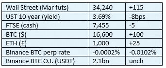
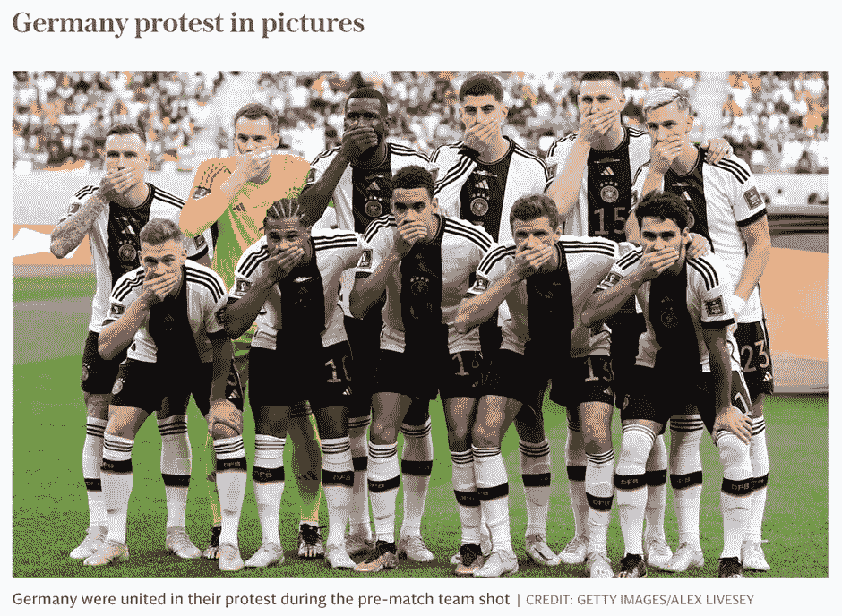

# 《好奇的密码》2022 年 11 月 24 日评论——密码标桩第三部分

> 原文：<https://medium.com/coinmonks/curious-cryptos-commentary-24th-november-2022-crypto-staking-part-3-ad3fc8087b2f?source=collection_archive---------27----------------------->

**TL；博士**

加密标桩第 3 部分——回顾 CCC 对标桩 stablecoins 的看法，其结论至今仍然非常中肯。

**市场抢购**

**市场包装**

美联储的公开评论称，利率上升的陡峭轨迹可能会放缓，这给风险市场带来了宽慰。如今，石油价格已经低于普京非法且残忍地吞并乌克兰大片地区之前的价格(他的名字很快就会出现在国际刑警组织的反人类罪名单上)，这种认为全球大宗商品价格可以通过央行设定国内利率来控制的荒谬观点可以暂时被忽略。

**偶发系列——2022 年世界杯**

紧随我支持阿根廷之后(见昨天和以前关于阿根廷币的评论),我现在发现我也支持德国。这个世界会变成什么样子？

让我们希望所有来自西方自由民主国家的球队都像德国人一样抗议。

**好奇密码的评论——密码赌注第三部分**

在 2021 年 11 月 1 日和 2 日，CCC 发表了一些关于在集中交易中下注(借出)稳定资本的想法。我认为它们值得完整地重复一遍。当然，这样做，我今天早上就不用写什么新东西了。休息一天总是好的。

**好奇密码评论 2021 年 11 月 1 日—借出稳定密码**

在昨天的一次讨论之后，我被要求写下一些关于租借 stablecoins 的想法。

有许多平台提供存款稳定的回报，以换取定期支付利息。利率可以高达 8%、10%甚至更高。与你当地银行或国家储蓄投资所提供的微不足道的回报相比，这些利率表面上看起来很有吸引力。

请注意，银行提供的低回报直接归因于英格兰银行设定的 0.1%的基本利率。这可能会在周四增加，但不会超过 0.25%，甚至可能更低。

…

我的观点是，政府通过中央银行这个媒介——尽管有相反的说法，但它并不独立于政府——在确定利率方面没有发言权。

这种情况将严重背离当前的全球规范，但会带来数不清的好处。或许改天再讨论。

…

关于借出 stablecoins 的第一个观察是，这实际上根本不是关于 cryptos 的。

它确实包含了用于执行交易的密码，但是密码不是这个想法的核心，也不是必需的。

你的钱有很多赚取利息的机会。有几个 P2P 借贷平台提供高利率。垃圾债券目前的收益率高达 6%或更高(欧洲的平均收益率约为 4%)。从理论上讲，你可以在一周内从站在吧台那边的家伙那里得到 100%的回报。

最后一点是关键点——你的贷款回报(无论以何种形式)应该反映你所承担的风险。

如果回报大于风险，那么相对于所有其他可能的投资，这项投资是值得考虑的。

如果回报不大于风险，那就根本不要考虑投资。

…

这就引出了如何评估风险的棘手问题。

做那件事没有正确的方法，但有许多错误的方法。

在你决定之前，你要在这个兔子洞里走多远完全取决于你自己。但我怀疑，你走得越远，你就越不相信稳定贷款的回报。

…

你需要评估的第一个风险是，你选择的稳定币是真的稳定币，还是仅仅是虚幻的。

2021 年 10 月 9 日，CCC 对最大的，我认为是第一个 stable coin——Tether(USDT)进行了短暂的观察。在不太理想的抵押品支持下(包括在本不应该存在相关性风险的地方引入相关性风险的加密抵押贷款)，USDT 维持盯住美元的汇率制度，只是因为人们相信它。

我没有深入调查过其他的 stablecoins，但是发现它们在这方面非常相似并不奇怪。

我知道一些读者对菲亚特没有什么信心，他们很正确地指出菲亚特只是烟幕和镜子。但是我更信任菲亚特而不是 stablecoins。无论如何，如果你不信任菲亚特，你也不能信任稳定的硬币。

…

一旦你跨过了那个坎(如果可以的话)，你就需要看看借贷平台本身了。

这就是事情变得棘手的地方。

尽职调查可能会非常困难。很多这样的平台仅仅是一个网站，仅此而已。所有的去中心化金融(DeFi)平台都是如此。但是这就是去中心化的好处——没有对手风险。有市场风险，有智能合同风险，有恶意行为者风险。但是没有中介。

当你有一个中介，如中央交易所，尽职调查是必需的。这意味着至少要详细回答这些问题:

I)平台是否为股份有限公司所有？

ii)如果是，在哪里？谁是审计员？上次审计的账目显示了什么？

iii)他们在哪里纳税？

㈣它们是否受到管制？

v)如果是，在哪里？哪个监管机构？监管机构有没有发布过负面通知？

vi)公司是否有信用评级？

vii)公司是否有未偿还的债券、贷款或透支？

八)公司还有哪些其他资产？

ix)其杠杆率是多少？

x)您如何联系公司？

xi)他们有电话号码吗？当你打那个号码的时候会发生什么？

xii)是否有保险？

十三)如果有，能看到政策吗？它包括什么，在哪里？

xiv)支付日期是什么时候？Mt. Gov 的债权人已经等了好几年了…

xv)他们的业绩记录如何？它们存在多久了？

如果你愿意，我可以继续说下去，但似乎没什么意义。

对我来说，你不可能得到这些最基本问题的详细答案，更不用说所有的了。

…

向 stablecoins 放贷是一项风险极高的业务。我的观点是，即使 50%的年回报率也不会引起我的注意。

但让我强调，这是我个人的评估，显然许多人不同意我的看法。

这可能是因为他们认为稳定的贷款类似于把钱存在一个受监管的、有保险的商业银行账户里。

嗯，不是的。

…

我需要强调的是，仅仅因为我认为回报不值得冒险，你就有义务得出自己的结论。

如果你把稳定的收益借给一个平台，你很可能最终获得 8%的年收益。总之，如果你能拿回你的钱，外加 8%的利息，就结果而言，这是一笔不错的交易。

【2021 年 11 月 2 日《好奇的密码》评论——跟进昨天 CCC 的 stablecoins 贷款

我通过 CCC 分销渠道之一收到了一份请求，这是对我在昨天的 CCC 中概述的关于借出 stablecoins 的初步意见的直接回应。

这个请求是专门针对我对 Nexo 的想法的，这个平台是一天前在 CCC 的一个不同的分销渠道中偶然提出来的。

带着我匆忙写下的清单(如昨天 CCC 中所引用的),我开始尝试回答我为自己设定的问题，如果我要走上借马厩的道路的话。

的确，我可以找到一些方法来回答一些问题。但是那占据了我昨天一天的大部分时间，一去不复返了(都是你的错 JP)。

我无法回答所有这些问题——无论如何，我会有更多的问题，因为我就是这样笨拙的——在任何合理的时间范围内，只要我不死。

…

我承认，在此之前，我从未详细研究过借出稳定债券所提供的潜在机会。

甚至在考虑这个想法之前，我就为自己设定了一个最低的年回报率 50%的门槛(仅仅是基于盲目的偏见)。

在昨天做了这项工作之后，为了造福 CCC 社区，我似乎错误地(在我的记忆中现在是两次)设定了 50%这个看似很高的比率。

我现在知道，除非年利率超过 100%,否则我不会考虑借出稳定债券的想法。

…

这是我个人对我的风险/回报比的评估。

其他人会得出不同的结论，对适合他们的风险/回报比率会有不同的评估。

**合规材料**

触发警惕警告——如果任何读者在读完我的评论后，觉得自己“真的在颤抖”(正如一名达勒姆学生所声称的，他无法在情绪上应对不同的观点)，那么我只能建议你不要读，或者不要颤抖。这取决于你。

Cryptos——我的任何评论都不应该被视为参与 cryptos 的建议。我可能在不知道的情况下胡说八道。任何加密投资都必须被视为极高的风险，并被视为在出售前价值为零。

股票——只是为了说明这不是股票咨询服务。CCC 团队不提供任何形式的财务建议。本注释中对资产价格的任何引用都是为了简单地给出注释的上下文，并为与密码相关的某些股票的表现增添色彩。

为避免疑问，本通讯不是煽动购买密码，购买股票，甚至出售家庭成员希望购买密码或股票。

请注意，所有版权归好奇密码有限公司所有。

礼貌地要求偶尔分享和复制，你的愿望就会实现。

这封信或我们网站的新订户总是最受欢迎的。

www.curiouscryptos.com

【medium.com/@mark_curiouscryptos 

> 交易新手？尝试[加密交易机器人](/coinmonks/crypto-trading-bot-c2ffce8acb2a)或[复制交易](/coinmonks/top-10-crypto-copy-trading-platforms-for-beginners-d0c37c7d698c)