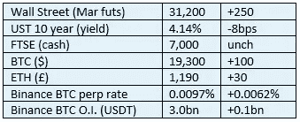

# 好奇的密码评论 2022 年 10 月 24 日

> 原文：<https://medium.com/coinmonks/curious-cryptos-commentary-24th-october-2022-72a7b492eb3d?source=collection_archive---------55----------------------->

**TL；博士**

法国对加密很友好！

**市场抢购**

**市场包装**

根据 CryptoQuant([https://CryptoQuant . com/quick take/6353 a6 ed 0d 35 e 01068 fc 7 bad-sufficily-old-coins-is-move-spend](https://cryptoquant.com/quicktake/6353a6ed0d35e01068fc7bad-Sufficiently-old-coins-are-moving-spent))的说法，最近一次在 2 年至 5 年前流通的旧硬币已经大规模转移到中央交易所。

很难将此解读为短期内的积极信号。

**好奇的 Cryptos 评论——法国**

受到近几个月来 CCC 对当局的批评的刺激，尽管被定罪的罪犯克里斯蒂娜·拉加德(欧洲央行行长)尽了最大努力来摧毁加密革命，但法国现在正在竭尽全力转移加密税收。

上周，crypto.com 宣布在法国投资 1.5 亿欧元，包括在法国建立一个地区中心。

中央加密货币交易所 Luno 和币安已经获得监管机构的批准，可以在法国开展业务。币安还宣布了一项 1 亿欧元的投资，并声明法国“在成为欧洲该行业的领导者方面具有得天独厚的优势”，这是一个大胆的主张，也更加令人惊讶。

那些亲身经历过法国官僚程序的人对这些事件的转变感到非常高兴。

…

但最新的消息是我们如何真正知道法国正在认真对待密码。

领先的投资银行 SocGen (Société Générale)是法国市值第三大的银行，该公司已获得监管机构批准，可以担任数字资产服务提供商。

这意味着它的客户——这一举措可能是针对机构空间，而不是零售，至少目前是这样——可以投资 cryptos，将 SocGen 用作加密资产的执行人和托管人。

我们已经有一段时间没有谈到监护权的问题了，但这并不意味着它的重要性在最近有所降低。

移交加密资产的存储和安全责任，以及在丢失或被盗情况下的相关保险，是全面采用加密的必要条件，但不是充分条件。

如果 SocGen 看到了客户对该产品的需求，那么欧洲所有其他银行也是如此。

**合规的东西**

触发警惕警告——如果任何读者在读完我的评论后，觉得自己“真的在颤抖”(正如一名达勒姆学生所声称的，他无法在情绪上应对不同的观点)，那么我只能建议你不要读，或者不要颤抖。这取决于你。

Cryptos——我的任何评论都不应该被视为参与 cryptos 的建议。我可能在不知道的情况下胡说八道。任何加密投资都必须被视为极高的风险，并被视为在出售前价值为零。

股票——只是为了说明这不是股票咨询服务。CCC 团队不提供任何形式的财务建议。本注释中对资产价格的任何引用都是为了简单地给出注释的上下文，并为与密码相关的某些股票的表现增添色彩。

为避免疑问，本通讯不是煽动购买密码，购买股票，甚至出售家庭成员希望购买密码或股票。

请注意，所有版权归好奇密码有限公司所有。

礼貌地要求偶尔分享和复制，你的愿望就会实现。

这封信或我们网站的新订户总是最受欢迎的。

[www.curiouscryptos.com](http://www.curiouscryptos.com)

medium.com/@mark_curiouscryptos

> 交易新手？试试[密码交易机器人](/coinmonks/crypto-trading-bot-c2ffce8acb2a)或[复制交易](/coinmonks/top-10-crypto-copy-trading-platforms-for-beginners-d0c37c7d698c)