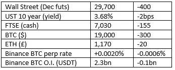

# 好奇的密码评论 2022 年 9 月 24 日

> 原文：<https://medium.com/coinmonks/curious-cryptos-commentary-24th-september-2022-360de8efb026?source=collection_archive---------16----------------------->

**TL；博士**

系绳清算的日子即将到来。

**市场抢购**

**市场包装**

XRP (Ripple)是加密领域的佼佼者，自 Ripple Labs 和 SEC 要求简易判决的消息传出以来，其股价上涨了约 50%。市场认为证交会错了。让我们希望市场是正确的。

**好奇 Cryptos 的评论——系绳(USDT)**

尽管是最早的，也是最大的，稳定的成员之一，USDT 在过去已经受到了 CCC 的一些当之无愧的批评。

这种批评的理由很简单。长期以来，USDT 背后的组织雇用了一家离岸会计公司来“审计”他们的资产和负债，尽管他们不断声称要透明，但对 USDT 背后的资产从来没有一个令人满意的解释。

我们所知道的是，一些抵押品——至少在过去——包括向加密货币实体发放的贷款，在最不受欢迎的地方引入了相关性风险。

稳定的密码已经成为密码领域的一个重要方面，可以是好的或坏的力量。

我们从 Terra 的惨败中看到，一个算法稳定圈的崩溃导致了几个连锁效应、市场混乱、破产，最终导致了像权这样的人入狱，他监督了 450 亿美元财富的毁灭。

鉴于算法稳定货币的内在局限性，特别重要的是，表面上由保证 1:1 盯住美元的资产支持的稳定货币确实拥有这些资产。

我们马上就会知道了。

…

纽约州南区的美国法官凯瑟琳·波尔克·费拉(Katherine Polk Failla)已下令泰瑟公司提供 USDT 背后资产的详细信息，以及显示交易的文件:

“原告清楚地解释了他们为什么需要这些信息:评估 USDT 对我们的支持

并允许一名法务会计师评估 USDT 储备。尽管法院理解[被告]的立场是原告的理论在“其他资产”和其他资金方面正在转变，但在诉讼的这个阶段，在双方没有妥协的情况下，法院认为原告的陈述是真实的，即这些信息对于评估其关于 USDT 支持的主张是必要的。"

对于一家声称一切都是为了透明的公司来说，这一切早就应该完成了。

…

申诉人不仅声称 USDT 没有现实世界的资产支持，而且泰瑟还犯有洗钱和经营未经许可的汇款业务等罪行。

所寻求的赔偿是相当激进的，不太可能达到 1.4 万亿美元。

Tether 反对这一命令，这进一步巩固了它作为一家不愿透露自己是否在退潮前裸泳的公司的声誉。

这种信息披露的命令只能是一件好事，尽管如果我们发现 USDT 是另一个建立在傲慢和叫喊之上的稳定的货币，它确实有可能造成严重的市场混乱。

**合规材料**

触发警报警告——如果任何读者在读完我的评论后，觉得自己“真的在颤抖”(正如一名达勒姆大学的学生所声称的，他无法在情绪上应对 Rod Liddle 提出的不同观点),那么我只能建议你不要读，或者不要颤抖。这完全取决于你。

Cryptos——我的任何评论都不应该被视为参与 cryptos 的建议。我可能在不知道的情况下胡说八道。任何加密投资都必须被视为极高的风险，并被视为在出售前价值为零。

股票——只是为了说明这不是股票咨询服务。CCC 团队不提供任何形式的财务建议。本注释中对资产价格的任何引用都是为了简单地给出注释的上下文，并为与密码相关的某些股票的表现增添色彩。

为避免疑问，本通讯不是煽动购买密码，购买股票，甚至出售家庭成员希望购买密码或股票。

请注意，所有版权归好奇密码有限公司所有。

礼貌地请求分享和复制，你的愿望就会实现。

这封信或我们网站的新订户总是最受欢迎的。

【www.curiouscryptos.com 号

 [## 马克·蒂姆西-中号

### 阅读马克·蒂姆西在媒体上的文章。每天，马克·蒂米斯和成千上万的其他声音都在阅读、写作和分享…

medium.com](/@mark_curiouscryptos) 

> 交易新手？试试[密码交易机器人](/coinmonks/crypto-trading-bot-c2ffce8acb2a)或[复制交易](/coinmonks/top-10-crypto-copy-trading-platforms-for-beginners-d0c37c7d698c)