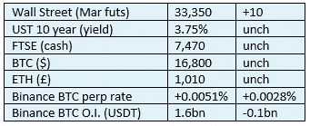

# 《好奇的密码》2022 年 12 月 25 日评论——包装和去中心化

> 原文：<https://medium.com/coinmonks/curious-cryptos-commentary-25th-december-2022-wrapping-and-decentralisation-360e999bfece?source=collection_archive---------35----------------------->

**TL；博士**

包装过程可以让我们对集中世界和分散世界之间的关系如何随着时间的推移而发展有所了解。

> 从顶级交易者那里复制交易机器人。免费试用。

**市场抢购**

**市场包装**

这是 BTC 价格连续五天没有变化，这肯定是前所未有的。

**好奇的 Cryptos 评论——包裹的硬币和去中心化辩论**

2019 年，随着 Bitgo、Kyber 和 Ren 联合创建的 wBTC(包装)的推出，包装硬币首次出现。

BTC 区块链和区块链联邦理工学院有不同的协议和功能。他们不能互相交谈。发送 BTC 到一个 ETH 地址，反之亦然，将要么失败，或将导致您的硬币丢失。

随着 DeFi(去中心化金融)的增长和赚取被动收入的机会主要局限于 ETH 而不是 BTC(尽管有一些例外)，这种不可互操作性的局限性变得显而易见。BTC 持有者被剥夺了这样的机会，ETH 网络被剥夺了 BTC 网络的流动性和规模。

这些限制使得 wBTC 的发明成为必要，这是一种代表 BTC 价值的硬币，可以在区块链联邦交易所交易。

事后看来，这是一个非常简单的概念，但其结构却非常优雅。

用户将存入 BTC，作为交换，将收到完全相同数量的 wBTC。在任何时间点，wBTC 都可以兑换(“烧掉”)完全相同数量的 BTC。假设 wBTC 池由 BTC 100%担保，套利机会确保 wBTC 的价值将与 BTC 相同，反映套利交易成本和时机的波动非常小。

…

wBTC 由抵押品的集中保管人创建。

这句话让密码最大化主义者怒不可遏，但他们本质上是敏感的。对一个极端主义者来说，纯洁胜过实用，但我更喜欢生活在现实世界中。具有讽刺意味的是，最大化主义者的最终目标——一个完全去中心化的世界——无法在不妥协的情况下实现，因为纯粹主义者的方法阻止了大规模采用，使 cryptos 成为一种利基技术。但实现最大化主义者目标所需的妥协嵌入并保证了集中和分散的世界共存，互补并增强彼此的优势。

在 wBTC 的情况下，受信任的组织(Bitgo 是其中之一)保管作为 wBTC 的交换而存放的 BTC。兑换时，一旦 wBTC 被退回并烧毁，Bitgo 必须批准兑换。

除了最近的一次事故之外，这个过程一直进行得很好。对于普通读者来说，这一故障与欺诈性的中央加密货币交易所 FTX 有关也就不足为奇了。

就在 FTX 申请破产的两天前，FTX 的一个人寄来了 3000 份 wBTC(当时价值约 5500 万美元)要求赎回。这些硬币被烧毁，但 Bitgo 拒绝释放 BTC，因为他们不知道 FTX 的那个人。

在这个阶段，不仅仅是密码至上主义者感到愤怒，我也是。铸造和燃烧过程是使用智能合约执行的。我理解为什么包装硬币的第一次迭代决定了最快采用的路径涉及集中保管，通过审计和保险来证明抵押率为 100%，但增加一层集中批准并不合适。

结果是，3000 枚弹道导弹被烧毁，3000 枚 BTC 没有归还。wBTC 现在超额抵押，FTX 债权人必须证明这些 BTC 的所有权。

…

XRP(Ripple)——目前处于美国证券交易委员会(SEC)监管地盘的中心——也拥有自己的包装硬币 wXRP，可用于区块链，而非本土硬币。

TokenSoft 为在区块链联邦理工学院([https://wrapped.com/](https://wrapped.com/))交易的包括 XRP 在内的几枚硬币提供包装服务。

同样，铸造和焚烧过程使用智能合同进行，并且同样有一个中央托管人 Hex Trust 来确保所有包装硬币的 100%抵押。据我所知，不存在我们在 wBTC 和 Bitgo 中看到的额外批准流程。

…

完全分散的包裹硬币的一个例子是 WETH(包裹的 ETH)

我们中的大多数人会对我们的原因感到惊讶。

尽管 ERC-20 标准(被成千上万的硬币使用)是建立在区块链联邦理工学院的基础上的，但是联邦理工学院与它是不兼容的。

将 ETH 兑换成 ERC-20 代币需要存放 ETH 并进行铸造。

为了与许多基于以太坊的 dApps(去中心化的应用)交互，需要存放 ETH 并生成 wet。

这一过程是完全去中心化的，只使用智能合同，完全没有集中的投入。WETH 只是 ETH 的 ERC-20 兼容版本。

**合规玩意儿**

触发警报警告。

如果任何读者在读完我的评论后觉得他们“真的在颤抖”(这是一名达勒姆大学的学生提出的说法，他无法在情感上——当然也无法在智力上——应对罗德·利德尔表达的不同观点)，那么我只能建议你不要读，或者不要颤抖。这取决于你。

Cryptos——我的任何评论都不应该被视为参与 cryptos 的建议。我可能在不知道的情况下胡说八道。任何加密投资都必须被视为极高的风险，并被视为在出售前价值为零。

股票——只是为了说明这不是股票咨询服务。CCC 团队不提供任何形式的财务建议。本注释中对资产价格的任何引用都是为了简单地给出注释的上下文，并为与密码相关的某些股票的表现增添色彩。

为避免疑问，本通讯不是煽动购买密码，购买股票，甚至出售家庭成员希望购买密码或股票。

请注意，所有版权归好奇密码有限公司所有。

礼貌地要求偶尔分享和复制，你的愿望就会实现。

这封信或我们网站的新订户总是最受欢迎的。

[www.curiouscryptos.com](http://www.curiouscryptos.com)

medium.com/@mark_curiouscryptos

> *加入 Coinmonks* [*电报频道*](https://t.me/coincodecap) *和* [*Youtube 频道*](https://www.youtube.com/c/coinmonks/videos) *了解加密交易和投资*

# 另外，阅读

*   [有哪些交易信号？](https://coincodecap.com/trading-signal) | [Bitstamp vs 比特币基地](https://coincodecap.com/bitstamp-coinbase) | [买索拉纳](https://coincodecap.com/buy-solana)
*   [密码交易机器人](/coinmonks/crypto-trading-bot-c2ffce8acb2a) | [维护审查](https://coincodecap.com/uphold-review)
*   [如何给 MetaMask 钱包添加 Arbitrum？](https://coincodecap.com/how-to-add-arbitrum-to-metamask-wallet)
*   [KuCoin vs 北海巨妖 vs BitYard](https://coincodecap.com/kucoin-vs-kraken-vs-bityard)
*   [最适合加密交易的 VPN](https://coincodecap.com/best-vpns-for-crypto-trading)
*   [ProfitFarmers 回顾](https://coincodecap.com/profitfarmers-review) | [如何使用 Cornix 交易机器人](https://coincodecap.com/cornix-trading-bot)