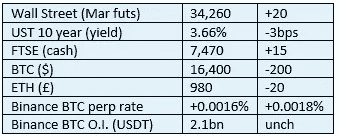

# 《好奇的密码》2022 年 11 月 25 日评论—比利时

> 原文：<https://medium.com/coinmonks/curious-cryptos-commentary-25th-november-2022-belgium-3752c547a6ec?source=collection_archive---------39----------------------->

**TL；博士**

比利时在为加密爱好者的战斗中领先，而 MetaMask 却让自己失望了。

**市场抢购**

**市场包装**

感恩节期间，市场总是有点紧张，在一系列风险市场中，流动性处于最低水平。

**好奇的 Cryptos 评论—比利时**

比利时金融服务和市场管理局(FSMA)发布了一份新报告，其目标是“……解释加密资产可能属于招股说明书规则和/或 MiFID 商业行为规则范围的最常见情况。”如果你这周已经看够了足球，你可以在这里阅读全文:

[https://www . fsma . be/sites/default/files/media/files/2022-11/fsma _ 2022 _ 25 _ en . pdf](https://www.fsma.be/sites/default/files/media/files/2022-11/fsma_2022_25_en.pdf)

尽管这份报告没有确定比利时或更远地区的密码相关规则和法规，但它是实施 MiCA(密码资产市场)的潜在有用起点，MiCA 是欧盟旗舰立法，预计将于 2024 年实施，距离欧洲议会、欧盟委员会和欧洲理事会同意其内容仅 18 个月。我真的希望公务员有努力工作和期限的概念，但我知道我的愿望是徒劳的。

FSMA 提出的一个关键点是:

“如果没有发行人，如通过计算机代码创建的工具，并且这不是在发行人和投资者之间的协议执行过程中完成的(例如，比特币或以太网)，则原则上招股说明书条例、招股说明书法和 MiFID 行为规则不适用。”

这是什么意思？

让我来解释一下《公务员为你说话》,这项任务只比翻译《加利福尼亚人》稍微容易一点，因为《加利福尼亚人》充斥着“活在自我”之类的短语，以及其他与生活或现实毫无关系的废话。

这意味着 BTC、瑞士联邦理工学院和大量其他密码都不是证券。

好样的，比利时。

我希望证交会(SEC)主席加里詹斯勒(Gary Gensler)的办公桌上有一份打开的副本，因为他正在考虑输掉对 XRP (Ripple)的诉讼。

**好奇密码解说—数据收集**

似乎即使是去中心化世界的支持者也无法摆脱中心化世界的坏习惯。

ConsenSys([https://consensys.net/](https://consensys.net/))提供了一套区块链产品，“……使得在以太坊上构建应用程序和参与 DeFi、NFTs、DAOs 和元宇宙变得容易”。

他们的产品包括 Infura 和 MetaMask，Infura 是一种基于 API 的工具，允许与以太网进行交互，meta mask 是世界上使用最广泛的加密钱包之一，建立在 in fura 的基础上。

MetaMask 是一个令人惊叹的产品，尽管它确实需要一点技术知识来为以太坊以外的区块链进行设置，并且它确实需要一点经验来自信地处理 dApps(去中心化应用程序)。

ConsenSys 宣布，Infura 现在将收集使用 MetaMask 时在以太坊网络上进行的所有交易的 IP 地址和公钥。

这是疯狂的，违背了整个去中心化的哲学。

也毫无意义。我一刻也不敢相信还有人在没有 VPN 和反跟踪软件的情况下使用互联网。所以，IP 地址信息是没用的，所有使用 ETH 的交易都在区块链上公开记录。

但这种变化的动机只是一个小小的例子，说明世界越来越多地尽可能采用去中心化的模式，这对我们的隐私有多么重要。

**合规材料**

触发警惕警告——如果任何读者在读完我的评论后，觉得自己“真的在颤抖”(正如一名达勒姆学生所声称的，他无法在情绪上应对不同的观点)，那么我只能建议你不要读，或者不要颤抖。这取决于你。

Cryptos——我的任何评论都不应该被视为参与 cryptos 的建议。我可能在不知道的情况下胡说八道。任何加密投资都必须被视为极高的风险，并被视为在出售前价值为零。

股票——只是为了说明这不是股票咨询服务。CCC 团队不提供任何形式的财务建议。本注释中对资产价格的任何引用都是为了简单地给出注释的上下文，并为与密码相关的某些股票的表现增添色彩。

为避免疑问，本通讯不是煽动购买密码，购买股票，甚至出售家庭成员希望购买密码或股票。

请注意，所有版权归好奇密码有限公司所有。

礼貌地要求偶尔分享和复制，你的愿望就会实现。

这封信或我们网站的新订户总是最受欢迎的。

www.curiouscryptos.com

【medium.com/@mark_curiouscryptos 

> 交易新手？尝试[加密交易机器人](/coinmonks/crypto-trading-bot-c2ffce8acb2a)或[复制交易](/coinmonks/top-10-crypto-copy-trading-platforms-for-beginners-d0c37c7d698c)