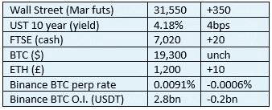

# 好奇的密码 2022 年 10 月 25 日评论

> 原文：<https://medium.com/coinmonks/curious-cryptos-commentary-25th-october-2022-a9d2e955185e?source=collection_archive---------53----------------------->

**TL；博士**

来自以色列的好消息，以及关于人工智能交易机器人的一个发人深省的教训。

**市场抢购**

**市场包装**

过去两周，股市出现了不错的反弹，上涨了近 10%。密码没有随之而来，但股票和密码之间相关性的降低是健康的。

**好奇的 Cryptos 评论——以色列**

特拉维夫证券交易所(TASE)已经宣布进入加密领域。

TASE 刚刚公布了其 2023-2027 年战略计划，该计划有四个关键目标，其中之一是:

"使用区块链(DLT)创建一个数字资产平台，并涉足加密领域."

公告更详细地解释了这一目标在实践中的表现:

“TASE 将推动创新技术的实施，包括 DLT、各类数字资产的令牌化和智能合同。TASE 打算研究多个潜在的行动计划，包括将现有基础设施转换为创新技术，将创新技术部署到专门的平台，为数字资产提供一篮子服务和产品等。”

TASE 首席执行官 Ittai Ben-Zeev 对这一发展发表了个人见解:

「未来五年是 TASE 在全球资本市场科技革命中扮演积极角色的重要机会。」

当谈到密码时，CCC 总是赞成使用“革命”这个词。

…

以色列也有其他的发展。

今年早些时候，该国最大的银行 Leumi 银行开始为机构客户提供 BTC 和瑞士联邦理工学院(ETH)的交易和托管服务，就在最近，一家集中式加密货币交易所——黄金交易所——获得了监管机构颁发的首张资本市场牌照。

…

每次我们看到这样的公告，我们都知道它们是由日益增长的客户需求驱动的。

每次我们看到这样的公告，我们都知道机构客户的关键需求——定价的透明度、执行的便利性，以及至关重要的托管服务——正日益得到满足。

需求产生机会产生需求。这就是良性循环的样子。

**好奇密码解说——人工智能交易机器人**

现在有很多人工智能交易机器人。毫无疑问，有些是真的，有些是彻头彻尾的骗局，但我悄悄地相信，他们 100%都没有实现自己的主张。

我内心的怀疑者认为，如果有人发明了一个人工智能交易机器人，能够提供有保证的超额回报，那么就没有动力与他人分享这种交易功能。那个人只会坐以待毙，尽可能多地利用他们的资产，然后变得非常富有，而没有人知道。

如果这是真的，那么所有向公众宣传的人工智能交易机器人从长远来看都只是为出售该服务的人赚钱。

…

我一直对交易机器人的操作原则感到有点不安——你允许第三方代码访问你的中央加密货币交易账户，以代表你进行交易。

现在我知道恶心是合理的。

3Commas 人工智能交易机器人的四名用户在遭受网络钓鱼攻击后，损失了高达 600 万美元的密码。

这种攻击采取了伪装成 3Commas 自己网站的虚假网站的形式。攻击者通过这些虚假网站获取 API 密钥，并清空相关的 exchange 帐户。

这次攻击发生在 3Commas 的交易环境之外，但我必须问一个简单的问题。

这四个用户平均每人损失 150 万美元。谁会天真到在一个集中账户中保存这么多密码，然后让第三方软件访问它？

**合规材料**

触发警惕警告——如果任何读者在读完我的评论后，觉得自己“真的在颤抖”(正如一名达勒姆学生所声称的，他无法在情绪上应对不同的观点)，那么我只能建议你不要读，或者不要颤抖。这取决于你。

Cryptos——我的任何评论都不应该被视为参与 cryptos 的建议。我可能在不知道的情况下胡说八道。任何加密投资都必须被视为极高的风险，并被视为在出售前价值为零。

股票——只是为了说明这不是股票咨询服务。CCC 团队不提供任何形式的财务建议。本注释中对资产价格的任何引用都是为了简单地给出注释的上下文，并为与密码相关的某些股票的表现增添色彩。

为避免疑问，本通讯不是煽动购买密码，购买股票，甚至出售家庭成员希望购买密码或股票。

请注意，所有版权归好奇密码有限公司所有。

礼貌地要求偶尔分享和复制，你的愿望就会实现。

这封信或我们网站的新订户总是最受欢迎的。

【www.curiouscryptos.com 号

【medium.com/@mark_curiouscryptos 

> 交易新手？尝试[加密交易机器人](/coinmonks/crypto-trading-bot-c2ffce8acb2a)或[复制交易](/coinmonks/top-10-crypto-copy-trading-platforms-for-beginners-d0c37c7d698c)