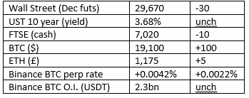
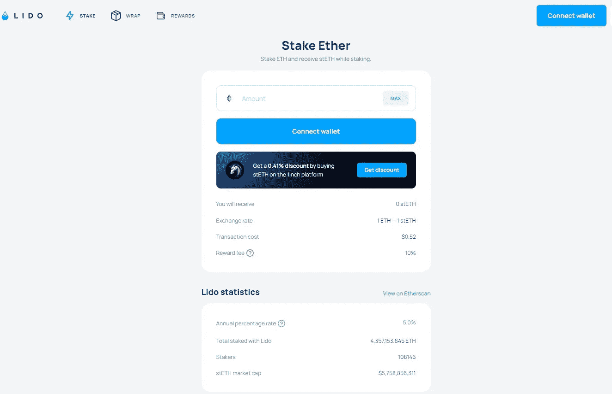

# 好奇的密码 2022 年 9 月 25 日评论

> 原文：<https://medium.com/coinmonks/curious-cryptos-commentary-25th-september-2022-a796195445ee?source=collection_archive---------31----------------------->

**TL；博士**

是时候评估流动性赌注的机会了。

**市场抢购**

**市场包装**

只是为了让你们放心，CCC 仍然保持强烈的非政治性。

但无论如何，从金融角度来看，我认为市场对英国税法(*)简化以及随之而来的供应方限制放松的明显群体思维反应，是一个巨大的机会。

IG 目前英镑兑美元汇率为 1.084。让我们在接下来的几个月里继续关注它。

**好奇密码的评论 ETH 的液体赌注**

既然 ETH 已经从工作证明(PoW)过渡到利益证明(PoS ),那么你首先应该考虑的是通过持有 ETH 获得被动收入的机会。

公平地说，这些机会在合并之前就已经存在，但现在是重新评估各种选择的时候了。

作为背景，PoS 硬币的所有者可以“下注”这些硬币来帮助保护网络，并增加该网络的去中心化。作为赌注的奖励，每个区块的交易费按照赌注者持有股份的比例奖励给他们。这类似于矿工在 PoW 共识机制中收取大宗费用。

但是有一个关键的区别。

例如，你可以开采 BTC，但永远不会拥有 BTC，除了从获得大宗奖励到将其出售给菲亚特之间的 10 分钟左右。

一个人可以拥有 BTC，但永远不会成为 BTC 的矿工。

一个人可以拥有自己的 ETH，但永远不要把它作为赌注。

但是你不能不拥有它就去赌。

…

假设你是一袋 ETH 的骄傲拥有者，你有几个赌注选择，我们将会以不同的细节来看。

第一步，也是最复杂的一步，是创建自己的定位节点。这需要最少 32 ETH(约 40k 美元)，这对于大多数人来说可能是一个不可逾越的障碍。但增加的技术复杂性将击败大多数非技术人员，并且存在相当大的被称为“削减”的负面风险，我们不需要在这里进行讨论。我们将假设这种选择在理论上是可能的，但实际上并非如此。

第二种选择是通过比特币基地或币安这样的集中交易所进行投资。这无疑是技术上最简单的途径，并且适合那些愿意在集中交易所持有密码的 ETH 持有者。

比特币基地和币安都以类似的方式工作，尽管币安给出了书面保证，赌注者不会支付验证机的运行费用，也不会遭受任何严厉的处罚。这显然是一种营销策略，但如果这对你的利润很重要的话，它会增加你在币安的赌注回报。

对于这两个交易所来说，在它们各自的网站上都有很容易识别的下注 ETH 的途径，并且在它们的帮助页面上可以很容易地找到进一步的细节。如果您确实有困难，或者只是需要帮助，整个 CCC 团队都可以帮助您完成这个过程。

…

这两种堆叠方法的最大问题是，您的堆叠 ETH 现在被锁定，并且在上海升级之前无法移除，上海升级将允许拆堆，一旦实施了分片。这计划在 2023 年年中实现，但很可能会推迟。我深信所有的 CCC 爱好者都是 ETH 的长期持有者，但我确实明白，如果你愿意，在一段不确定的时间内不能出售你的 ETH 是一种令人不快的事情。

顺便提一下，这种情况的负面影响在 Terra 事件中暴露无遗。如果我没记错的话，LUNA original(现名为 LUNC，Luna Classic)的赌注者两周内无法提取资金，这让他们在面对硬币价格暴跌时无能为力。

其他一些标桩模型以类似的方式工作。

宇宙网络 CCC 在其中有相当规模的投资——有 21 天的平仓期，这是 Terra 惨败后的限制，将导致我比最初预想的更早退出这些投资。

…

当然，所有这些问题都可以通过去中心化金融(DeFi)轻松解决，这再次证明了 DeFi 注定是人类最具影响力的发明之一。解决非流动性赌注难题仅仅是个开始。

有几个不同的产品，但我们会看看丽都金融，他们现在显然拥有 30%的股权。尽管 Lido 本身就是一个 DAO(去中心化的自治组织),但这一统计数据无疑引发了一些关于去中心化的问题。

这个统计数据也让我们对 Lido Finance 在代码漏洞的概率和混乱的可能性方面有了一些信心——在与 DeFi 交互时，这两种风险都不应该被低估。

不管怎样，给你:

[https://lido.fi/#networks](https://lido.fi/#networks)

点击 Stake Ether，您将进入 DeFi 用户非常熟悉的屏幕:

如果那不是你，你被 DeFi 迷惑了，不要绝望。在我写这篇文章的时候，CCC towers 的培训团队正在为 DeFi interaction 开发课程模块。专门针对丽都的那款很快就可以上市了。

连接你的钱包(可能是 MetaMask，希望使用分类账 Nano X 保护)，押上你的 ETH，批准交易，以及汽油费，然后你就可以走了。

你的 ETH 已经被钉死了。

…

但是等等，什么？上海升级前怎么拿回来？

在你的钱包里，你现在拥有 1:1 的 stETH (staked ETH)，但没有 ETH。

这一比率与上海邮政的比率为 1:1，它每天都在增加，年利率为 5%，但最重要的是它是流动的。

我的意思是，你可以在 DeFi 流动性池中使用 stETH 来进一步提高你的被动收入。

你可以在分散交易所(DEX)或集中交易所(CEX)用 stETH 交换其他 cryptos 或 fiat。

可以用来买 NFT。

你可以像使用 ETH 一样使用它，但如果你只是一个 ETH 持有者，你现在赚取的是一小笔被动收入，如果你愿意的话，还可以获得完全的退出流动性。

…

(*) HMRC 的雇员比 NHS 的全科医生还多。各方面都错了。

**合规材料**

触发警报警告——如果任何读者在读完我的评论后，觉得自己“真的在颤抖”(正如一名达勒姆大学的学生所声称的，他无法在情绪上应对 Rod Liddle 提出的不同观点),那么我只能建议你不要读，或者不要颤抖。这完全取决于你。

Cryptos——我的任何评论都不应该被视为参与 cryptos 的建议。我可能在不知道的情况下胡说八道。任何加密投资都必须被视为极高的风险，并被视为在出售前价值为零。

股票——只是为了说明这不是股票咨询服务。CCC 团队不提供任何形式的财务建议。本注释中对资产价格的任何引用都是为了简单地给出注释的上下文，并为与密码相关的某些股票的表现增添色彩。

为避免疑问，本通讯不是煽动购买密码，购买股票，甚至出售家庭成员希望购买密码或股票。

请注意，所有版权归好奇密码有限公司所有。

礼貌地请求分享和复制，你的愿望就会实现。

这封信或我们网站的新订户总是最受欢迎的。

【www.curiouscryptos.com 号

 [## 马克·蒂姆西-中号

### 阅读马克·蒂姆西在媒体上的文章。每天，马克·蒂米斯和成千上万的其他声音都在阅读、写作和分享…

medium.com](/@mark_curiouscryptos) 

> 交易新手？试试[密码交易机器人](/coinmonks/crypto-trading-bot-c2ffce8acb2a)或[复制交易](/coinmonks/top-10-crypto-copy-trading-platforms-for-beginners-d0c37c7d698c)