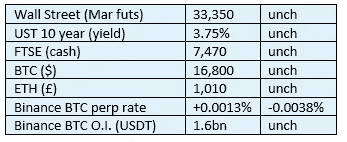
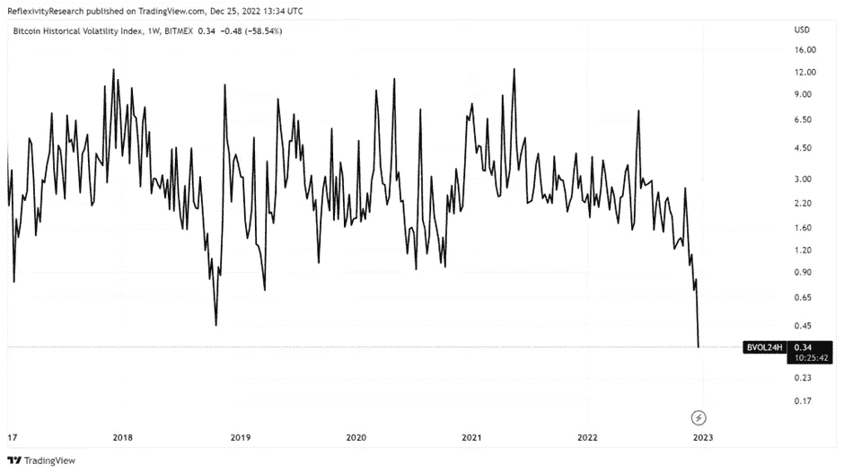
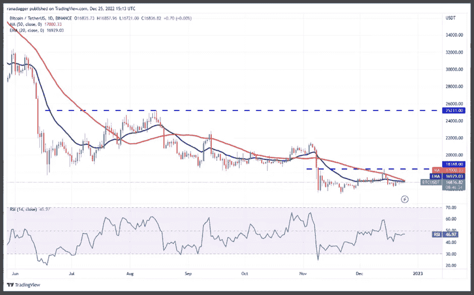
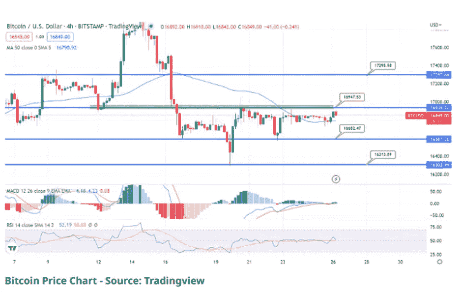
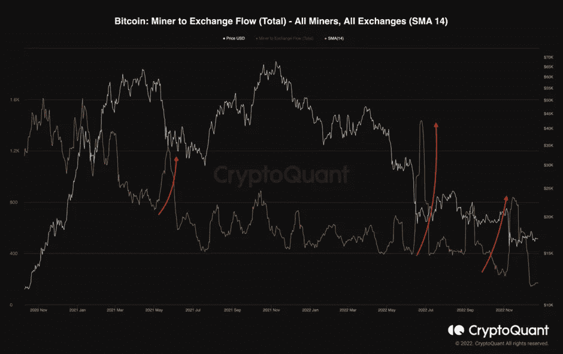
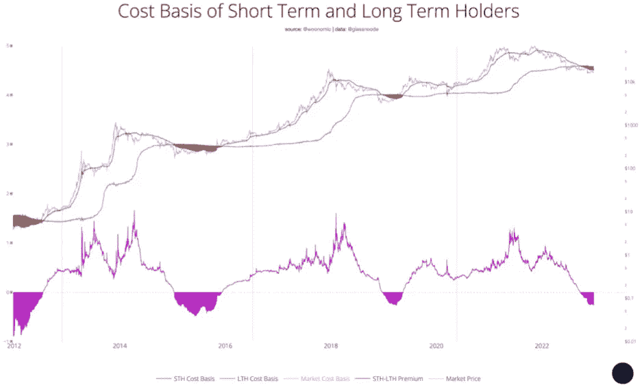

# 《好奇的密码》2022 年 12 月 26 日评论—价格分析

> 原文：<https://medium.com/coinmonks/curious-cryptos-commentary-26th-december-2022-price-analysis-743fa0c1db3b?source=collection_archive---------41----------------------->

**TL；博士**

简单看一下一些指标，这些指标可能会让你对 BTC 市场的健康与否有所了解。

**市场抢购**

**市场包装**

这已经是连续六天了，BTC 一直保持在 16，800 美元(四舍五入到最接近的 100 美元)。这是什么意思？读读《乡亲们》…

**好奇的 Cryptos 评论— BTC 价格走势分析**

以防我们还不知道，下面是我们目前经历的 BTC 价格缺乏波动性的图表证明:

至少目前，Crypto 的支持者对这种情况感到满意。价格稳定为未来价格的进一步改善奠定了坚实的基础，因为这告诉我们，尽管人们担心 FTX 的惨败会进一步蔓延，但越来越多的人相信，我们最终可能能够从 2022 年的杠杆调整中走出来。

> 从顶级交易者那里复制交易机器人。免费[试用](https://coincodecap.com/go/pionex-coinmonks)。

尽管缺乏价格行动，这些蛇油的供应商——又名技术分析师，又名技术人员——仍然声称他们提供未来价格走势的洞察力。正如普通读者所知，技术人员胡言乱语，但意识到这些胡言乱语并不是坏事。所以，让我们看看一些曲线和东西。

该图显示了 50 日均线和 20 日均线。

移动平均线是一个简单的概念——它是特定时期的平均价格，在本例中是 50 天。技术人员从来不会解释为什么 50 天比 36 天 16 小时 4 分钟更有意义。他们希望我们信任它。

指数移动平均线给最近的价格点比旧的价格点更大的权重，如果 20 天均线和 50 天均线一样，如上图所示，这对技术人员来说有特殊的价值，原因还不清楚。

无论如何，这位技术人员(为了分享他或她的尴尬，他或她的名字将保持匿名)得出结论，我们“可能很快就会看到区间扩大”，但“最好是等到这对搭档做出决定性的举动，然后再开始方向性押注”。这两条评论可能是我在金融市场工作 25 年后遇到的最没用的见解。

第二个评论隐含的意思是，技术分析只是向后看，但是你永远不会让一个技术人员承认他们信仰的核心缺陷。

这里还有一个:

这些是 4 小时交易范围的烛台。4 小时对技术人员来说又有特殊意义，同样没有明确的理由。我们只是信任它。

这个技术人员的结论？“尽管 RSI 和 MACD 都处于积极购买区，但比特币仍然受到 50 天移动平均线的拖累”，这是在交易 25 年后最无用的洞察力更早进入的强大竞争。

…

我还有几个例子，但我想你明白我的意思了。技术人员的玩笑开够了，让我们看看一些真正有价值的真实数据。

散列率是衡量全球分配给比特币网络的计算能力的指标。最近一段时间，hash rate 出现了向美国的强劲迁移，其中大部分是在德克萨斯州，利用了该州的可再生能源计划，至少我是这么得到可靠消息的。如果我错了，请纠正我。

最近几天影响美国大片地区的风暴将全球哈希速率从 230 EH/s 降低到 155 EH/s。EH 代表 exahashes，其中一个相当于一个万亿分之一哈希，但零的准确数量不需要我们关心。重要的是，支持 BTC 的三分之一的计算能力在短时间内被关闭，而 BTC 网络继续以任何形式不受影响。

这显示了非凡的适应力，这在人类的任何其他技术努力中都是看不到的。

…

另一个与采矿相关的统计数据是:

这在 14 日均线上显示，从矿商流向交易所的 BTC 处于多年低点。

我同意不应赋予 14 天比任何其他时期更大的意义，但这里重要的是趋势。毫不奇怪，矿商出售 BTC 的程度(矿商将 BTC 转移到交易所的唯一原因是出售)与 BTC 的价格变动之间存在明显的相关性。简单经济学 1.0，一个我们已经看到的概念，对于全球各地的央行行长和政府来说过于复杂，难以理解，因为他们用无能的政策决策策划了大规模的通胀飙升。

…

对于我们今天的最后一张真实世界数据的图表，我们有这样一个小妙处:

我们在这里看到的是短期持有人的成本基础，长期持有人的成本基础，它们之间的差异(底部的紫色线)，以及 BTC 在对数尺度上的价格。

为了解释这个图表，我们需要做一些假设。

第一个对我来说似乎相对直观——很大一部分长期持有人是 BTC 的支持者，他们对这项变革性技术抱有极大的信心。他们通常是所谓的“钻石手”，不愿意卖出(尤其是在熊市期间)，愿意加仓(尤其是在熊市期间)。我把自己算在那群人里，当然。

短期持有者将由几个群体组成。一些短期硬币是钻石手最近购买的，将有可能成为长期硬币。一些是包装后用于投资目的的硬币(详见昨天的 CCC)，但人们怀疑大多数是投机性质的，被称为“弱手”。

弱手总会卖成强势，但也经常卖成弱势。很明显，2021 年下半年，那些仅仅对主流媒体关于 BTC 的新闻做出反应，而对底层技术没有任何真正理解或欣赏的人进行了许多完全投机性的购买。

当他们有机会时，这些人可能会以盈亏平衡的价格出售，这确实表明未来会有所放缓。

但是这个图表可能会讲述一个不同的故事。

此图潜在显示的是弱牌和方块牌之间的平衡已经实质上向有利于后者的方向转移。这是一个最有可能对 2023 年的价格走势产生积极影响的环境。

**合规材料**

触发警报警告。

如果任何读者在读完我的评论后觉得他们“真的在颤抖”(这是一名达勒姆大学的学生提出的说法，他无法在情感上——当然也无法在智力上——应对罗德·利德尔表达的不同观点)，那么我只能建议你不要读，或者不要颤抖。这取决于你。

Cryptos——我的任何评论都不应该被视为参与 cryptos 的建议。我可能在不知道的情况下胡说八道。任何加密投资都必须被视为极高的风险，并被视为在出售前价值为零。

股票——只是为了说明这不是股票咨询服务。CCC 团队不提供任何形式的财务建议。本注释中对资产价格的任何引用都是为了简单地给出注释的上下文，并为与密码相关的某些股票的表现增添色彩。

为避免疑问，本通讯不是煽动购买密码，购买股票，甚至出售家庭成员希望购买密码或股票。

请注意，所有版权归好奇密码有限公司所有。

礼貌地要求偶尔分享和复制，你的愿望就会实现。

这封信或我们网站的新订户总是最受欢迎的。

【www.curiouscryptos.com 号

【medium.com/@mark_curiouscryptos 

> 加入 Coinmonks [电报频道](https://t.me/coincodecap)和 [Youtube 频道](https://www.youtube.com/c/coinmonks/videos)了解加密交易和投资

# 另外，阅读

*   [加拿大最佳加密交易机器人](https://coincodecap.com/5-best-crypto-trading-bots-in-canada) | [库币评论](https://coincodecap.com/kucoin-review)
*   [火币的加密交易信号](https://coincodecap.com/huobi-crypto-trading-signals) | [HitBTC 审核](/coinmonks/hitbtc-review-c5143c5d53c2)
*   [TraderWagon 回顾](https://coincodecap.com/traderwagon-review) | [北海巨妖 vs 双子星 vs BitYard](https://coincodecap.com/kraken-vs-gemini-vs-bityard)
*   [如何在 FTX 交易所交易期货](https://coincodecap.com/ftx-futures-trading)