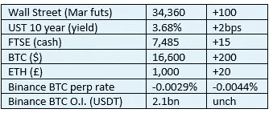

# 《好奇的密码》2022 年 11 月 26 日评论— ETH 标桩

> 原文：<https://medium.com/coinmonks/curious-cryptos-commentary-26th-november-2022-eth-staking-85f100990aba?source=collection_archive---------22----------------------->

**TL；博士**

通过查看 ETH 的一些选项，了解下注的必要性。

**市场抢购**

**市场包装**

下一个严重的金融问题已经开始酝酿了。我知道这是一个晦涩难懂的话题，但随着 QE(量化宽松)逐步结束(值得注意的是，欧洲央行尚未这么做)，QT(量化紧缩)取而代之，政府将付出什么样的代价。

世界各地的中央银行一直在向它们的所有者(也就是政府)扔现金，支付他们用凭空变出来的钱购买的债券的利息。QT 包括以比购买时低得多的价格将这些债券卖回市场。政府(而 CBs 只是政府的一个部门——它们从来没有，也永远不会独立，尽管有人声称它们是独立的)是高买低卖的高手。

我们都被英国央行的资产负债表缠住了，情况不会很好。

**好奇密码解说——密码锁定第四部分——锁定 ETH**

现在我们已经看了两个不同的集中赌注的例子——这两个例子都不吸引我，因为风险远远大于回报——是时候进入有趣的东西了。

有太多分散的赌注选项，其中许多通常被称为产量农业。但是，我们将非常简单地开始，讨论过程和机制的赌注。

…

ETH 最近从 PoW(工作证明)共识机制过渡到 PoS(利益证明)共识机制，这是迈向 ETH 2.0 路线图的一步。在许多方面，参与 PoS 才是加密赌注的真正定义。

一如既往，维基百科是一个很好的起点:

“利益证明(PoS)协议是一类针对[区块链](https://en.wikipedia.org/wiki/Blockchain)的[共识机制](https://en.wikipedia.org/wiki/Consensus_(computer_science))，它通过按持有相关加密货币的数量比例选择验证者来工作。这样做是为了避免[工作验证](https://en.wikipedia.org/wiki/Proof_of_work)方案的计算成本。”

验证者对他们持有的区块链本地货币下赌注，在这个例子中是 ETH。每个验证机被选中验证下一个区块的概率与该验证机下注的硬币数量成正比。

作为验证下一个块的回报，验证器获得该块中包含的费用。

一些评论家把这比作把菲亚特存入你的银行账户并从中赚取利息。

这些评论家把情况过于简单化了，要么是因为他们懒得去做适当的研究，要么是因为他们不理解他们所研究的材料。懒惰和缺乏智力都不是特别好的长相。

…

将自己设置为一个 ETH 验证器是可行的，但是很困难。首先，最低赌注要求是 32 ETH，所以今天大约是 30k。我怀疑这对于许多人来说是一个遥不可及的障碍。

还有一些技术问题，需要专门的 IT 资源、持续监控、软件更新等等。未能遵守一些最低服务准则可能会导致你的赌注硬币理发。上文提到的评论员将此与 2013 年塞浦路斯政府盗窃国内银行账户中的现金相提并论，但后者只是犯罪，而前者是双方自愿达成的协议的一部分。

但还有另一种方式参与，那就是加入赌注池。

实际上，你把标桩过程外包给了一个专门提供这种服务的机构。该组织将从创建积木中获得回报，从这些收益中收取一定的费用(通常为 1%到 5%)，并按照下注的硬币数量的比例将其余部分分配给所有通过它们下注的硬币。

这并不是没有风险，但是如果你做了调查，并且明智地选择了验证者，那么你持有的股份将会为你带来可预测的持续的额外收益。我们都喜欢额外的 ETH，甚至是密码反对者。

…

对于我的许多赌注硬币，我使用 stake.fish 作为我的中间人:

[https://stake.fish/](https://stake.fish/)

我对这个组织的体验是非常积极的。我很少和他们发生问题，当我需要联系他们时，他们几乎会立即回复我的邮件。问题很快就解决了。

但这只是个人观点，不能作为推荐，尽管我们可以使用 stake.fish 作为工作示例。

迎面走来:

https://v1.stake.fish/en/ethereum-shared/dashboard/

首先，你需要连接你的钱包。我将继续重复下一句话——请使用 Ledger Nano 提供的 MetaMask，我的首选是 X，尽管有些人不同意 s。

一旦连接上，点击“立即下注”按钮，几个街区后，你就可以参与保护和维护以太坊网络的分散化。

在任何时候，你都可以查看你的 ETH 奖励，但是 cryptos 总是有一个小问题。

…

无论是直接作为验证者，还是间接使用赌注池，甚至是通过中央加密货币交易所，ETH 都被锁定，直到上海升级到位，这是 ETH 过渡流程路线图的下一步。

上海预计 2023 年初推出，但可能会推迟。

如果你是长期持有 ETH(下一年不能被描述为长期),这个限制对你来说应该没有问题。

如果您认为您可能希望在未来 6-12 个月内访问您的 ETH，这种类型的赌注不适合您。

然而，我确实有一个解决这个难题的办法，而且也可以用于长期持有人。明天，或不久之后，我们将详细研究液体打桩。天哪，那将是令人兴奋的。

…

我真诚地建议，如果你决定沿着这条路走下去，你应该调查赌注池，而不仅仅是赌注。

以太坊基金会提供的(简短)列表是一个很好的起点:

[https://ethereum.org/en/staking/pools/](https://ethereum.org/en/staking/pools/)

**合规玩意儿**

触发警惕警告——如果任何读者在读完我的评论后，觉得自己“真的在颤抖”(正如一名达勒姆学生所声称的，他无法在情绪上应对不同的观点)，那么我只能建议你不要读，或者不要颤抖。这取决于你。

Cryptos——我的任何评论都不应该被视为参与 cryptos 的建议。我可能在不知道的情况下胡说八道。任何加密投资都必须被视为极高的风险，并被视为在出售前价值为零。

股票——只是为了说明这不是股票咨询服务。CCC 团队不提供任何形式的财务建议。本注释中对资产价格的任何引用都是为了简单地给出注释的上下文，并为与密码相关的某些股票的表现增添色彩。

为避免疑问，本通讯不是煽动购买密码，购买股票，甚至出售家庭成员希望购买密码或股票。

请注意，所有版权归好奇密码有限公司所有。

礼貌地要求偶尔分享和复制，你的愿望就会实现。

这封信或我们网站的新订户总是最受欢迎的。

【www.curiouscryptos.com 

[medium.com/@mark_curiouscryptos](mailto:medium.com/@mark_curiouscryptos)

> 交易新手？尝试[加密交易机器人](/coinmonks/crypto-trading-bot-c2ffce8acb2a)或[复制交易](/coinmonks/top-10-crypto-copy-trading-platforms-for-beginners-d0c37c7d698c)