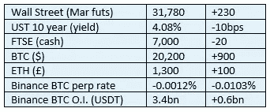
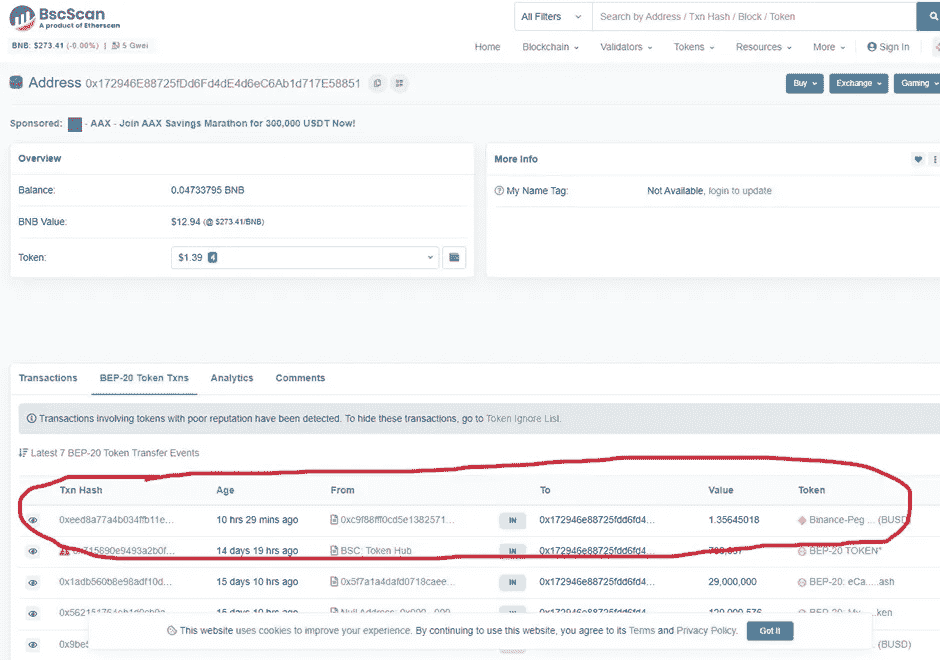
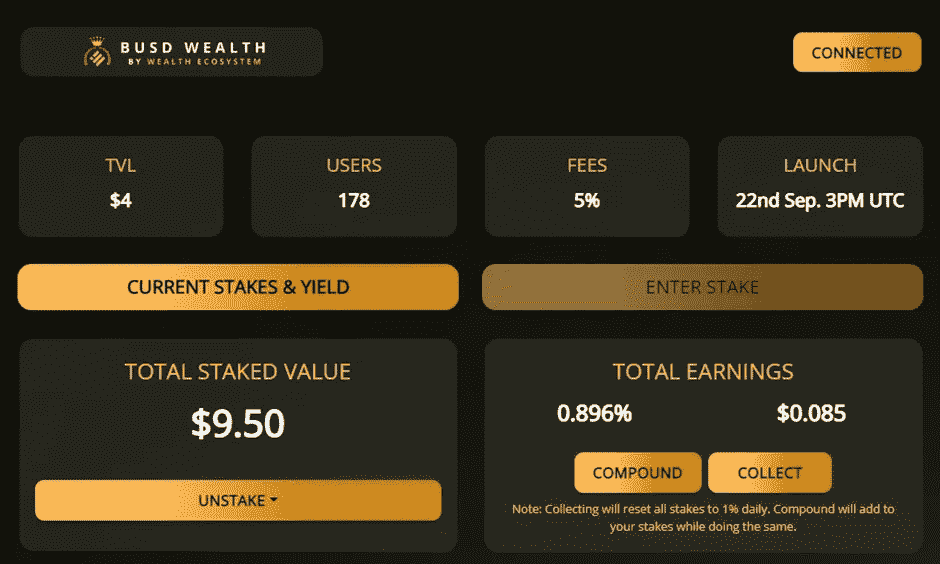

# 《好奇的密码》评论 2022 年 10 月 26 日

> 原文：<https://medium.com/coinmonks/curious-cryptos-commentary-26th-october-2022-1570b36fdb8b?source=collection_archive---------38----------------------->

**TL；博士**

BUSD 财富是一个庞氏骗局。

**市场抢购**

**市场包装**

很高兴看到 20k 美元再次上涨，尽管我不会问这是否是有史以来的最后一次。

永续期货的未平仓合约大幅增加，以及反映空头失衡的融资利率，共同表明市场容易受到重大空头挤压而走高。任何积极的消息都可能引发这种短暂的挤压，尽管这并不一定会发生。

**好奇密码的评论——基于网络的矿工**

2022 年 10 月 10 日，CCC 开始了一项小型实验，参与者是众多网络矿商中的一家，这些矿商提供高收益，只是为了换取赌注硬币。

我坚信，这些网站要么是彻头彻尾的骗局，你永远无法从中取回你的股份或应计利息，要么它们只是庞氏骗局。

为了证实我的怀疑，CCC 财政部向 BUSD 财富投资了 10 BUSD(币安稳定币):

[https://busdwealth.com/](https://busdwealth.com/)

这种迭代最初提供 1%的日回报率，如果不移除或复合应计利息，这个数字会随着时间的推移而增加。

打桩时收取 5%的税费，拆桩时收取 10%的税费。

你们当中眼尖的人会从 2022 年 10 月 10 日 CCC 附带的屏幕截图中注意到，TVL(总价值锁定)有 160 个用户，接近 29k 美元。

有必要试着解释一下这句话。

TVL 是一个经常在 DeFi(去中心化金融)中使用的术语。这是一种对已承诺签订智能合同的资产的衡量，以美元法定条款表示。

BUSD 财富于 2022 年 9 月 22 日启动，这意味着到 CCC 投资之日，它已经运行了 18 天。

以 10 BUSD(价值 10 美元)的最低投资，160 个用户将至少存入价值 16 万美元的 BUSD。算上 5%的博彩税——它进入了网站赞助商的钱包——TVL 至少需要 15.2 万美元。

这告诉我们，截至 CCC 投资之日，至少已有 12.3 万美元的 BUSD 资产被转移。我认为可以肯定的是，早期投资者已经拿走了他们 1%的每日回报，并拿走了他们的股份，减去了未上税的部分。

在 CCC 投资后的几天里，我密切关注着 TVL，注意到它每天都在下降。把它留到最后一分钟——正如你将看到的那样，有点太晚了——我的意图是通过试图提取获得的利息和赌注金额来测试这整个设置是一个彻头彻尾的骗局的假设。

昨天 TVL 跌至 11 美元。我的赌注是 9.50 BUSD，利息是 1.35 BUSD。如果没有骗局，这是一个令人印象深刻的结果。在不考虑复利的情况下，短短两周 14%的回报率折合成年率为 364%。

令我惊讶的是，我成功地提取了应计利息，如下所示:

确信 BUSD 财富不是一个彻头彻尾的骗局后，我去取了我的赌注。

对我来说不幸的是，一定有人同时取出了一些应计利息，因为 TVL 已经跌到了 9 美元——对我来说太低了，以至于不能平仓。

截至目前，TVL 的 178 名用户的价格已降至 4 美元:

除非另一个杯子被卷入，否则我的 9.50 BUSD 将永远锁定在这份合同中。

…

BUSD 财富，像许多其他类似的项目一样，只是一个庞氏骗局。

这样的情况是有可能赚钱的。你必须早到，并希望其他人跟随。尽管参与庞氏骗局并不违法(正如伯尼·马多夫(Bernie Madoff)被判 150 年监禁且不得假释时发现的那样，经营庞氏骗局是违法的)，但在我看来，试图从他人的担保损失中获取经济利益似乎是不道德的。

正如许多人似乎在做的那样，推广这样的计划更令人反感。尤其是在培养基上。

…

记住，如果你看不到声称的高收益的正当理由，那么你就是收益。

**合规材料**

触发警惕警告——如果任何读者在读完我的评论后，觉得自己“真的在颤抖”(正如一名达勒姆学生所声称的，他无法在情绪上应对不同的观点)，那么我只能建议你不要读，或者不要颤抖。这取决于你。

Cryptos——我的任何评论都不应该被视为参与 cryptos 的建议。我可能在不知道的情况下胡说八道。任何加密投资都必须被视为极高的风险，并被视为在出售前价值为零。

股票——只是为了说明这不是股票咨询服务。CCC 团队不提供任何形式的财务建议。本注释中对资产价格的任何引用都是为了简单地给出注释的上下文，并为与密码相关的某些股票的表现增添色彩。

为避免疑问，本通讯不是煽动购买密码，购买股票，甚至出售家庭成员希望购买密码或股票。

请注意，所有版权归好奇密码有限公司所有。

礼貌地要求偶尔分享和复制，你的愿望就会实现。

这封信或我们网站的新订户总是最受欢迎的。

【www.curiouscryptos.com 号

【medium.com/@mark_curiouscryptos 

> 交易新手？试试[加密交易机器人](/coinmonks/crypto-trading-bot-c2ffce8acb2a)或者[复制交易](/coinmonks/top-10-crypto-copy-trading-platforms-for-beginners-d0c37c7d698c)