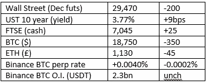

# 《好奇的密码》评论 2022 年 9 月 26 日

> 原文：<https://medium.com/coinmonks/curious-cryptos-commentary-26th-september-2022-b24c3868ec9b?source=collection_archive---------54----------------------->

**TL；博士**

可逆交易可能会让一些乐观主义者感到厌恶，但它们确实提供了更大的安全性。

**市场抢购**

**市场包装**

英镑度过了一个艰难的夜晚，吸引了英国股票的买家。

更重要的是，10 年期国债收益率飙升至 4%正在伤害美国股市和加密债券。

**好奇的 Cryptos 评论——苹果应用商店**

App Store 将允许应用程序销售 NFT，对所有销售收取高达 30%的佣金，这将继续以菲亚特命名。

我们为什么关心？这有可能为大约 10 亿 iPhone 用户提供一个 ETH 钱包，推动大规模的加密理解和采用。

**好奇密码评论——可逆交易**

区块链技术的卖点之一是其不可改变的特性。

虽然理论上 51%的攻击可以改变区块链的历史，但一旦某种程度的去中心化到位，它就变得实际上不可能了。

至少理论上是这样，但有一种方法可以解决这个问题，以太坊基金会在 2016 年 7 月 20 日使用这种方法重写了 ETH 的历史。

以太坊主网于 2015 年 7 月 30 日发布。2016 年 4 月，DAO 作为一个数字分散自治组织在以太坊网络上推出，这正是以太坊发明的发展类型。来自维基百科:

“道的目标是提供一种新的[分权](https://en.wikipedia.org/wiki/Decentralization)商业模式，用于组织[商业](https://en.wikipedia.org/wiki/Commercial_enterprise)和[非营利](https://en.wikipedia.org/wiki/Non-profit)企业。它是在[以太坊](https://en.wikipedia.org/wiki/Ethereum) [区块链](https://en.wikipedia.org/wiki/Blockchain_(database))建立的，没有传统的管理结构或董事会。刀的[代号](https://en.wikipedia.org/wiki/Source_code)为[开源](https://en.wikipedia.org/wiki/Open-source_software)

一切都很好，但代码包含一个漏洞，允许个人将 DAO 持有的三分之一资金转移到自己的钱包中，总共 360 万 ETH，当时价值约 5000 万美元，今天约为 47 亿美元。

以太坊社区在如何应对上存在分歧——一些人认为这是简单的盗窃，而另一些人认为这是恶意的，但可以接受，因为这种行为是编码允许的。

以太坊很难允许那些在剥削中失去 ETH 的人追回他们失去的资金，实际上是在改写历史。这条链子是我们今天所知道和喜爱的。

纯粹主义者保留了最初的链，现在被称为 ETC(以太坊经典)。鉴于它们的相对价格，ETH 为 1300 美元，ETC 为 30 美元，很容易评估哪一个更成功。

…

利用代码漏洞经常是一件事。尽管围绕代码开发和审计的安全措施和实践每天都在改进，但世界将永远是一个不完美的地方。

还有公然盗窃的问题。密码最大化主义者高呼“不是你的钥匙，不是你的密码”，这意味着如果你知道别人的私人钥匙，你也拥有他们的密码。的确，如果你知道私人密钥，你就可以清空相关的钱包，但这并不意味着这样做是合法的。

窃取私钥的网络钓鱼骗局仍然是骗局。

…

为了解决这些问题，人们提出了可翻转硬币的想法。

这就是它的工作方式。

ETH 的所有者会将资金存入发行 rETH(可逆 ETH)的合同中。斯坦福大学区块链研究员王凯丽解释说:

“不可否认，我们看到的主要黑客攻击都是证据确凿的盗窃。如果有办法在这种情况下逆转这些盗窃行为，我们的生态系统将会更加安全。我们的提议只有在分散的法定法官批准的情况下才允许撤销。”

如果有人认为他们的资金被盗，他们可以提交冻结请求，这将由分散的法官法庭考虑。此类请求必须在有争议交易的一两天内提出，双方将提供交易合法性的证据，随后几天将做出决定。

…

研究人员承认，在机制方面还有很多工作要做，但像这样的想法的发展将极大地增强密码世界的安全性和合法性。

**合规材料**

触发警报警告——如果任何读者在读完我的评论后，觉得自己“真的在颤抖”(正如一名达勒姆大学的学生所声称的，他无法在情绪上应对 Rod Liddle 提出的不同观点),那么我只能建议你不要读，或者不要颤抖。这完全取决于你。

Cryptos——我的任何评论都不应该被视为参与 cryptos 的建议。我可能在不知道的情况下胡说八道。任何加密投资都必须被视为极高的风险，并被视为在出售前价值为零。

股票——只是为了说明这不是股票咨询服务。CCC 团队不提供任何形式的财务建议。本注释中对资产价格的任何引用都是为了简单地给出注释的上下文，并为与密码相关的某些股票的表现增添色彩。

为避免疑问，本通讯不是煽动购买密码，购买股票，甚至出售家庭成员希望购买密码或股票。

请注意，所有版权归好奇密码有限公司所有。

礼貌地请求分享和复制，你的愿望就会实现。

这封信或我们网站的新订户总是最受欢迎的。

[www.curiouscryptos.com](http://www.curiouscryptos.com)

 [## 马克·蒂姆西-中号

### 阅读马克·蒂姆西在媒体上的文章。每天，马克·蒂米斯和成千上万的其他声音都在阅读、写作和分享…

medium.com](/@mark_curiouscryptos) 

> 交易新手？试试[密码交易机器人](/coinmonks/crypto-trading-bot-c2ffce8acb2a)或者[复制交易](/coinmonks/top-10-crypto-copy-trading-platforms-for-beginners-d0c37c7d698c)