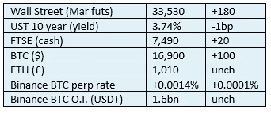

# 《好奇的密码》2022 年 12 月 27 日评论——JPM 和富达

> 原文：<https://medium.com/coinmonks/curious-cryptos-commentary-27th-december-2022-jpm-and-fidelity-ac38994efa0f?source=collection_archive---------58----------------------->

**TL；博士**

摩根大通和富达对加密革命有不同的看法。

**市场抢购**

**市场包装**

一周以来，BTC 的价格终于首次发生了变化。也是朝着正确的方向。

> 从顶级交易者那里复制交易机器人。免费试用。

**好奇的 Cryptos 评论——摩根大通**

JPM 和 cryptos 的关系很有趣。

首席执行官杰米戴蒙是一个怀疑论者，坚定地站在沃伦巴菲特的阵营。然而，该公司的分析师有时会对戴蒙持不同看法。

但这些分析师似乎采取了吉姆·克莱默的方法。对于那些不熟悉吉姆·克莱默的人来说，他是美国消费者新闻与商业频道每日节目的主持人，就投资什么或不投资什么给出了他的个人建议。你可以把他描述成一个动量交易者，但在潮流转向之前，他能准确无误地随波逐流，这让他的金融建议在很大程度上成了一场灾难。几年来，理论上的“反克莱姆”ETF(交易所交易基金)一直是表现最好的资产之一。

在去年牛市接近尾声时，JPM 的分析师果断支持 cryptos。

当我们在几乎完全相反的环境中结束 2022 年时，JPM 的分析师们现在对 cryptos 不屑一顾。

JPM 的高级分析师 Jared Gross 明确表达了他目前的立场:

“作为一种资产类别，对于大多数大型机构投资者来说，加密实际上是不存在的。波动性太高，而且缺乏你可以指出的内在回报，这使得它非常具有挑战性。大多数机构投资者可能都松了一口气，因为他们没有跳进那个市场，而且可能近期也不会这么做。”

也许他不熟悉忠诚。

**好奇密码的评论——保真度**

富达拥有 4.5 万亿 AUM(管理的资产)，使其成为投资界的巨兽之一。

作为 cryptos 的长期支持者，该公司最近宣布增加其加密服务的员工人数，超过 100 人，这与业内其他公司形成鲜明对比。

富达的每一个与密码相关的新举措都在这些页面中频繁出现。

现在它正扩展到元宇宙。

富达的商标申请表明了利用 Web3 建立 NFT 市场和金融服务的计划。富达似乎正试图通过提供教育资源、财务规划、交易、包括养老基金在内的投资组合管理，以及加密钱包和关键的加密保管服务，在虚拟世界中重现其现实世界的运营。

富达最近受到了三名怀疑密码的参议员的抨击，原因是他们允许养老金计划所有者接触 BTC。这是一个奇怪的举动，因为今年 5 月通过的一项法案特别允许 401(k)退休储蓄计划在 BTC 投资。参议员德宾、史密斯和沃伦在立法辩论中失败了，因此他们诉诸于使用恶霸战术来推进他们试图扼杀加密革命的目标。

**合规材料**

触发警报警告。

如果任何读者在读完我的评论后觉得他们“真的在颤抖”(这是一名达勒姆大学的学生提出的说法，他无法在情感上——当然也无法在智力上——应对罗德·利德尔表达的不同观点)，那么我只能建议你不要读，或者不要颤抖。这取决于你。

Cryptos——我的任何评论都不应该被视为参与 cryptos 的建议。我可能在不知道的情况下胡说八道。任何加密投资都必须被视为极高的风险，并被视为在出售前价值为零。

股票——只是为了说明这不是股票咨询服务。CCC 团队不提供任何形式的财务建议。本注释中对资产价格的任何引用都是为了简单地给出注释的上下文，并为与密码相关的某些股票的表现增添色彩。

为避免疑问，本通讯不是煽动购买密码，购买股票，甚至出售家庭成员希望购买密码或股票。

请注意，所有版权归好奇密码有限公司所有。

礼貌地要求偶尔分享和复制，你的愿望就会实现。

这封信或我们网站的新订户总是最受欢迎的。

www.curiouscryptos.com

【medium.com/@mark_curiouscryptos 

> *加入 Coinmonks* [*电报频道*](https://t.me/coincodecap) *和* [*Youtube 频道*](https://www.youtube.com/c/coinmonks/videos) *了解加密交易和投资*

# 另外，阅读

*   [Bookmap 点评](https://coincodecap.com/bookmap-review-2021-best-trading-software) | [美国 5 大最佳加密交易所](https://coincodecap.com/crypto-exchange-usa)
*   [加密交易机器人](/coinmonks/crypto-trading-bot-c2ffce8acb2a) | [造币评论](https://coincodecap.com/coingate-review)
*   最佳加密[硬件钱包](/coinmonks/hardware-wallets-dfa1211730c6) | [Bitbns 评论](/coinmonks/bitbns-review-38256a07e161)
*   [新加坡十大最佳密码交易所](https://coincodecap.com/crypto-exchange-in-singapore) | [收购 AXS](https://coincodecap.com/buy-axs-token)
*   [红狗赌场评论](https://coincodecap.com/red-dog-casino-review) | [Swyftx 评论](https://coincodecap.com/swyftx-review)