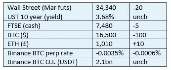

# 好奇 Cryptos 评论 2022 年 11 月 27 日— (PoR)储量证明

> 原文：<https://medium.com/coinmonks/curious-cryptos-commentary-27th-november-2022-por-proof-of-reserves-3faa7655dfca?source=collection_archive---------32----------------------->

**TL；博士**

PoR(储量证明)在今天是有缺陷的，但它将在未来成为一个非常有用的工具。或许比证交会更有用。

**市场抢购**

**市场包装**

杠杆化的孩子们没有放弃市场再次低迷的希望。在 cryptos 之外，风险市场对我来说似乎是良性的(暗示今天晚些时候会出现大规模抛售……)，所以我只能假设是技术人员在主导这场表演。

**好奇的 Cryptos 评论— PoR(储量证明)**

自从 FTX 的欺诈性惨败导致中央加密货币交易所失败以来，关于储备证明的概念已经有了很多闲聊。

这个想法很简单——提供交易所储备的加密证明，应该会让加密储户放心，他们的资金是安全的，而且应该会减少另一个 FTX 情况的可能性。

然而，正如在 2022 年 11 月 13 日和 14 日的 CCC 中所讨论的，这种相当幼稚和简单的方法并不能解决问题。

例如，Crypto.com 很快就提供了有关其外汇储备的信息，但却只字不提其债务。资产负债表的一半总比什么都没有好，但它所讲述的远不及故事的一半。

在 Crypto.com 发布该信息后不久，大量资产被转移到 Gate.io，gate . io 随后报告了其储量证明，实际上在两个不同的交易所重复计算了 320，000 ETH。

第一个问题要么是天真，要么是故意误解。第二种至少是不诚实的，对于任何上市公司来说，本质上都是犯罪，

…

北海巨妖是一个大型的中央加密货币交易所，迄今为止我与它没有任何互动。

北海巨妖的首席执行官，扎着马尾的 Jesse Powell，站出来为 CCC 的这一批评立场辩护，当他评论币安对其储备而不是负债的披露时:

“对不起，不行，这里不是 PoR。这要么是无知，要么是故意曲解。merkle 树只是没有审计员来确保你没有包括负结余的账户。没有负债，资产负债表就毫无意义。”

杰西身上的斑点。尽管我为自己在大多数金融事务(以及其他事务)上的逆向思维感到自豪，但有时有盟友也是件好事。

杰西继续以稳健的方式:

“我说过我会更加自信地提出问题。这是其中之一。”准备金" =资产减去负债"准备金"！=钱包列表储备证明审计需要客户余额和钱包控制的加密证明。”

…

但总的来说，这些都是好东西。

避免交易所再次崩盘符合投资者和行业双方的利益，而行业本身已经在以明智的方式采取行动。当然，总会有恶意的行为者，但这是人类努力的所有领域都存在的问题，而不是特定的与密码相关的问题。

立法者和监管者也是时候关注什么是重要的，而不是试图擦亮自己作为密码杀手的证书。交给你，证券交易委员会主席加里·詹斯勒。

**好奇的 Cryptos 评论——美国证券交易委员会主席加里·詹斯勒**

Gensler 最近受到了一些全能但适当的批评，因为他对监管密码的强制执行方法远远超出了他自己的职权范围(见 CCC 2022 年 11 月 5 日)。

国会议员汤姆·艾默(Tom Emmer)现在加入了公开呼吁 SEC 及其主席的长长名单。他声称 Gensler 的方法不仅负担过重，限制了创新和发展，而且未能完成其核心任务:

“我们现在甚至更担心，因为我们已经看到他的战略错过了摄氏度，旅行者，Terra/Luna——现在是 FTX。”

他认为违反 1980 年文书工作减少法案是证交会越权的一个例子。

这是我第一次，当然也是最后一次提及这项特定的法例。

**合规玩意儿**

触发警惕警告——如果任何读者在读完我的评论后，觉得自己“真的在颤抖”(正如一名达勒姆学生所声称的，他无法在情绪上应对不同的观点)，那么我只能建议你不要读，或者不要颤抖。这取决于你。

Cryptos——我的任何评论都不应该被视为参与 cryptos 的建议。我可能在不知道的情况下胡说八道。任何加密投资都必须被视为极高的风险，并被视为在出售前价值为零。

股票——只是为了说明这不是股票咨询服务。CCC 团队不提供任何形式的财务建议。本注释中对资产价格的任何引用都是为了简单地给出注释的上下文，并为与密码相关的某些股票的表现增添色彩。

为避免疑问，本通讯不是煽动购买密码，购买股票，甚至出售家庭成员希望购买密码或股票。

请注意，所有版权归好奇密码有限公司所有。

礼貌地要求偶尔分享和复制，你的愿望就会实现。

这封信或我们网站的新订户总是最受欢迎的。

【www.curiouscryptos.com 

[medium.com/@mark_curiouscryptos](mailto:medium.com/@mark_curiouscryptos)

> 交易新手？试试[加密交易机器人](/coinmonks/crypto-trading-bot-c2ffce8acb2a)或者[复制交易](/coinmonks/top-10-crypto-copy-trading-platforms-for-beginners-d0c37c7d698c)