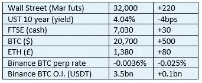

# 好奇的密码评论 2022 年 10 月 27 日

> 原文：<https://medium.com/coinmonks/curious-cryptos-commentary-27th-october-2022-1fe4d3aaf9cf?source=collection_archive---------54----------------------->

**TL；博士**

英国和法规。

**市场抢购**

**市场包装**

我昨天评论说，我们可能会看到空头挤压，这一评论在一天内遭到了 10 亿美元的空头平仓，推动 BTC 几乎突破 2.1 万美元。

热衷于自我施加更多痛苦的空头已经恢复，导致更负的期货融资利率，并伴随着未平仓合约的小幅增加。今天的任何积极消息，或对风险资产的普遍兴趣增加，都可能导致空头再次发出痛苦的嚎叫。

**偶然系列——财富税**

OBR(预算责任办公室)表示，2022 年英国的公共支出将达到每户 3.8 万英镑。

税前平均家庭收入刚刚超过 3 万英镑。

鉴于公众或政治没有兴趣以任何有意义的方式控制政府支出，量化宽松的幻想经济学和现代货币理论也遭到了越来越多的质疑，财富税是唯一的选择。

那些认为市政税太高的房主(试着住在哈克尼)会对政府为住在自己家里每年征收的额外费用感到非常不安。

这种情况将导致英镑流入律师的口袋，因为那些足够富裕、能够通过(合法)避税安排来保护自己的人正是这么做的，而负担则落在了那些收入较低的人身上。

…

财富税确实有一个明显的好处——它们将刺激额外的资金流入自我保管钱包中的密码。

**好奇的 Cryptos 评论——英国**

英国以其金融服务业的卓越地位而自豪，尤其是在银行业务的财富创造和增值部分——资本市场的交易和风险管理，包括债务和股权，以及交易撮合。

在坐视美国和欧盟在加密技术监管、吸引外来投资和税收方面取得进展后，英国立法者开始意识到被落在后面的风险。

TradFi 是一个极具竞争力的行业，但它的重心将越来越多地被吸引到加密领域。

…

《金融服务和市场法案》的核心目标就是解决这个问题:

“……采取一系列措施来保持和加强英国作为金融服务全球领导者的地位，确保该部门继续为全国的个人和企业提供服务。"

如果你认为英国现在的财政状况很糟糕，没有伦敦金融城的贡献，我们的麻烦会大得多。

国会议员兼加密和数字资产各党派议会小组主席 Lisa Cameron 也发表了令人鼓舞的讲话:

“我们正处于学习曲线上，这非常非常重要，因为英国政府有一个政策愿景，即英国将成为加密货币和数字资产的国际中心。”

但这种对处于学习曲线上的认识，让我有点困扰。我们每天都在学习——这就是 CCC 的使命。关键问题是——你处于学习曲线的哪个位置。我有点担心，作为加密资产立法和监管的领导者，Lisa 应该比她知道得更多:

“根据我的理解，以及我们在比特币大会上的讨论，你知道，其中一些与比特币有关，一些可能不是那么重要，因为它的去中心化性质。”

也许她只是表达得不好。

…

新法案本身似乎反映了围绕 cryptos 的一些核心误解。

它引入了一个新术语“数字结算资产”(DSA)来代替“加密资产”，其理由是“加密资产使用某种形式的分布式账本技术(DLT)”，而 DSA 包括 [stablecoins](https://assets.publishing.service.gov.uk/government/uploads/system/uploads/attachment_data/file/1079348/Stablecoin_FMISAR_Consultation.pdf) 。

Stablecoins 也使用 DLT，除了在非常特殊的情况下，CBDCs(中央银行数字货币)不是，也永远不会是 cryptos。

我担心的是，这项新法案是在希望促进加密行业创新和发展的幌子下推出的，但其真正的目的是充当特洛伊木马，加速英国自己的 CBDC，即英国硬币。

**合规玩意儿**

触发警惕警告——如果任何读者在读完我的评论后，觉得自己“真的在颤抖”(正如一名达勒姆学生所声称的，他无法在情绪上应对不同的观点)，那么我只能建议你不要读，或者不要颤抖。这取决于你。

Cryptos——我的任何评论都不应该被视为参与 cryptos 的建议。我可能在不知道的情况下胡说八道。任何加密投资都必须被视为极高的风险，并被视为在出售前价值为零。

股票——只是为了说明这不是股票咨询服务。CCC 团队不提供任何形式的财务建议。本注释中对资产价格的任何引用都是为了简单地给出注释的上下文，并为与密码相关的某些股票的表现增添色彩。

为避免疑问，本通讯不是煽动购买密码，购买股票，甚至出售家庭成员希望购买密码或股票。

请注意，所有版权归好奇密码有限公司所有。

礼貌地要求偶尔分享和复制，你的愿望就会实现。

这封信或我们网站的新订户总是最受欢迎的。

[www.curiouscryptos.com](http://www.curiouscryptos.com)

medium.com/@mark_curiouscryptos

> 交易新手？试试[密码交易机器人](/coinmonks/crypto-trading-bot-c2ffce8acb2a)或[复制交易](/coinmonks/top-10-crypto-copy-trading-platforms-for-beginners-d0c37c7d698c)