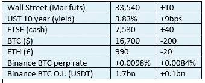

# 《好奇的密码》2022 年 12 月 28 日评论——BTC 矿工

> 原文：<https://medium.com/coinmonks/curious-cryptos-commentary-28th-december-2022-btc-miners-aeed253c1922?source=collection_archive---------62----------------------->

**TL；博士**

BTC 矿商的日子不好过，这一事实反映在他们的股票估值上。

**市场抢购**

**市场包装**

市场忽略了 10 年后的涨幅，可能是因为大多数人仍在度假。如果报道准确的话，普京的杀人雇佣军的撤退似乎正在加速。俄罗斯的全面退出将是 2023 年最美好的开端。

> 不知道什么时候买卖，试试[复制交易](http://coincodecap.com/go/bityard)。

**好奇的 Cryptos 评论——矿工们**

毫无疑问，在整个 2022 年，BTC 矿商的环境一直很艰难，因为他们受到了 BTC 价值下跌以及关键可变成本(即能源)大幅上涨的冲击。

间接受害者之一是 BlockFi(见 2022 年 12 月 5 日)，这是一家采矿业的主要贷款人，其贷款行为转向了危险和坦率地说荒谬的领域。

一周前，Core Scientific 宣布自愿申请破产([https://www . prnewswire . com/news-releases/Core-Scientific-announces-comprehensive-recording-transaction-301708021 . html](https://www.prnewswire.com/news-releases/core-scientific-announces-comprehensive-restructuring-transaction-301708021.html))，尽管该公司仍在继续运营，预计其可转换债券的重组将取得成功。

自 2022 年 1 月在纳斯达克上市以来，Core Scientific 的股价今年下跌了 98%。

Greenidge Generation 重组了部分债务，但警告称，其持续运营的能力存在“重大疑问”。它的股价今年下跌了 99%(我认为我们可以看到一种趋势正在形成)。

Argo Blockchain 要求其股票在今天发布重大公告之前停牌。

2022 年 12 月 12 日，Argo 发表声明([https://www . londonstockexchange . com/news-article/ARB/restoration-of-trading-on-the-LSE/15754846](https://www.londonstockexchange.com/news-article/ARB/restoration-of-trading-on-the-lse/15754846))称，它正在与第三方进行谈判，以“加强其资产负债表并改善其流动性”，从而避免破产。我想我们今天会知道这些努力是否成功。Argo 的股价在 2022 年仅下跌了 95%(仅出于披露目的 CCC 本月早些时候对 Argo 进行了高度投机性的投资)。

Riot Blockchain 今年下跌了 86%。马拉松数字控股公司今年下跌了 91%。

…

相信加密革命的全球反向投资者，可以预期会利用为极端投机性投资留出的资金，在这一领域采取一些行动，尽管这当然不是投资建议。

当我说极度投机时，与通常的投资相比，这已经超出了规模。如果 BTC 的价格行为在短期内没有改善，人们可能会预计其中一些公司会倒闭。然而，如果这些矿商中的任何一家熬过了下一轮牛市，在这些价位投资的回报很可能会大幅增加。

**好奇的 Cryptos 评论—突发新闻**

Argo 已将其采矿设施出售给 Galaxy Digital，但保留了其采矿设备，并将继续像以前一样运营。该股以 7.49 便士开盘，当天上涨了 110%。我能感觉到双倍的增长正在到来…

**合规玩意儿**

触发警报警告。

如果任何读者在读完我的评论后觉得他们“真的在颤抖”(这是一名达勒姆大学的学生提出的说法，他无法在情感上——当然也无法在智力上——应对罗德·利德尔表达的不同观点)，那么我只能建议你不要读，或者不要颤抖。这取决于你。

Cryptos——我的任何评论都不应该被视为参与 cryptos 的建议。我可能在不知道的情况下胡说八道。任何加密投资都必须被视为极高的风险，并被视为在出售前价值为零。

股票——只是为了说明这不是股票咨询服务。CCC 团队不提供任何形式的财务建议。本注释中对资产价格的任何引用都是为了简单地给出注释的上下文，并为与密码相关的某些股票的表现增添色彩。

为避免疑问，本通讯不是煽动购买密码，购买股票，甚至出售家庭成员希望购买密码或股票。

请注意，所有版权归好奇密码有限公司所有。

礼貌地要求偶尔分享和复制，你的愿望就会实现。

这封信或我们网站的新订户总是最受欢迎的。

【www.curiouscryptos.com 

[medium.com/@mark_curiouscryptos](mailto:medium.com/@mark_curiouscryptos)

> *加入 Coinmonks* [*电报频道*](https://t.me/coincodecap) *和* [*Youtube 频道*](https://www.youtube.com/c/coinmonks/videos) *了解加密交易和投资*

# 另外，阅读

*   [Bookmap 点评](https://coincodecap.com/bookmap-review-2021-best-trading-software) | [美国 5 大最佳加密交易所](https://coincodecap.com/crypto-exchange-usa)
*   [密码交易机器人](/coinmonks/crypto-trading-bot-c2ffce8acb2a) | [造币评论](https://coincodecap.com/coingate-review)
*   最佳加密[硬件钱包](/coinmonks/hardware-wallets-dfa1211730c6) | [Bitbns 评论](/coinmonks/bitbns-review-38256a07e161)
*   [新加坡十大最佳加密交易所](https://coincodecap.com/crypto-exchange-in-singapore) | [购买 AXS](https://coincodecap.com/buy-axs-token)
*   [红狗赌场评论](https://coincodecap.com/red-dog-casino-review) | [Swyftx 评论](https://coincodecap.com/swyftx-review)