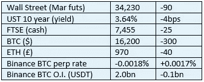

# 好奇的密码 2022 年 11 月 28 日评论

> 原文：<https://medium.com/coinmonks/curious-cryptos-commentary-28th-november-2022-5a0529918ce?source=collection_archive---------32----------------------->

**TL；博士**

证交会诉 XRP 案仍在继续。

**市场抢购**

**市场包装**

一夜之间，我们看到了一个向下的大数字手柄的测试。Twitter 上流传着 wETH (wrapped ETH)没有得到 ETH 1:1 支持的谣言，尽管智能合同代码是开源的，并且一直在接受无休止的审计。在这背后，有一种说法是，FTX 在罪犯萨姆·班克曼-弗里德和他的马屁精们的统治下，创造了 10，000 个 wBTC(包装好的 BTC ),却没有一个 BTC。再说一次，这种废话很容易被忽略，但在当前的环境下，人们可以理解投资者仍然紧张不安。但俗话说，在别人恐惧的时候贪婪(不是投资建议，只是洞察我个人的想法)。

**好奇的 Cryptos 评论——XRP(涟漪)更新**

仅仅两天后，SEC(证券交易委员会)推动的对 XRP 的下一轮迫害就开始了。周三，双方都必须提交简易判决答辩摘要，无论它们是什么。

在整个过程中——SEC 指控 Ripple Labs Inc .以 XRP 的形式销售未注册证券——SEC 一直努力不让一些特定信息进入公共领域，这些信息被称为 Hinman documents。其中包括与时任公司金融部门负责人威廉·辛曼的一次演讲有关的电子邮件。这个著名的演讲表达了一个观点，即 BTC 和瑞士联邦理工学院都不应该被归类为证券，因此不属于 SEC 的职权范围。

辩护律师现在掌握了这些文件，尽管他们(还)没有得到法院的许可将它们公之于众。在这些文件被透露给 XRP 法律小组后不久，辩护律师 Stuart Alderoty 说:

“经过 18 个月和 6 次法庭指令，我们终于有了辛曼文件(SEC 内部电子邮件和他 2018 年著名演讲的草稿)。虽然它们目前仍然保密(在证交会的坚持下)，但我可以说，为得到它们而战是非常值得的。我一直对我们的法律争论感觉良好，现在感觉更好了。我一直对证交会的策略感到不满，现在更是如此。”

哎哟。

Ripple Labs Inc .的首席执行官布拉德·加林豪斯(Brad Garlinghouse)在评估中甚至更加严厉:

“证交会希望你认为，它关心信息披露、透明度和清晰度。不要相信他们。当真相最终大白时，他们在这里的可耻行为会让你震惊。”

又哎哟。

…

这两个人都不能说是不偏不倚的，但是如果他们的评论没有任何根据或理由，我会感到非常惊讶。

普通读者都明白，这场官司的结果对此时此地正在发生的加密革命至关重要。在他们最近成功击败 LBRY Inc .之后，SEC 的胜利将鼓励 SEC 主席 Gary Gensler 在他看似个人的十字军东征中成为众所周知的加密杀手。一个智力超群的人希望死在自己制造的战场上，成功的希望渺茫，这是一种耻辱。

Ripple Labs Inc .的胜利将巩固 CFTC(商品和期货交易委员会)作为大多数密码的主要监管机构的作用，这无疑是对所有人都最好的结果。

…

我仍然对这个案件的一个方面感到困惑。

XRP 的支持者在社交媒体上的热情没有止境，他们一直在鼓吹威廉·希曼腐败。他们指出，他在证交会任职期间，作为一家律师事务所的合伙人，年薪约为 1000 万美元。

对于大型律师事务所的合伙人来说，1000 万美元的年薪是最低的，所以我不接受这种观点。

他们表示，在他被借调到证交会期间，以太坊基金会聘用了他的律师事务所，声称这表明了利益冲突。我只能假设已经采取了适当的措施来减轻这种非常现实的风险，但我承认，我对这种说法的证据和其他人对他所谓腐败的证据一样少。

但把所有这些放在一边，如果威廉·辛曼确实发表讲话，宣称 ETH 不是证券，仅仅是因为以太坊基金会(间接)向他支付了提出这一主张的费用，这只会增加 SEC 在此案中获胜的可能性。

无论我问这个问题多少次，都没有得到答案——我到底错过了什么？

**合规材料**

触发警惕警告——如果任何读者在读完我的评论后，觉得自己“真的在颤抖”(正如一名达勒姆学生所声称的，他无法在情绪上应对不同的观点)，那么我只能建议你不要读，或者不要颤抖。这取决于你。

Cryptos——我的任何评论都不应该被视为参与 cryptos 的建议。我可能在不知道的情况下胡说八道。任何加密投资都必须被视为极高的风险，并被视为在出售前价值为零。

股票——只是为了说明这不是股票咨询服务。CCC 团队不提供任何形式的财务建议。本注释中对资产价格的任何引用都是为了简单地给出注释的上下文，并为与密码相关的某些股票的表现增添色彩。

为避免疑问，本通讯不是煽动购买密码，购买股票，甚至出售家庭成员希望购买密码或股票。

请注意，所有版权归好奇密码有限公司所有。

礼貌地要求偶尔分享和复制，你的愿望就会实现。

这封信或我们网站的新订户总是最受欢迎的。

[www.curiouscryptos.com](http://www.curiouscryptos.com)

medium.com/@mark_curiouscryptos

> 交易新手？试试[密码交易机器人](/coinmonks/crypto-trading-bot-c2ffce8acb2a)或[复制交易](/coinmonks/top-10-crypto-copy-trading-platforms-for-beginners-d0c37c7d698c)