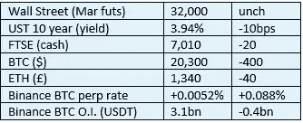

# 好奇的密码 2022 年 10 月 28 日评论

> 原文：<https://medium.com/coinmonks/curious-cryptos-commentary-28th-october-2022-a42ebf6e345a?source=collection_archive---------47----------------------->

**TL；博士**

好奇密码的空投通知(CCAC)和我们的第一笔免费资金。

**市场抢购**

**市场包装**

随着长端如此惊人的反弹，股票和密码都没有做出反应是相当令人惊讶的。

**偶遇系列——另类世界小姐(AMW)**

我非常荣幸能参加今晚在南岸环球剧院举行的 AMW 开幕式和闭幕式。

安德鲁·洛根(Andrew Logan)开始这个节目是对女性物化的批评，与最初的世界小姐相同，包括白天服装、泳装、晚装和一个冠军，但以更具创造性、当然也更露营的方式进行了重建。

有了一群非常忠诚的狂热追随者，门票很快就销售一空，就像格拉斯顿伯里的门票一样，尽管不可否认的是，场馆规模要小一些。

今晚是 50 周年纪念日。我很自豪自 1998 年以来一直参与其中。

我们的舞蹈团由专业舞蹈演员和许多训练有素的舞蹈演员组成。我两者都不是，所以他们把我放在后面。

如果你想体验我们国家的文化亮点之一，同时在我忘记编舞和把舞蹈动作倒过来时咯咯地笑，我们有一个直播:

[https://www.alternativemissworld.org/gold-2022](https://www.alternativemissworld.org/gold-2022)

另一边见。

**好奇密码的评论——好奇密码的空投通知(CCAC)**

对于 CCAC 的订户来说——任何注册的人都可以免费获得——是时候将我们的第一次免费空投货币化了。

2021 年 1 月，那些注意到 CCAC 的人自豪地成为 100 STX(堆叠)硬币的主人。但所有权和归属权是两回事，许多在金融危机期间在伦敦金融城工作的人可以证明这一点。

理论上，在去年年底，这 100 个 STX 价值近 300 美元，对于你花 15 分钟申请空投的时间来说，这是一个相当不错的回报。

但是直到最近，你才可以把空投硬币换成硬币或者换成另一个密码。现在你可以这样做，这就是我要做的。

目前，100 STX 可以在比特币基地以 31 美元的价格兑换菲亚特，这仍然是一个不错的回报，每小时 120 美元，加上学习体验，这是 CCAC 的一个主要优势。但这不是一顿正式的午餐。

我的计划是用比特币基地的 ETH 来交换，而不是卖给菲亚特。我坚定地认为——不管它值不值得——在未来的两到三年内，ETH 将是现在的 10 倍，把这个只花了你 15 分钟时间的空投项目的法定价值提高到 300 多美元。

现在我们在谈论两个人的午餐。

**合规材料**

触发警惕警告——如果任何读者在读完我的评论后，觉得自己“真的在颤抖”(正如一名达勒姆学生所声称的，他无法在情绪上应对不同的观点)，那么我只能建议你不要读，或者不要颤抖。这取决于你。

Cryptos——我的任何评论都不应该被视为参与 cryptos 的建议。我可能在不知道的情况下胡说八道。任何加密投资都必须被视为极高的风险，并被视为在出售前价值为零。

股票——只是为了说明这不是股票咨询服务。CCC 团队不提供任何形式的财务建议。本注释中对资产价格的任何引用都是为了简单地给出注释的上下文，并为与密码相关的某些股票的表现增添色彩。

为避免疑问，本通讯不是煽动购买密码，购买股票，甚至出售家庭成员希望购买密码或股票。

请注意，所有版权归好奇密码有限公司所有。

礼貌地要求偶尔分享和复制，你的愿望就会实现。

这封信或我们网站的新订户总是最受欢迎的。

[www.curiouscryptos.com](http://www.curiouscryptos.com)

medium.com/@mark_curiouscryptos

> 交易新手？试试[密码交易机器人](/coinmonks/crypto-trading-bot-c2ffce8acb2a)或[复制交易](/coinmonks/top-10-crypto-copy-trading-platforms-for-beginners-d0c37c7d698c)