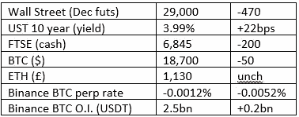

# 好奇的密码 2022 年 9 月 28 日评论

> 原文：<https://medium.com/coinmonks/curious-cryptos-commentary-28th-september-2022-d8f02a7c338b?source=collection_archive---------36----------------------->

**TL；博士**

监管变得越来越有趣。

**市场抢购**

**市场包装**

昨天的总结表明，我们很快就会看到 4%的 10 年。我没想到会这么快。

**好奇密码的评论——规则**

过去有人告诉我，CCC 花了太多时间关注加密货币立法和监管方面的新闻、问题和事件。

这在一定程度上可能是因为在交易台上工作了 25 年，在此期间，人们不禁会欣赏某些监管规定的价值，但对其他规定感到绝望。

2007/2008 年的 GFC(全球金融危机)绝对是由于错误的规则造成的，尽管当然也有一些人(特别是 Kareem Serageldin，我坐了他很多年，他被送进了监狱)犯下了令人发指的罪行。在有人攻击我之前，我会在金融界使用“十恶不赦”这个词。

经常可以看到和听到密码最大化主义者高呼“不是你的钥匙，不是你的密码”(醒醒吧，伙计，这不是真的)的口号，他们希望一个没有监管的世界，这可能伴随着美元的贬值。

我有消息给这些人。在没有监管的情况下，零售或机构客户主流采用密码的可能性为零，而且比我们今天拥有的更多。

这个世界确实需要主流采用加密技术。

我们需要它来对抗政客们在国际货币基金组织(IMF)和大型科技公司(big tech)等组织的帮助和教唆下的控制野心。这些集权力量得到了 BBC 和《金融时报》等权威机构的支持，它们可能在不知不觉中帮助推动世界进入一个不自由、不自由的社会模式。

如果我们想在数字世界中保留我们的个人隐私、自由和尊严，我们需要密码来工作。

为了实现这一点，我们需要适当和有针对性的立法和监管。

…

关于这个话题，这里有两个相互矛盾，但有趣且有启发性的故事。

**好奇的 Cryptos 评论——龙卷风现金**

你可能还记得 8 月 10 日的 CCC，以及后来的一些思考，外国资产办公室(OFAC)宣布它已经批准了 Tornado Cash，这是一种充当密码混合器的计算机代码。

混合器是一种掩饰加密硬币或其任何部分的确切踪迹的手段。

这样做有合法的理由，但是像几乎所有的人类发明一样，从学习如何生火(虽然当然有些人仍然认为这是普罗米修斯的礼物，尽管赫拉克剌斯的努力，普罗米修斯的永恒命运是可以想象的最可怕的命运之一)到通过使用硬币和纸作为价值的代表来快速进行贸易，搅拌器可以用于非法目的。

这就是 OFAC 批准“龙卷风现金”的原因，这是一种令人愤慨的过度监管行为，个人自由和隐私的捍卫者发出了自己的声音。

OFAC 现在已经取消了全面制裁。龙卷风现金的代码回到了 GitHub 上，个人将不再受到个人制裁。

OFAC 曾表示:“美国制裁条例不会禁止美国人复制开源代码并在线提供给其他人查看”(来源 Twitter，buy hey，我的研究团队资源有限)。

CCC 完全支持防止洗钱者和恐怖分子使用密码作为他们使用 100 美元钞票和 500 欧元钞票转移非法资金的次要附加手段，但 Tornado Cash 最多只是一个小角色。

这个看似很小的收获对那些有集中和控制本能的人来说是一个重大的挫折。

**好奇的 Cryptos 评论——Ooki DAO(去中心化自治组织)**

Ooki DAO 和 Tornado Cash 一样，也只是一段计算机代码，但其目的是直接针对非法活动。

它在世界各地提供保证金交易和贷款服务，不遵守任何现行法律法规。

例如，在英国，密码的杠杆交易不仅是受监管的活动，而且被 FCA(金融行为监管局)禁止用于零售:

https://www.fca.org.uk/publication/policy/ps20-10.pdf

我引用:

“我们禁止在英国或从英国向所有零售客户营销、分发和销售涉及某些类型的不受监管、可转让的加密资产的衍生品和 etn。”

为清楚起见，这一禁令涉及密码的衍生物，而不是密码本身。

作为一个 DAO，与 Ooki 的交互只是简单地连接您的钱包(可能由 Ledger Nano X 保护的 MetaMask ),而没有 KYC(了解您的客户)或 AML(反洗钱)保护。

显然，Ooki DAO 是一个非法的操作，但有坏人在那里。

…

商品期货交易委员会(CFTC)对 Ooki 的匿名会员提起诉讼:

[https://storage . court listener . com/recap/gov . us courts . cand . 400807/gov . us courts . cand . 400807 . 11 . 1 . pdf](https://storage.courtlistener.com/recap/gov.uscourts.cand.400807/gov.uscourts.cand.400807.11.1.pdf)

这场诉讼的有趣之处在于送达的方式，以及送达的对象。

它发布在一个为讨论 Ooki DAO 的治理问题而设立的聊天室中，针对的是 DAO 的每一个投票成员，包括其原生硬币 Ooki 的所有所有者。实际上，这种硬币的零售拥有者现在可以被 CFTC 罚款，一旦他们知道这个消息，就会迅速离开。

作为充分披露，CCC 在 OOKI 没有经济利益，但我一直在私下警告一些人参与此道的风险。这些警告没有得到重视

与 Tornado Cash 相反，这是一个利用监管力量来执行市场规则的好例子。

展望未来，任何投资来源于非法活动的硬币的人现在都知道，惩罚将随之而来。

**合规材料**

触发警报警告——如果任何读者在读完我的评论后，觉得自己“真的在颤抖”(正如一名达勒姆大学的学生所声称的，他无法在情绪上应对 Rod Liddle 提出的不同观点),那么我只能建议你不要读，或者不要颤抖。这完全取决于你。

Cryptos——我的任何评论都不应该被视为参与 cryptos 的建议。我可能在不知道的情况下胡说八道。任何加密投资都必须被视为极高的风险，并被视为在出售前价值为零。

股票——只是为了说明这不是股票咨询服务。CCC 团队不提供任何形式的财务建议。本注释中对资产价格的任何引用都是为了简单地给出注释的上下文，并为与密码相关的某些股票的表现增添色彩。

为避免疑问，本通讯不是煽动购买密码，购买股票，甚至出售家庭成员希望购买密码或股票。

请注意，所有版权归好奇密码有限公司所有。

礼貌地请求分享和复制，你的愿望就会实现。

这封信或我们网站的新订户总是最受欢迎的。

www.curiouscryptos.com

 [## 马克·蒂姆西-中号

### 阅读媒体上马克·蒂姆西的作品。每天，马克·蒂米斯和成千上万的其他声音都在阅读、写作和分享…

medium.com](/@mark_curiouscryptos) 

> 交易新手？试试[密码交易机器人](/coinmonks/crypto-trading-bot-c2ffce8acb2a)或[复制交易](/coinmonks/top-10-crypto-copy-trading-platforms-for-beginners-d0c37c7d698c)