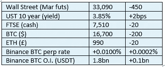

# 《好奇的密码》评论 2022 年 12 月 29 日——迈达斯投资

> 原文：<https://medium.com/coinmonks/curious-cryptos-commentary-29th-december-2022-midas-investments-39a68ca4869a?source=collection_archive---------31----------------------->

**TL；dr**

另一家(小型)集中密码货币交易所关门大吉，警告我们 FTX 传染病对我们来说是一个持续的风险。

**市场快照**

**市场包装**

这是股市对国债收益率飙升的延迟抛售，尽管我注意到一家主流报纸今天的标题是“中国放松对疫情的限制后，投资者会穿上靴子”。

那位记者和我对“充实自己”这个词一定有不同的理解，但正如普通读者所熟知的，我经常与我们今天看到的许多财务报告不一致。我应该解释一下，有一些优秀的个人记者，他们的管理层不了解金融界。

> 交易新手？在[最佳密码交易所](/coinmonks/crypto-exchange-dd2f9d6f3769)上尝试[密码交易机器人](/coinmonks/crypto-trading-bot-c2ffce8acb2a)或[副本交易](/coinmonks/top-10-crypto-copy-trading-platforms-for-beginners-d0c37c7d698c)

**偶发系列-阿富汗**

联合国安理会表示，它对塔利班神权统治这个贫穷、愚昧的国家所固有的厌恶女性“深感震惊”。

那会告诉他们。

**好奇的密码评论——迈达斯投资**

Midas Investments 是或曾经是规模较小的集中密码货币交易所之一。

周二，迈达斯停止了所有的取款、存款和交易，这从来都不是一个好迹象。提款现已恢复，但有一个关键的但书。

投资者持有的 BTC Midas、ETH 和 stablecoins 的资金余额将减少 55%，但显然没有其他硬币会遭受同样的命运。详细内容见此处[https://blog . MIDAS . investments/MIDAS-closure-reason-pivot-to-cede fi/](https://blog.midas.investments/midas-closure-reasons-and-pivot-to-cedefi/)。

根据该新闻稿，资产(即客户存款)总额为 5200 万美元，负债总额为 1.15 亿美元。

FTX 崩溃主要是因为高级管理层对其客户实施了欺诈，将他们的存款用于交易。这在 FTX 的 T & Cs(条款和条件)中被明确排除。

我不知道迈达斯的 T & Cs 怎么说，但很明显，迈达斯没有将 100%的客户存款存入单独账户。即使在 T&Cs 中允许这样做，考虑到密码固有的易变性，中央密码货币交易所以这种方式运作也是一种自杀行为。

新闻稿向我们提供了一些信息，说明这些资金是如何被不当使用的，并因以下原因造成损失:

“2022 年 4 月 1400 万美元的 Ichi 方案

2022 年春季 1500 万美元的 DeFi Alpha 投资组合

和谐桥黑客事件导致 150 万美元损失

由于 FTM 令牌的价格变化，损失了 300 万美元

由于在流动性差的市场上平衡 MIDAS token 销售，损失 1500 万美元

1000 万美元，因为在原生技能和迈达斯强化技能中支付的奖励比通过 DeFi 获得的奖励高”

Midas 利用客户存款参与高风险的 DeFi(分散金融)项目，并创造和推广自己的本土硬币。听起来太熟悉了。

其存款遭受 55%折价的投资者将通过收到 Midas 代币来弥补余额。但是，当声明对迈达斯硬币的未来做出这样的评论时，不要屏住呼吸:

“我们还将停止为 MIDAS token 提供流动性，并致力于消除其中的所有流动性，使其完全可以在社区中交易。”

好吧，这很快就会变为零，尽管勇敢的人也许会有机会。

消息发布前，迈达斯的交易价格约为 30 美元，昨日以 1 美分的价格易手。目前在 Uniswap 上，它的价格超过了 25 美分，尽管数量很少，最高曾达到 45 美分。24 小时内 4500%的回报会让一个人非常幸运。恐怕不是 CCC 财政部的。

…

像这样的消息让我困惑。

这是一个毫无疑问不受监管的小型加密货币交易所，以不可持续的高利率疯狂吸引投资者的存款。一度有近 2.5 亿美元流向他们。

尽管利率高得不可持续，但投资者在这样的平台上存款的风险远远超过任何潜在回报。

为什么人们继续犯这种小学生的错误？

我再重复一遍。

不要将超过 5-10%的加密资产放在中央交易所，最好只放在比特币基地或币安。

**合规材料**

触发警报警告。

如果任何读者在读完我的评论后觉得他们“真的在颤抖”(这是一名达勒姆大学的学生提出的说法，他无法在情感上——当然也无法在智力上——应对罗德·利德尔表达的不同观点)，那么我只能建议你不要读，或者不要颤抖。这取决于你。

Cryptos——我的任何评论都不应该被视为参与 cryptos 的建议。我可能在不知道的情况下胡说八道。任何加密投资都必须被视为极高的风险，并被视为在出售前价值为零。

股票——只是为了说明这不是股票咨询服务。CCC 团队不提供任何形式的财务建议。本注释中对资产价格的任何引用都是为了简单地给出注释的上下文，并为与密码相关的某些股票的表现增添色彩。

为避免疑问，本通讯不是煽动购买密码，购买股票，甚至出售家庭成员希望购买密码或股票。

请注意，所有版权归好奇密码有限公司所有。

礼貌地要求偶尔分享和复制，你的愿望就会实现。

这封信或我们网站的新订户总是最受欢迎的。

[www.curiouscryptos.com](http://www.curiouscryptos.com)

medium.com/@mark_curiouscryptos

> *加入 Coinmonks* [*电报频道*](https://t.me/coincodecap) *和* [*Youtube 频道*](https://www.youtube.com/c/coinmonks/videos) *了解加密交易和投资*

# 另外，阅读

*   [3 商业评论](/coinmonks/3commas-review-an-excellent-crypto-trading-bot-2020-1313a58bec92) | [Pionex 评论](https://coincodecap.com/pionex-review-exchange-with-crypto-trading-bot) | [Coinrule 评论](/coinmonks/coinrule-review-2021-a-beginner-friendly-crypto-trading-bot-daf0504848ba)
*   [莱杰 vs n rave](/coinmonks/ledger-vs-ngrave-zero-7e40f0c1d694)|[莱杰 nano s vs x](/coinmonks/ledger-nano-s-vs-x-battery-hardware-price-storage-59a6663fe3b0) | [币安评论](/coinmonks/binance-review-ee10d3bf3b6e)
*   [加密交易机器人](/coinmonks/crypto-trading-bot-c2ffce8acb2a) | [Bingbon 评论](https://coincodecap.com/bingbon-review)
*   [Bybit Exchange 审查](/coinmonks/bybit-exchange-review-dbd570019b71) | [Bityard 审查](https://coincodecap.com/bityard-reivew) | [Jet-Bot 审查](https://coincodecap.com/jet-bot-review)