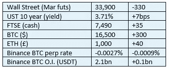

# 《好奇的密码》2022 年 11 月 29 日评论—密码标桩第五部分

> 原文：<https://medium.com/coinmonks/curious-cryptos-commentary-29th-november-2022-crypto-staking-part-5-7e57bde5e534?source=collection_archive---------39----------------------->

**TL；博士**

作为我们的加密赌注系列的一部分，这是一个及时提醒的重复，这个世界充满了野蛮，低级的骗子。

**市场抢购**

**市场包装**

加密贷款公司 BlockFi 是 FTX 欺诈惨败的最新受害者，昨天申请破产。这对加密价格几乎没有影响，因为这并不令人意外，因为 BlockFi 在今年早些时候因 3AC 和 Celsius 倒闭而遭受损失后，得到了 FTX 4 亿美元循环信贷额度的纾困。

评级机构惠誉(Fitch)令人震惊地轻描淡写称，破产申请敲响了警钟。

**好奇密码评论—加密赌注第 5 部分—欺诈警报**

11 月 26 日，CCC 给出了一个简短的概述，介绍了标桩 ETH 的一些可能性。我想起了 2022 年 2 月 21 日的一篇早期文章，这篇文章就这个话题警告了一个非常有说服力的骗局。它仍然是相关的，值得重读一遍。在这里。

**好奇的 Cryptos 评论— ** ETH 赌注诈骗警报****

普通读者熟悉 ETH 从 PoW(工作证明)到 PoS(利益证明)的转变过程。完成后，这种过渡将有几个好处，包括更短的结算时间和更便宜的费用。

就安全性而言，甚至就环境损害或其他方面而言，关于 PoW 与 PoS 相比的相对优势存在复杂的争论，但这些争论不需要我们在这里关注——决定已经做出，过程正在进行中。

作为过渡的一部分，瑞士联邦理工学院的所有者有机会对他们的股份进行投资，以换取我上次看到的大约 10-20% APY 的回报。在转换完成之前，定桩机将无法拆桩。

…

今天我收到了一封非常有说服力的电子邮件，据称是来自“ETH 基金会”,提供立即下注 25%的 ETH 奖励。

如果你点击链接，你会被带到一个非常有说服力的网站，网址是:

[https://staking-ethereum.org/en/eth2/staking/](https://staking-ethereum.org/en/eth2/staking/)

这是一个安全的网站，名字包含 ethereum.org。比我更谨慎、更少怀疑的 ETH 所有者可能会从表面上接受这一点，然后开始下注。

任何这样做的人都被骗子骗走了所有的财产。我会解释原因。

…

1.邮件上的“发件人:”是 no.reply@beastmarts.com。

2.邮件底部唯一的拼写错误是 notices@ethereunn.org。

3.网站地址在 ethereum.org 之前有“staking —”。

4.报价是预先支付 25%的 APY，这不是如何赚取费用。

5.该提议仅限于第一个 550，000 ETH 接受该提议，倒计时定时器增加了 FOMO 的紧张局势。

6.有一种说法是，每个钱包只能下注一次，这意味着用少量 ETH 测试报价以确定它是否是一个骗局是毫无意义的——“不允许进行第二次操作”。

7.有一个加入 reddit 网站“r/ethstaker”的链接，但这完全独立于以太坊基金会，不会被他们推广。

到这个时候，我越来越确信这是一个骗局。

所以，我去了以太坊的官方网站:

[https://ethereum.org/en/](https://ethereum.org/en/)

除了赌注页面，这两个网站几乎是一样的——ethereum.org 官方网站根本没有提到直接与他们打赌，更不用说 25%的预付款了。

…

骗子总是迎合你的贪婪感。请不要上当。

**合规玩意儿**

触发警报警告。

如果任何读者在读完我的评论后觉得他们“真的在颤抖”(这是一名达勒姆大学的学生提出的说法，他无法在情感上——当然也无法在智力上——应对罗德·利德尔表达的不同观点)，那么我只能建议你不要读，或者不要颤抖。这取决于你。

Cryptos——我的任何评论都不应该被视为参与 cryptos 的建议。我可能在不知道的情况下胡说八道。任何加密投资都必须被视为极高的风险，并被视为在出售前价值为零。

股票——只是为了说明这不是股票咨询服务。CCC 团队不提供任何形式的财务建议。本注释中对资产价格的任何引用都是为了简单地给出注释的上下文，并为与密码相关的某些股票的表现增添色彩。

为避免疑问，本通讯不是煽动购买密码，购买股票，甚至出售家庭成员希望购买密码或股票。

请注意，所有版权归好奇密码有限公司所有。

礼貌地要求偶尔分享和复制，你的愿望就会实现。

这封信或我们网站的新订户总是最受欢迎的。

【www.curiouscryptos.com 

[medium.com/@mark_curiouscryptos](mailto:medium.com/@mark_curiouscryptos)

> 交易新手？尝试[加密交易机器人](/coinmonks/crypto-trading-bot-c2ffce8acb2a)或[复制交易](/coinmonks/top-10-crypto-copy-trading-platforms-for-beginners-d0c37c7d698c)