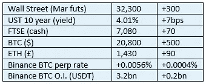

# 好奇的密码评论 2022 年 10 月 29 日

> 原文：<https://medium.com/coinmonks/curious-cryptos-commentary-29th-october-2022-16a7c63221b5?source=collection_archive---------29----------------------->

**TL；博士**

富达的年度机构投资者调查让我们欢欣鼓舞。

**市场抢购**

**市场包装**

如果我早几分钟完成我的涂鸦，我会报告 BTC 在 21，000 美元。

**好奇密码的评论——保真度**

富达是一家资产管理公司，拥有近 4 万亿美元的 AUM(管理的资产)。

尽管不及贝莱德的 10 万亿美元，但这足以让他们进入资产管理公司的前三名。

如果这些数字没有意义，因为我们的大脑无法想象超过数百的数字，我总是觉得这个图形有点令人吃惊:

[http://www.pagetutor.com/trillion/index.html](http://www.pagetutor.com/trillion/index.html)

…

关键在于，富达是投资界的一个关键角色，不能掉以轻心。

该公司是 cryptos 的早期采用者，这正好表明他们的管理层级是多么开明。他们成立了自己的 BTC 矿业公司——当时 BTC 的估值为 100 多美元——只是为了更多地了解当时新兴的资产类别。

自 2018 年以来，富达一直在对机构投资者进行关于密码的年度调查。以下是初步报告，随后是对调查结果的更深入分析:

[https://www . fidelitydigitalassets . com/sites/default/files/documents/2022 _ Institutional _ Investor _ Digital _ Assets _ study . pdf](https://www.fidelitydigitalassets.com/sites/default/files/documents/2022_Institutional_Investor_Digital_Assets_Study.pdf)

愤世嫉俗者会妄下结论，认为富达是 cryptos 的忠实支持者，所以评论是不可信的。嗯，我们都有自己的偏见，所以我建议你先去关注你的。

…

让我们从负面来看，CCC 试图尽可能的平衡，不像我提到的其他媒体。

…

关于“投资数字资产的障碍”，价格波动每年都会出现。

当风险资产普遍遭遇困境时，这种担忧会被放大。不足为奇的是，养老基金不像以前那样热衷于投资，而家族基金对密码的兴趣却在急剧增加。尽管很难获得相关数据(家族基金，尽管就 AUM 而言规模很大，但完全是私人的)，但就其投资范围而言，监管要求很少或没有，家族基金通常是其他高风险投资者(对冲基金、私募股权基金等)投资的领先指标。)跟随。

对监护权的担忧排名很高，这对 CCC 的读者来说是旧闻。这是一个在不远的将来在工业规模上即将解决的问题。

cryptos 的监管分类也排名很高，这在我看来表明一些投资经理没有做好功课。

最大的加密软件 BTC 已经被宣布为商品，这个决定不会改变。

尽管美国证券交易委员会(SEC)正试图推翻其公开声明，即 ETH 是一种商品，但他们最不可能在这方面取得成功。

2022 年，美国和欧盟在密码监管方面取得了巨大进展。

我认为这种缺乏监管分类的担忧不会持续太久。

…

让我们来看看积极的一面。

81%的机构投资者认为加密技术在他们的投资组合中有一定的作用。

麦肯锡估计，金融机构持有 500 万亿美元的资产。BTC 和 ETH 的市值约为 6000 亿美元。

如果只有 1%的投资资金被转移到 cryptos(将由 BTC 和 ETH 主导)，这意味着 BTC 和 ETH 的市值总和将增加近 10 倍。ETH 现在实际上处于通缩状态，90%的 BTC 已经被开采。

我个人认为，可以非常有力地证明加密技术在全球投资中所占的比例将远远超过 1%。如果你认为这种可能性很大——很可能在未来三到五年内发生——那么 10 倍的市盈率就大大低估了。

…

富达数字资产总裁 Tom Jessop 总结道:

“我们认为，数字资产的基本面仍然强劲，过去几年市场的制度化使其能够经受住最近的事件。”

干得好，汤姆。

**合规材料**

触发警惕警告——如果任何读者在读完我的评论后，觉得自己“真的在颤抖”(正如一名达勒姆学生所声称的，他无法在情绪上应对不同的观点)，那么我只能建议你不要读，或者不要颤抖。这取决于你。

Cryptos——我的任何评论都不应该被视为参与 cryptos 的建议。我可能在不知道的情况下胡说八道。任何加密投资都必须被视为极高的风险，并被视为在出售前价值为零。

股票——只是为了说明这不是股票咨询服务。CCC 团队不提供任何形式的财务建议。本注释中对资产价格的任何引用都是为了简单地给出注释的上下文，并为与密码相关的某些股票的表现增添色彩。

为避免疑问，本通讯不是煽动购买密码，购买股票，甚至出售家庭成员希望购买密码或股票。

请注意，所有版权归好奇密码有限公司所有。

礼貌地要求偶尔分享和复制，你的愿望就会实现。

这封信或我们网站的新订户总是最受欢迎的。

[www.curiouscryptos.com](http://www.curiouscryptos.com)

medium.com/@mark_curiouscryptos

> 交易新手？试试[密码交易机器人](/coinmonks/crypto-trading-bot-c2ffce8acb2a)或[复制交易](/coinmonks/top-10-crypto-copy-trading-platforms-for-beginners-d0c37c7d698c)