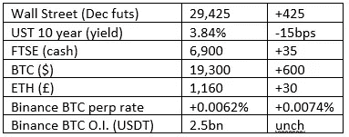
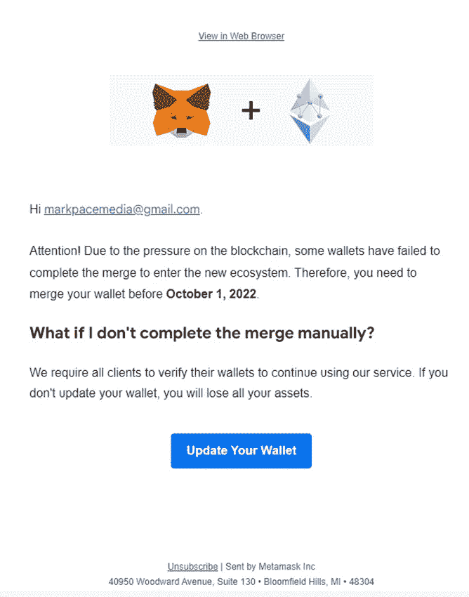

# 好奇加密的评论 2022 年 9 月 29 日

> 原文：<https://medium.com/coinmonks/curious-cryptos-commentary-29th-september-2022-f302ef25e708?source=collection_archive---------36----------------------->

**TL；博士**

合并诈骗警报。

**市场抢购**

**市场包装**

如果你只看了耸人听闻的标题，你认为市场正在全面崩溃是情有可原的。从上面的指标可以看出，事实并非如此。英镑实际上与周五迷你预算后恐慌引发的抛售持平，从低点上涨了近 5%。

**好奇密码解说—技术分析(TA)**

TA 的支持者们确实让我们所有人嘲笑他们。

例如，材料指标表明:

“币安主要交易所的 BTC/美元图表显示，棕色巨鲸涌入 BTC 支撑，以最小化滑点。”

是啊，不管怎样，伙计。你在说废话。你什么都不知道。

你甚至不知道如何拼写最小化。

**好奇的 Cryptos 评论——量化宽松(QE)又回来了**

出于显而易见的原因，CCC 仍然保持着强烈的非政治性。

英国央行最终重启了 QE，并威胁提高短期利率。

如果你的目标是导致经济衰退，这是最理想的组合。

…

一个拥有无限资源、买入长期英国国债的买家，显然是有史以来最大的市场操纵者。其他任何这样做的人都会被判很长时间的监禁，但英国央行行长安德鲁贝利(Andrew Bailey)只会期待更高的奖金。试图操纵短期曲线的真正的银行家，而不是贝利这样的技术官僚，已经被监禁了，这是理所应当的。这不会是贝利的命运，尽管也许应该如此。

英国央行的高管凌驾于法律之上，为所欲为。

…

其他央行可能会效仿，导致资产进一步增加(富人越来越富，穷人越来越穷)，并可能逆转美元在 2022 年的出色表现。

这种由 QE 创造的不确定性——以及相关的现代货币理论，也就是神奇的摇钱树——扭曲了市场，对每个人都非常不利。

除了那些热衷于加密的人。

**好奇密码的评论——骗局警报**

MetaMask 的用户可能会收到如下所示的电子邮件。

该链接会将您带到一个网页，要求您为 MetaMask 钱包输入 12 个单词的机密短语。

任何这样做的人都会立即失去钱包中的所有资金。

总之，我填好表格，点击提交，下面是 12 个字的短语:

“你这个卑鄙的骗子，我们都希望你尽快痛苦地死去”。

**合规材料**

触发警报警告——如果任何读者在读完我的评论后，觉得自己“真的在颤抖”(正如一名达勒姆大学的学生所声称的，他无法在情绪上应对 Rod Liddle 提出的不同观点),那么我只能建议你不要读，或者不要颤抖。这完全取决于你。

Cryptos——我的任何评论都不应该被视为参与 cryptos 的建议。我可能在不知道的情况下胡说八道。任何加密投资都必须被视为极高的风险，并被视为在出售前价值为零。

股票——只是为了说明这不是股票咨询服务。CCC 团队不提供任何形式的财务建议。本注释中对资产价格的任何引用都是为了简单地给出注释的上下文，并为与密码相关的某些股票的表现增添色彩。

为避免疑问，本通讯不是煽动购买密码，购买股票，甚至出售家庭成员希望购买密码或股票。

请注意，所有版权归好奇密码有限公司所有。

礼貌地请求分享和复制，你的愿望就会实现。

这封信或我们网站的新订户总是最受欢迎的。

[www.curiouscryptos.com](http://www.curiouscryptos.com)

 [## 马克·蒂姆西-中号

### 阅读媒体上马克·蒂姆西的作品。每天，马克·蒂米斯和成千上万的其他声音都在阅读、写作和分享…

medium.com](/@mark_curiouscryptos) 

> 交易新手？试试[密码交易机器人](/coinmonks/crypto-trading-bot-c2ffce8acb2a)或者[复制交易](/coinmonks/top-10-crypto-copy-trading-platforms-for-beginners-d0c37c7d698c)