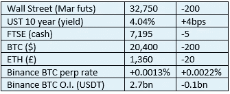

# 《好奇的密码》评论 2022 年 11 月 2 日—速汇金

> 原文：<https://medium.com/coinmonks/curious-cryptos-commentary-2nd-november-2022-moneygram-4d37fcc82b8f?source=collection_archive---------43----------------------->

**TL；博士**

MoneyGram 是最新一家采用 cryptos 的金融服务公司。

**市场抢购**

**市场包装**

这让我发笑。最近几周，彭博一直是最直言不讳地支持源自英国的市场动荡的人之一，但没有事实证据支持这种耸人听闻的说法。

今日头条？

“交易员们赶在还能买的时候，从英国央行购买稀缺的英国债券”。

嗬哼。

与此同时，美国 10 年期国债收益率曲线仍处于反转状态，这被视为正常现象？

**好奇密码的评论——money gram 和更多的密码应用**

如果你不熟悉 MoneyGram，维基百科是这样描述的:

MoneyGram International，Inc .是一家总部位于美国的美国跨境 P2P 支付和汇款公司

我认为我们这些在英国的人更有可能知道西联汇款，尽管他们的服务和产品——直到现在——非常相似。

MoneyGram 是下一个认识到加密革命力量的大型金融服务提供商。

[https://www . prnewswire . com/news-releases/money gram-introduces-new-crypto-service-enabled-customers-to-buy-sell-and-hold-cryptogram-via-the-money gram-app-301664682 . html](https://www.prnewswire.com/news-releases/moneygram-introduces-new-crypto-service-enabling-customers-to-buy-sell-and-hold-cryptocurrency-via-the-moneygram-app-301664682.html)

新闻稿宣布，美国几乎所有州的用户(可能不包括纽约州，尽管其市长坚持认为纽约州将成为一个加密中心)现在可以购买、持有和出售 BTC、联邦理工学院和 LTC(莱特币，BTC 的一种衍生物，交易时间更快、更便宜)。该公司已经明确表示，cryptos 的范围将会扩大，大概覆盖的地理范围也会扩大。

速汇金董事长兼首席执行官艾利克斯·霍姆斯表示:

“随着消费者对数字货币的兴趣不断增加，我们凭借我们的全球网络、领先的合规解决方案和强大的金融科技创新文化，在满足这一需求和弥合区块链与传统金融服务之间的差距方面具有独特的优势。”

他继续说道:

“作为 MoneyGram 发展的下一步，我们很高兴能够为我们的客户提供一个可信且易于使用的平台，以安全地购买、出售和持有选定的加密货币。”

这一愿景解决了密码散户投资者的三个核心问题——购买方便、定价透明，以及最重要的保管。

更令人高兴的是，亚历克斯清楚地表明，我经常重复的评论，即公司投资开发加密产品只是对消费者需求的回应，和以往一样是正确的。

**合规的东西**

触发警惕警告——如果任何读者在读完我的评论后，觉得自己“真的在颤抖”(正如一名达勒姆学生所声称的，他无法在情绪上应对不同的观点)，那么我只能建议你不要读，或者不要颤抖。这取决于你。

Cryptos——我的任何评论都不应该被视为参与 cryptos 的建议。我可能在不知道的情况下胡说八道。任何加密投资都必须被视为极高的风险，并被视为在出售前价值为零。

股票——只是为了说明这不是股票咨询服务。CCC 团队不提供任何形式的财务建议。本注释中对资产价格的任何引用都是为了简单地给出注释的上下文，并为与密码相关的某些股票的表现增添色彩。

为避免疑问，本通讯不是煽动购买密码，购买股票，甚至出售家庭成员希望购买密码或股票。

请注意，所有版权归好奇密码有限公司所有。

礼貌地要求偶尔分享和复制，你的愿望就会实现。

这封信或我们网站的新订户总是最受欢迎的。

[www.curiouscryptos.com](http://www.curiouscryptos.com)

medium.com/@mark_curiouscryptos

> 交易新手？试试[密码交易机器人](/coinmonks/crypto-trading-bot-c2ffce8acb2a)或[复制交易](/coinmonks/top-10-crypto-copy-trading-platforms-for-beginners-d0c37c7d698c)