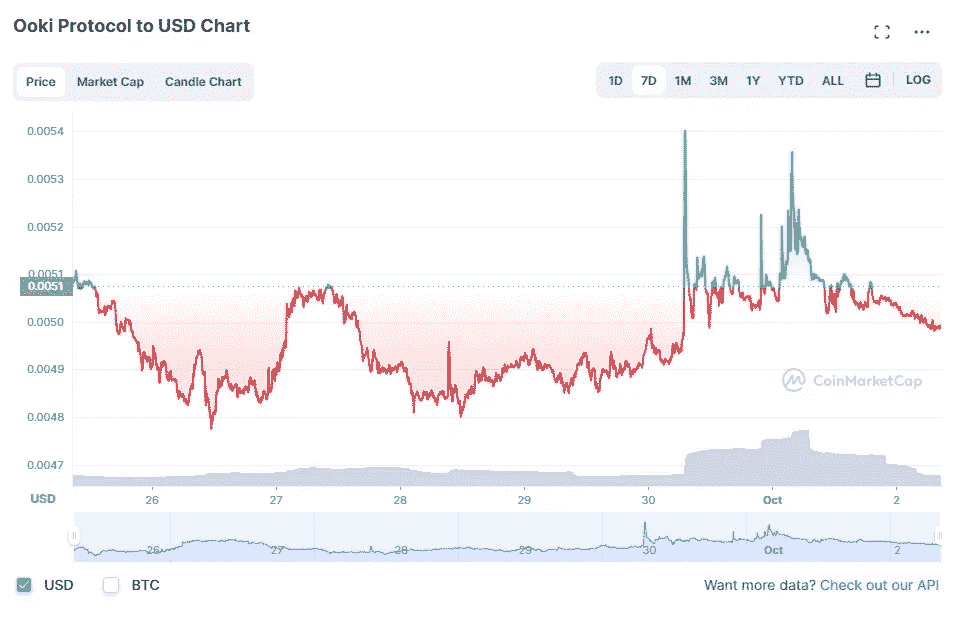

# 好奇的密码评论 2022 年 10 月 2 日

> 原文：<https://medium.com/coinmonks/curious-cryptos-commentary-2nd-october-2022-250e80d9c1e3?source=collection_archive---------22----------------------->

**TL；博士**

Ooki DAO 法庭的案子，以及一些潜在的分歧。

**市场抢购**

**市场包装**

在本周一些有趣的讨论之后，我应该澄清一点困惑。

我对各种政治观点的报纸散布的虚假陈述的批评，不应与表达对 Trussonomics 的支持相混淆。远非如此 CCC 仍然保持着强烈的非政治性。

我的不满是，关于市场动荡的耸人听闻的标题没有事实依据。这是一个完全合理的立场，来论证迷你预算不利于经济的观点，但用市场动荡来证明这一立场是站不住脚的。

很有可能，由于放松管制、减税以及恢复水力压裂法的遥远且最不可能的前景，经济受到了影响，但断言“总理已经摧毁了经济”是不正确的，正如凯尔·斯塔莫爵士今天在《星期日电讯报》上所做的那样。你可能有理由相信这是真的，历史可能会证明你是对的，但现在还没有确凿的证据，未来几个月也不会有。

现在，回到 cryptos。

**好奇的 Cryptos 评论——Ooki DAO(去中心化自治组织)**

2022 年 9 月 28 日，CCC 报告称，CFTC(商品期货交易委员会)已对 Ooki DAO 发出通知，该公司在 BTC 和其他加密平台上为杠杆产品提供不受监管的非法交易活动:

[https://storage . court listener . com/recap/gov . us courts . cand . 400807/gov . us courts . cand . 400807 . 11 . 1 . pdf](https://storage.courtlistener.com/recap/gov.uscourts.cand.400807/gov.uscourts.cand.400807.11.1.pdf)

该诉讼针对 DAO 的所有现任和前任投票成员，其中包括土著硬币 OOKI 的所有所有者。

这让 OOKI 的持有者处境艰难。作为一个非法人团体，Ooki DAO 的每个成员理论上都要为其他成员的行为负责，所有成员都有无限责任，这与股份有限公司的股东形成鲜明对比。

OOKI 上周的价格走势表明，这种针对个人的可怕风险虽然遥远，但尚未被市场所认识:

毫无疑问，这将是一个旷日持久的法庭案件，并将建立法律和监管先例。清晰对业务发展来说永远都是一件好事。

但是还有更进一步的风险，需要考虑。

Ooki DAO 显然在进行非法经营，应该受到惩罚。

合法行事的 Dao 应该没有这种类型的诉讼风险，但当监管机构进行土地征用时，我们没有人会感到惊讶——我们希望这起诉讼的结果不会实际上宣布 Dao 的存在为非法。

但是这种情况还有一个令人担忧的方面。

Dao 永远在变化和发展。有可能今天合法经营的刀客，将来会从事非法活动。道令牌的当前持有者可能不再是未来的持有者，但可能要对未来持有者的非法行为负责。

有了这些知识，我现在要离开去详细审查所有的 CCC 的道控股，可能会导致一个建议，抛售其中一些。在这一点得到澄清之前，CCC 肯定不会参与任何治理决策。

**合规材料**

触发警报警告——如果任何读者在读完我的评论后，觉得自己“真的在颤抖”(正如一名达勒姆大学的学生所声称的，他无法在情绪上应对 Rod Liddle 提出的不同观点),那么我只能建议你不要读，或者不要颤抖。这完全取决于你。

Cryptos——我的任何评论都不应该被视为参与 cryptos 的建议。我可能在不知道的情况下胡说八道。任何加密投资都必须被视为极高的风险，并被视为在出售前价值为零。

股票——只是为了说明这不是股票咨询服务。CCC 团队不提供任何形式的财务建议。本注释中对资产价格的任何引用都是为了简单地给出注释的上下文，并为与密码相关的某些股票的表现增添色彩。

为避免疑问，本通讯不是煽动购买密码，购买股票，甚至出售家庭成员希望购买密码或股票。

请注意，所有版权归好奇密码有限公司所有。

礼貌地请求分享和复制，你的愿望就会实现。

这封信或我们网站的新订户总是最受欢迎的。

www.curiouscryptos.com

 [## 马克·蒂姆西-中号

### 阅读媒体上马克·蒂姆西的作品。每天，马克·蒂米斯和成千上万的其他声音都在阅读、写作和分享…

medium.com](/@mark_curiouscryptos) 

> 交易新手？试试[密码交易机器人](/coinmonks/crypto-trading-bot-c2ffce8acb2a)或[复制交易](/coinmonks/top-10-crypto-copy-trading-platforms-for-beginners-d0c37c7d698c)