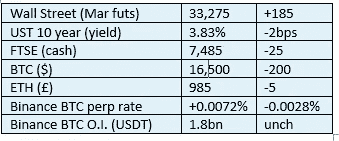

# 《好奇的密码》2022 年 12 月 30 日评论— Iota 标桩更新

> 原文：<https://medium.com/coinmonks/curious-cryptos-commentary-30th-december-2022-iota-staking-update-42c25a4c25df?source=collection_archive---------36----------------------->

**TL；博士**

IOTA 标桩更新——是时候要求 SMR(微光)并做出决定了。

**市场抢购**

**市场包装**

几个小时前还有点疲软，但这并没有改变年底低波动性和与所有其他风险资产低相关性的叙事。但不要对此过于兴奋，因为这种情况对我来说似乎不太可能，它不会持续太久。

> 交易新手？在[最佳加密交易](/coinmonks/crypto-exchange-dd2f9d6f3769)上尝试[加密交易机器人](/coinmonks/crypto-trading-bot-c2ffce8acb2a)或[复制交易](/coinmonks/top-10-crypto-copy-trading-platforms-for-beginners-d0c37c7d698c)

**好奇的 Cryptos 评论— IOTA 赌注**

2021 年 10 月，CCC 提醒 IOTA 的持有者有两个下注机会，一个是赢得 SMR(微光)，一个是赢得 ASMB(装配)。这是建立在 IOTA 生态系统之上的两个平台。

从那时起，为 ASMB 下注已经重复了三次以上——最近一次仍在进行中，所以如果你是一个 IOTA 持有者并且你还没有参加最近一轮，打开你的 Firefly 钱包，参与进来。在以前的核心承诺中已经提供了详细的说明，但是如果您有任何问题，请随时与我们联系。

SMR 现已上线。您可以使用 Firefly Shimmer wallet 申领您在下注 IOTA 中赢得的 SMR 奖励，该钱包可在此处下载:

[https://github . com/iota ledger/firefly/releases/tag/desktop-2 . 0 . 1](https://github.com/iotaledger/firefly/releases/tag/desktop-2.0.1)

如果你使用 Ledger 持有你的 cryptos，前往 Ledger Live，在设置中打开开发者模式，并下载 Shimmer 应用程序。连接到 Firefly Shimmer 钱包，按照屏幕上简单的说明申领您的奖励。

如果你在 Ledger 之外持有你的密码，你将需要输入你的私人密钥到 Firefly Shimmer 钱包，这个过程我会有点担心。如果你也有同样的感觉，那么先把你的 IOTA 藏起来放到一个新的钱包里，这有点痛苦。这是 Ledger Nano 成为首选自我保管解决方案的又一个原因。

目前，SMR 只有两家中央加密货币交易所报价市场——Bitfinex 和 BitForex。我对这些公司一无所知，但它们的名字听起来非常相似。

无论如何，你持有的 SMR 股份的价值将接近你持有的 IOTA 股份价值的 30%(不需要感谢我，我只是喜欢帮忙)，无论从哪个角度看，这都是一个不错的小亮点。

我的正常规则是尽快卖掉硬叉子、空投和非本地赌注奖励，以转换回这些免费赠品和/或 BTC 或 ETH 的来源的硬币。我从来没有使用过 Bitfinex 或 BitForex，我现在有点忙，要完成一个新交易所的整个设置和 KYC 过程，但我很快就会这样做。或者，你可以继续持有 SMR 股票，希望其表现优于大盘。这取决于你。

**合规材料**

触发警报警告。

如果任何读者在读完我的评论后觉得他们“真的在颤抖”(这是一名达勒姆大学的学生提出的说法，他无法在情感上——当然也无法在智力上——应对罗德·利德尔表达的不同观点)，那么我只能建议你不要读，或者不要颤抖。这取决于你。

Cryptos——我的任何评论都不应该被视为参与 cryptos 的建议。我可能在不知道的情况下胡说八道。任何加密投资都必须被视为极高的风险，并被视为在出售前价值为零。

股票——只是为了说明这不是股票咨询服务。CCC 团队不提供任何形式的财务建议。本注释中对资产价格的任何引用都是为了简单地给出注释的上下文，并为与密码相关的某些股票的表现增添色彩。

为避免疑问，本通讯不是煽动购买密码，购买股票，甚至出售家庭成员希望购买密码或股票。

请注意，所有版权归好奇密码有限公司所有。

礼貌地要求偶尔分享和复制，你的愿望就会实现。

这封信或我们网站的新订户总是最受欢迎的。

www.curiouscryptos.com

【medium.com/@mark_curiouscryptos 

> 加入 Coinmonks [电报频道](https://t.me/coincodecap)和 [Youtube 频道](https://www.youtube.com/c/coinmonks/videos)了解加密交易和投资

# 另外，阅读

*   [OKEx vs KuCoin](https://coincodecap.com/okex-kucoin) | [摄氏替代品](https://coincodecap.com/celsius-alternatives) | [如何购买 VeChain](https://coincodecap.com/buy-vechain)
*   [ProfitFarmers 回顾](https://coincodecap.com/profitfarmers-review) | [如何使用 Cornix 交易机器人](https://coincodecap.com/cornix-trading-bot)
*   [如何匿名购买比特币](https://coincodecap.com/buy-bitcoin-anonymously) | [比特币现金钱包](https://coincodecap.com/bitcoin-cash-wallets)
*   [瓦济克斯 NFT 评论](https://coincodecap.com/wazirx-nft-review)|[Bitsgap vs Pionex](https://coincodecap.com/bitsgap-vs-pionex)|[Tangem 评论](https://coincodecap.com/tangem-wallet-review)
*   [如何使用 Solidity 在以太坊上创建 DApp？](https://coincodecap.com/create-a-dapp-on-ethereum-using-solidity)