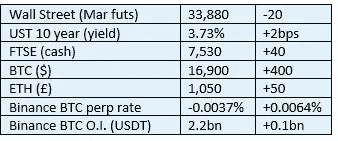

# 《好奇的密码》2022 年 11 月 30 日的评论——替代

> 原文：<https://medium.com/coinmonks/curious-cryptos-commentary-30th-november-2022-alts-e7148cf23fdd?source=collection_archive---------50----------------------->

**TL；博士**

简略地看一下 alt 的世界，有好有坏。

**市场抢购**

**市场包装**

股价短暂突破 1.7 万美元，就有可能导致杠杆化(做空)儿童被迫进行一连串的平仓。这种(上行)风险仍然存在，但随着永久期货融资利率逐渐回归中性，其影响会有所降低。

**好奇的 Cryptos 评论——山寨币日子不好过**

这个标题不应该让任何人感到意外。加密市场内部高度相关，alt 在上涨时表现出色，在下跌时表现不佳。

3AC、Celsius、Voyager 以及其中最糟糕的 FTX 等集中化和杠杆化组织的相继崩溃，对加密市场的信心以及一些人对加密革命的信念造成了一系列沉重打击。

随着 BTC 从其 ATH(历史最高水平)下跌 75%，很容易找到一堆下跌 90%或更多的低价位。对于明智的投资者来说 CCC 的指导思想是将 10%的总加密敞口用于 alt 空间——如果你继续相信加密故事，这种情况实际上是一个很好的机会。

在繁荣时期，保持 10%的敞口必然涉及在低价位表现出色时卖出低价位。在经济不景气的时候(也就是 2022 年)，保持 10%的敞口必然意味着在低价位股票表现不佳时买入它们。

与 DCA(美元成本平均法)非常相似，在所有其他条件相同的情况下，这种纪律和结构几乎可以保证比任何其他可能的 alts 投资方法提供更好的回报，如果这是一个人想要做的话。

…

当然，问题是，并非所有其他事情都是平等的。

有一些 DeFi(去中心化金融)平台正在苦苦挣扎。

出于对波动性的担忧，Aave 冻结了多个贷款市场。其中包括以下 alt:YFI、CRV、ZRX、MANA、1inch、BAT、sUSD、ENJ、GUSD、AMPL、RAI、USDP、LUSD、xSUSHI、DPI、renFIL 和 MKR，以及几个较小的 stablecoins。

Bancor 已暂停其单边流动性的最低担保金额，这是那些希望避免非永久性损失风险的人唯一真正的选择，尽管其名称是永久性的。它还暂停了 BNT 为 V2 提供流动性的支付，尽管我相信 V3 不会受到同样的限制。

DeFi platform Serum——其原生令牌 SRM 现在看起来可能变得完全没有价值——实际上已经关闭，尽管社区 hard fork 正在试图保持该节目在路上。CCC 财政部在 SRM 上的投资非常少，这正好证明了我的信念，即所有加密投资在出售前都应该被视为零价值。

币安暂停了几个专注于一些小盘股和非流动性 alts 的交易对。

随着用户兴趣的下降，比特币基地钱包已经放弃了对比特币现金、XRP、恒星流明和以太坊经典的支持。如果证交会诉 XRP 法院的案件对我们有利，他们可能会对其中至少一个决定感到后悔(见 CCC 29th 年 11 月 29 日等)。

…

今天漫谈的重点不是夸大 alt 领域的潜在机会。

事实上，尽管像 FTX 前首席执行官、未来的囚徒萨姆·班克曼-弗里德(Sam Bankman-Fried)这样的罪犯继续撒谎(“我认为它的价值(FTT)比普通代币更有经济支撑”)，但在 alt 市场复苏之前，可能会出现缺口。

但是会恢复的。我只希望在此之前，我的投资组合中不会有更多的 SRM。

**合规材料**

触发警报警告。

如果任何读者在读完我的评论后觉得他们“真的在颤抖”(这是一名达勒姆大学的学生提出的说法，他无法在情感上——当然也无法在智力上——应对罗德·利德尔表达的不同观点)，那么我只能建议你不要读，或者不要颤抖。这取决于你。

Cryptos——我的任何评论都不应该被视为参与 cryptos 的建议。我可能在不知道的情况下胡说八道。任何加密投资都必须被视为极高的风险，并被视为在出售前价值为零。

股票——只是为了说明这不是股票咨询服务。CCC 团队不提供任何形式的财务建议。本注释中对资产价格的任何引用都是为了简单地给出注释的上下文，并为与密码相关的某些股票的表现增添色彩。

为避免疑问，本通讯不是煽动购买密码，购买股票，甚至出售家庭成员希望购买密码或股票。

请注意，所有版权归好奇密码有限公司所有。

礼貌地要求偶尔分享和复制，你的愿望就会实现。

这封信或我们网站的新订户总是最受欢迎的。

www.curiouscryptos.com

【medium.com/@mark_curiouscryptos 

> 交易新手？尝试[加密交易机器人](/coinmonks/crypto-trading-bot-c2ffce8acb2a)或[复制交易](/coinmonks/top-10-crypto-copy-trading-platforms-for-beginners-d0c37c7d698c)