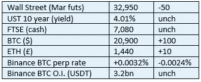

# 好奇的密码评论 2022 年 10 月 30 日

> 原文：<https://medium.com/coinmonks/curious-cryptos-commentary-30th-october-2022-ff64c6bcba6?source=collection_archive---------20----------------------->

**TL；博士**

Rishi Sunak 担任首相是否会改善英国的监管环境，目前尚无定论。

**市场抢购**

**市场包装**

杠杆做空基础没有显示出自残热情减弱的迹象。

**偶遇系列——另类世界小姐**

根据大众的要求，我很高兴地向大家报告，AMW 在周五晚上是一个爆炸。

我很荣幸能在舞蹈团中为表演做开场和闭幕式，我也非常幸运地被赋予了将三个奖项(王冠、权杖和圆球)中的一个颁发给获胜者的责任:

**好奇密码的评论——英国法规**

英国应该为其让女性和少数群体成员担任首相的记录感到自豪(Rishi Sunak 的母校温彻斯特学院此前只提供了一个首相职位，而威斯敏斯特有六个，伊顿公学有二十个)。

我们在 2022 年 10 月 27 日看到，文鼎通过英国立法程序的最新立法——金融服务和市场法案——要么是由对密码知之甚少的人制定的，要么是被那些议程是通过加速实施 CBDCs(中央银行数字货币)来加强政府控制和胁迫的人故意劫持的。

Rishi 会改变英国加密技术的发展轨迹吗？

…

考虑到不仅仅是英国，尤其是美国和欧盟的政府财政状况如此糟糕，人们会认为额外、增量和大规模税收收入的诱人前景难以抗拒。

事实上，美国和欧盟对加密技术的税收潜力做出了积极的回应，制定了一些非常令人鼓舞和明智的立法，让英国紧随其后。

从我们的加密角度来看，Rishi 与首相办公室的前任相比有两个主要优势。

他很年轻——这是一个人对所有秘密事物的个人热情的关键决定因素。

他也在金融城呆过，在高盛和两家对冲基金工作过。他对金融领域的理解和知识远远超过大多数人。他很可能理解 cryptos 的革命性力量，以及如何利用这种力量造福人类。

最重要的是，他将知道采取一种狭隘的方法，即呼吁标准的全球监管，或“禁止”加密技术，只会将税款投入其他国家的怀抱。

他已经表达了对密码行业的渴望:

“我的抱负是让英国成为加密资产技术的全球中心。”

听着，听着，Rishi。

…

但是也有缺点。

虽然他可能会有个人兴趣，但现在加密监管的授权已经交给了议会成员兼加密和数字资产各党派议会小组主席丽莎·卡梅伦。她的公开评论表明，她没有做足功课，每天服用 CCC 会受益匪浅。我真的希望她努力证明我的怀疑是错误的。

他也是 CBDCs 的支持者，这在无法控制自己控制本能的政客中并不罕见，尽管并不普遍。

我还读到，他是起草上述最新英国法案的重要角色，这使我强烈怀疑他对 cryptos 的个人议程。

…

请放心，任何发展和进展都将在 CCC 中报告。

**合规材料**

触发警惕警告——如果任何读者在读完我的评论后，觉得自己“真的在颤抖”(正如一名达勒姆学生所声称的，他无法在情绪上应对不同的观点)，那么我只能建议你不要读，或者不要颤抖。这取决于你。

Cryptos——我的任何评论都不应该被视为参与 cryptos 的建议。我可能在不知道的情况下胡说八道。任何加密投资都必须被视为极高的风险，并被视为在出售前价值为零。

股票——只是为了说明这不是股票咨询服务。CCC 团队不提供任何形式的财务建议。本注释中对资产价格的任何引用都是为了简单地给出注释的上下文，并为与密码相关的某些股票的表现增添色彩。

为避免疑问，本通讯不是煽动购买密码，购买股票，甚至出售家庭成员希望购买密码或股票。

请注意，所有版权归好奇密码有限公司所有。

礼貌地要求偶尔分享和复制，你的愿望就会实现。

这封信或我们网站的新订户总是最受欢迎的。

www.curiouscryptos.com

【medium.com/@mark_curiouscryptos 

> 交易新手？尝试[加密交易机器人](/coinmonks/crypto-trading-bot-c2ffce8acb2a)或[复制交易](/coinmonks/top-10-crypto-copy-trading-platforms-for-beginners-d0c37c7d698c)