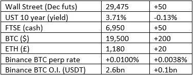

# 好奇的密码评论 2022 年 9 月 30 日

> 原文：<https://medium.com/coinmonks/curious-cryptos-commentary-30th-september-2022-ef8d306f805b?source=collection_archive---------48----------------------->

**TL；博士**

不管媒体怎么说，这也不全是坏消息。

**市场抢购**

**市场包装**

市场头条继续描绘市场动荡的画面，但我就是看不到数字。

根据雅虎的数据，GBPUSD 在迷你预算前一天晚上为 1.125，现在报价为 1.115，这对于动荡的外汇市场来说是一个微小的波动，尽管迷你预算后几天的过度反应给了勇敢者许多诱人的机会。

全球股市小幅下跌，加密股票上涨。10 年期英国国债收益率上升，但与我们在整个固定收益领域经历的 6 个月抛售相比，这一举动相形见绌，尽管令本周的上涨相形见绌，但媒体从未将其视为一场灾难。

**好奇的 cryptos 评论——对 Cryptos 来说一些简短的正面消息**

只是为了改变不正确但普遍持有的说法(见上文)，即所有风险资产现在都难逃一死。

**不可替代令牌(NFT)**卷土重来。CryptoPunk #2924 以 3,300 ETH 的价格售出，超过 400 万美元；

这一只非常受欢迎，因为它是一只穿着帽衫的猿，这对一些人来说很重要。它最后一次以 150 ETH 的价格出售是在 2020 年 11 月 13 日，当时只值区区 7 万美元。干得好。

在此背景下，二级市场交易量激增。

**贝莱德** —全球最大的投资管理公司，拥有 10 万亿 AUM(管理的资产)，推出了又一只与加密相关的 ETF(交易所交易基金)，这一次的目标是投资矿业公司、交易所和其他支持区块链生态系统的公司。贝莱德的产品策略师奥马尔·穆夫提说:

“我们相信，随着用例在范围、规模和复杂性方面的发展，数字资产和区块链技术将越来越与我们的客户相关。”

在此之后，我们还应该期待看到一个与贝莱德元宇宙相关的 ETF，但这尚未得到彭博一篇文章的证实。贝莱德技术机会基金联合投资组合经理 Reid Menge 称元宇宙是“正在发生的革命”

对加密空间的机构和零售需求不断增长。

西班牙电信巨头 Telefonica 与加密货币交易所 Bit2Me 合作，允许在 Telefonica 自己的网站上用加密货币支付大量商品。就我个人而言，我很惊讶我们在过去没有看到更多这样的事情。

Iota 发布了第 1 层解决方案，该解决方案将允许免费部署 NFTs、令牌化的真实资产和稳定副本。使用 Firefly 下注的 IOTA 所有者现在是数十亿 SMR 代币的骄傲所有者(见 CCC 2021 年 12 月 19 日)。用不了多久，我们就可以评估这笔意外之财的货币价值。

**合规玩意儿**

触发警报警告——如果任何读者在读完我的评论后，觉得自己“真的在颤抖”(正如一名达勒姆大学的学生所声称的，他无法在情绪上应对 Rod Liddle 提出的不同观点),那么我只能建议你不要读，或者不要颤抖。这完全取决于你。

Cryptos——我的任何评论都不应该被视为参与 cryptos 的建议。我可能在不知道的情况下胡说八道。任何加密投资都必须被视为极高的风险，并被视为在出售前价值为零。

股票——只是为了说明这不是股票咨询服务。CCC 团队不提供任何形式的财务建议。本注释中对资产价格的任何引用都是为了简单地给出注释的上下文，并为与密码相关的某些股票的表现增添色彩。

为避免疑问，本通讯不是煽动购买密码，购买股票，甚至出售家庭成员希望购买密码或股票。

请注意，所有版权归好奇密码有限公司所有。

礼貌地请求分享和复制，你的愿望就会实现。

这封信或我们网站的新订户总是最受欢迎的。

【www.curiouscryptos.com 

 [## 马克·蒂姆西-中号

### 阅读马克·蒂姆西在媒体上的文章。每天，马克·蒂米斯和成千上万的其他声音都在阅读、写作和分享…

medium.com](/@mark_curiouscryptos) 

> 交易新手？尝试[加密交易机器人](/coinmonks/crypto-trading-bot-c2ffce8acb2a)或[复制交易](/coinmonks/top-10-crypto-copy-trading-platforms-for-beginners-d0c37c7d698c)