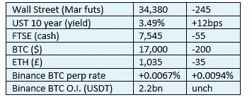

# 好奇密码 2022 年 12 月 3 日评论—杠杆和相关性

> 原文：<https://medium.com/coinmonks/curious-cryptos-commentary-3rd-december-2022-leverage-and-correlation-bdc447a97f5e?source=collection_archive---------29----------------------->

【2022 年 12 月 3 日

合规的东西在我每日信件的末尾。

**TL；博士**

杠杆会带来伤害。相关性会造成伤害。将这两者结合起来，你就有了一系列引人注目的灾难的要素。

**市场抢购**

**市场包装**

严格来说，BTC 已经打破了 17-处理下跌，虽然只有 6 美元在写作时。

当今世界有很多经济问题，主要是因为西方领导人做出的政治决策。政客们，尤其是财政部长们，无力帮助解决他们自己造成的问题，这一点可以从七国集团宣布的毫无意义的每桶俄罗斯石油 60 美元上限所带来的声势中看出来。

**好奇密码的评论——杠杆和相关性的背景**

CCC 经常引用杠杆和相关性的有毒组合来解释当前的一些市场阵痛。我的问题表明，我一直在假设这两个词对那些没有银行背景的人意味着什么。我今天会努力纠正这个疏忽。

对于一个缓慢开始的周六早上来说，这似乎是一个神秘的主题，但它有助于我们理解 2022 年期间我们在密码世界中看到的许多问题的根源。

2021 年期间加密价格的快速和巨大上涨可能让硬币持有者对他们的先见之明一笑，但这似乎导致了其他人的自大。未能关注杠杆和相关性的商业领袖，如今正让我们所有人付出代价。

当然，如果你是一个密码唱反调的人，这将是最终的结果。但即使你属于这一类，这些仍然是每个市场都会定期出现的重要教训。

…

开始理解杠杆和相关性最容易的地方是我们大多数人都熟悉的主题，无论是作为一个概念还是在实践中。这个主题就是用少量甚至零金额的现金抵押品(也就是存款)买房子，然后用抵押贷款(也就是以房子的市场价值作为抵押的贷款)支付剩余部分的过程。

自 12 世纪以来，抵押贷款在英国就已存在，但直到 20 世纪 60 年代左右，获得抵押贷款的机会非常有限。在那之前，银行很少向那些财富和收入完全或主要来自职业的人提供这种便利。战后不久，我的祖父母从西哈姆港搬到了加斯顿。这栋房子是用现金买的，可能只花了几百英镑。今天它的价值要高得多。

随着抵押贷款变得更加普遍，这创造了更多的住房需求，而由于英国过度限制和低效的规划许可程序，住房供应将始终受到限制。房价与平均收入的高倍数可以追溯到抵押贷款市场的民主化。

当你有抵押贷款时，你就被杠杆化了。

你每月偿还利息，通常也偿还部分资本。在一个典型的 25 年期抵押贷款中保持所有的付款，在期限结束时，你完全拥有你的房子。

这一切都很好，只是不可能知道未来 24 年的利率走势。对四分之一世纪后利率的任何预测，都与 OBR(预算责任办公室)代表财政部官员对英国政府债务一年轨迹的预测一样可靠。但这是另一天的讨论。

也不可能知道你未来的财务状况会如何。

杠杆是一种工具，而且是非常有用的工具。但是过度杠杆化——在这个例子中表现为由于利率上升或你的财务状况发生变化，或者两者兼而有之，你无力支付月供——可能会导致灾难。在这种情况下，失去你的家园，由于收回。

…

为了理解相关性，我们需要看看你抵押贷款的抵押品，在这种情况下是你的房子。或者更准确地说，出售后预期实现的现金价格。

如果只有一个借款人陷入经济困难，比如说由于失业，并且没有更广泛的经济问题，银行就会接管房子，在公开市场上出售，偿还贷款，任何多余的部分都会返还给借款人。

这对于贷款人或借款人来说都不是一个好的情况，但相对来说是可以管理的，尽管请理解我并没有低估在这种情况下某人必须经历的个人和情感上的混乱。

当一群借款人发现自己陷入财务困境是由于一些共同的原因时，相关性问题就出现了。

一个明显的例子是利率突然大幅上升。这可能对我们所有人来说都很熟悉。现在，除了欧洲央行之外，所有中央银行对利率的大规模市场操纵有望结束，利率将永远高于过去十年或更长时间以来的水平。

那些在 2022 年春季之前获得 10 年期固定利率抵押贷款的人将长期处于有利地位。尚不清楚其余抵押贷款借款人的状况如何。

另一个可能是衰退，它总是伴随着失业。很少有人为这种情况投保，更少的人没有收入也能偿还抵押贷款。

…

一种或两种情况都将影响房价下行。月度数据已经显示，由于利率上升，减少了买家的需求，中国部分地区的房价环比下降。

美国收益率曲线是几十年来最反转的。这是一个强烈的信号，表明美国距离衰退还有 6 到 18 个月的时间。西方世界的其他国家也会效仿。

不顾经济衰退提高利率不会有好结果。

…

这证明了杠杆和相关性的有害结合。

随着越来越多的借款人陷入困境，房屋供应增加，而需求却在减少。在这种情况下，房价只会暴跌。

与此同时，银行开始看到它们的抵押品存量相对于贷款价值有所减少。银行花大量时间担心自己的资产负债表，这是理所当然的。房价下跌只会刺激银行提前取消抵押品赎回权，进一步增加供应，加大房价下行压力。

相关性使得这种理论上的恶性循环成为现实。

…

今天到此为止。

明天我们将剖析这两种风险是如何导致 FTX 和 BlockFi 的失败，以及对 BTC 矿工的潜在影响。

…

(*)完全没有意义，因为截至目前，俄罗斯石油价格为每桶 50 美元。即使油价超过 60 美元，G7 也只是从其他地方获取石油，而俄罗斯的供应将填补缺口。

**合规材料**

触发警报警告。

如果任何读者在读完我的评论后觉得他们“真的在颤抖”(这是一名达勒姆大学的学生提出的说法，他无法在情感上——当然也无法在智力上——应对罗德·利德尔表达的不同观点)，那么我只能建议你不要读，或者不要颤抖。这取决于你。

Cryptos——我的任何评论都不应该被视为参与 cryptos 的建议。我可能在不知道的情况下胡说八道。任何加密投资都必须被视为极高的风险，并被视为在出售前价值为零。

股票——只是为了说明这不是股票咨询服务。CCC 团队不提供任何形式的财务建议。本注释中对资产价格的任何引用都是为了简单地给出注释的上下文，并为与密码相关的某些股票的表现增添色彩。

为避免疑问，本通讯不是煽动购买密码，购买股票，甚至出售家庭成员希望购买密码或股票。

请注意，所有版权归好奇密码有限公司所有。

礼貌地要求偶尔分享和复制，你的愿望就会实现。

这封信或我们网站的新订户总是最受欢迎的。

www.curiouscryptos.com

[medium.com/@mark_curiouscryptos](mailto:medium.com/@mark_curiouscryptos)

> 交易新手？试试[密码交易机器人](/coinmonks/crypto-trading-bot-c2ffce8acb2a)或者[复制交易](/coinmonks/top-10-crypto-copy-trading-platforms-for-beginners-d0c37c7d698c)