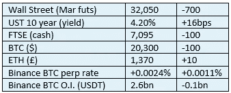

# 《好奇的密码》评论 2022 年 11 月 3 日—穆罕默德·埃里安

> 原文：<https://medium.com/coinmonks/curious-cryptos-commentary-3rd-november-2022-mohamed-el-erian-a36bd9d0c250?source=collection_archive---------24----------------------->

**TL；博士**

依我拙见，穆罕默德·埃里安完全错了。

**市场抢购**

**市场包装**

美联储将再次降息 75 个基点，预计英国央行将在接下来的一小时内再次降息 75 个基点。

央行行长们可笑地声称，他们近年来的行动对我们现在看到的猖獗通胀没有产生有害影响。随着通胀似乎有可能下降，在没有任何更具戏剧性的世界事件的情况下，随着石油和天然气价格回归均值，我怀疑他们将试图获得荣耀。

央行应该回归核心业务，成为造币厂的所有者和最后贷款人。他们没有其他能力。

**好奇的 Cryptos 评论——穆罕默德·埃里安**

穆罕默德·埃里安是安联的首席经济顾问，他曾在太平洋投资管理公司(Pimco)担任联席首席投资官比尔格罗斯(Bill Gross)多年，直到 2013 年底一次非常公开的争吵。他是一个有智慧的重量级人物，他的想法总是值得一听。

关于 BTC，他这样说:

“需要澄清的是，我不认为比特币会成为一种全球货币，我不认为它会被大规模采用。当人们说它将达到 10 万美元、20 万美元、30 万美元时，他们认为会被大量采用:你不会得到那个数字。”

穆罕默德给人的印象是，他相信 BTC 有一席之地，但纯粹是一个利基。事实上，他继续说，加密货币部门将在持续的熊市中幸存下来，并仍然是“支付生态系统”的重要组成部分。

不幸的是，我认为他有点不真诚。如果你仔细分析他所说的话，在我看来，他显然是一个不折不扣的反对者。我来解释一下原因。

…

BTC 固有的价值源于两个原因。

第一是作为价值储存手段，第二是作为网络的效用。

从价值储存来看，如果我们取 Mohamed 价格预测的上限——BTC 永远不会超过每 BTC 10 万美元——那么 BTC 的总市值就被限制在 10 万美元乘以 2100 万美元，即 2.1 万亿美元。

黄金的市值接近 11 万亿美元。如果 BTC 的价值永远低于总价值的 20%，那么 BTC 就不能被认为是一种价值储存手段，从而使 BTC 内在价值中的这一因素变得一文不值。

至于网络价值，看看社交网络的发展和衰退可能会有所启发。

社交网络的价值来源于其网络的规模和网络的增长。《老友记》是成功社交网络的最早范例之一，但它已经不复存在了。原因很简单——它的网络规模停止增长，然后开始缩小。随着网络收缩，价值的衰减与早期阶段的价值增长一样残酷。

顺便说一句，这也是梅塔从脸书转向元宇宙的原因——脸书被认为有步老友记后尘的危险。它对元宇宙的巨大(有人说是超大)押注，更好理解的背景是，这是它继续增长轨迹的唯一选择。

但是回到 BTC。如果 BTC 的网络价值仅限于 2.1 万亿美元——全球金融资产至少超过 100 万亿美元，可能远远超过这一数字——那么它就无关紧要，其网络效用将开始下降，使 BTC 内在价值中的这一因素完全没有价值。

…

实际上，通过将 BTC 的价格上限限制在每 BTC 10 万美元，穆罕默德表明 BTC 的实际价值为零。

…

当然，他不是唯一的一个。政府、央行、国际货币基金组织(IMF)、世界各地的公务员官僚机构以及一些精神特质是强制和控制的新闻媒体等控制性的中央机构将继续提出这种主张，尽管他们的论点没有任何合理性。

这些人都在说，权力下放是一种过时的力量，不能也不会被用来造福人类。

这是一个完全合理的立场，尽管完全有缺陷。

如果你认为是这样的话，那么我建议你不要进行任何密码投资，尽管我会敦促你继续阅读并自学密码，以防你真的同意我的想法。

我不希望你们仅仅因为无知和困惑而错过有史以来最伟大的技术革命给我们带来的机遇。

**合规材料**

触发警惕警告——如果任何读者在读完我的评论后，觉得自己“真的在颤抖”(正如一名达勒姆学生所声称的，他无法在情绪上应对不同的观点)，那么我只能建议你不要读，或者不要颤抖。这取决于你。

Cryptos——我的任何评论都不应该被视为参与 cryptos 的建议。我可能在不知道的情况下胡说八道。任何加密投资都必须被视为极高的风险，并被视为在出售前价值为零。

股票——只是为了说明这不是股票咨询服务。CCC 团队不提供任何形式的财务建议。本注释中对资产价格的任何引用都是为了简单地给出注释的上下文，并为与密码相关的某些股票的表现增添色彩。

为避免疑问，本通讯不是煽动购买密码，购买股票，甚至出售家庭成员希望购买密码或股票。

请注意，所有版权归好奇密码有限公司所有。

礼貌地要求偶尔分享和复制，你的愿望就会实现。

这封信或我们网站的新订户总是最受欢迎的。

[www.curiouscryptos.com](http://www.curiouscryptos.com)

medium.com/@mark_curiouscryptos

> 交易新手？试试[密码交易机器人](/coinmonks/crypto-trading-bot-c2ffce8acb2a)或[复制交易](/coinmonks/top-10-crypto-copy-trading-platforms-for-beginners-d0c37c7d698c)