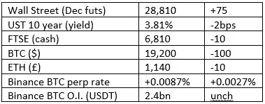
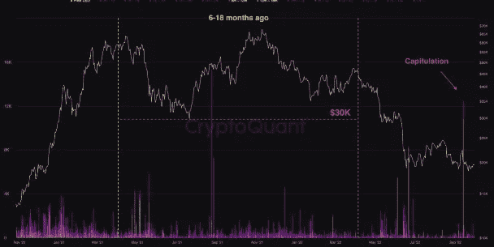

# 好奇的密码评论 2022 年 10 月 3 日

> 原文：<https://medium.com/coinmonks/curious-cryptos-commentary-3rd-october-2022-ac366cb252a2?source=collection_archive---------55----------------------->

**TL；博士**

CryptoQuant 为 BTC 提供了一些积极的分析。

**市场抢购**

**市场包装**

市场非常平静，所以没有变化。

**好奇的 Cryptos 评论——BTC 牛市的买家已经投降了**

CryptoQuant 是众多能够帮助洞察市场心态的在线分析公司之一。任何有足够耐心和计算能力的人都可以追踪 BTC 的动向，或者其他。

其中一个指标是外汇流入支出产出年龄区间，简称 SOAB，尽管这两种描述都没有脱口而出。

从本质上来说，这种方法可以识别出被购买和再次出售的硬币。

为什么会有兴趣呢？现存的 BTC 很大一部分是由钻石手掌握的。对此的定义各不相同，但这一概念旨在识别长期持有人，他们的投资可能被合理地假设为非投机性的，不太容易对每日价格波动感到担忧。对钻石手的估计在 60%到 80%之间变化，这确实是一个非同寻常的数字。

早期买家和钻石手之间确实存在关联，这可能是因为那些早期参与加密革命的人对这项技术有着天然的兴趣。

但这并不意味着最近的买家不能也是钻石手，但人们可能会预计，在价格上涨期间，寻求快速获利的投机者更有可能参与进来。

对 SOAB 的分析似乎证实了这一假设。首先，这是图表:

据分析师埃德里斯称:

“从图表中可以明显看出，6-18 个月前的硬币最近被大量抛售。这些硬币是在 2021 年 4 月至 2022 年 4 月之间以超过 3 万美元的价格购买的。这个信号意味着，许多在 2021 年牛市期间进入市场并超过 3 万美元大关的持有人，最近已经投降并以大约 50%的亏损退出市场。”

投降在金融市场是一个有用的想法。投机者，尤其是杠杆买家，在熊市或长期挤压期间提供了最大的抛售压力。随着这些市场参与者的比例减少，待售硬币的供应量也会减少。

当然，如果你同意 BTC 是“老鼠药的平方”(沃伦·巴菲特)的观点，这种分析对你来说毫无意义，这是理所当然的。

如果你是一个 BTC 爱好者，这种分析可能会给你一些信心，如果没有外部市场冲击(例如普京和他的威胁是显而易见的)，BTC 的价格下行压力可能会减轻。

**合规的东西**

触发警报警告——如果任何读者在读完我的评论后，觉得自己“真的在颤抖”(正如一名达勒姆大学的学生所声称的，他无法在情绪上应对 Rod Liddle 提出的不同观点),那么我只能建议你不要读，或者不要颤抖。这完全取决于你。

Cryptos——我的任何评论都不应该被视为参与 cryptos 的建议。我可能在不知道的情况下胡说八道。任何加密投资都必须被视为极高的风险，并被视为在出售前价值为零。

股票——只是为了说明这不是股票咨询服务。CCC 团队不提供任何形式的财务建议。本注释中对资产价格的任何引用都是为了简单地给出注释的上下文，并为与密码相关的某些股票的表现增添色彩。

为避免疑问，本通讯不是煽动购买密码，购买股票，甚至出售家庭成员希望购买密码或股票。

请注意，所有版权归好奇密码有限公司所有。

礼貌地请求分享和复制，你的愿望就会实现。

这封信或我们网站的新订户总是最受欢迎的。

[www.curiouscryptos.com](http://www.curiouscryptos.com)

【https://medium.com/@mark_curiouscryptos 号

> 交易新手？试试[密码交易机器人](/coinmonks/crypto-trading-bot-c2ffce8acb2a)或[复制交易](/coinmonks/top-10-crypto-copy-trading-platforms-for-beginners-d0c37c7d698c)