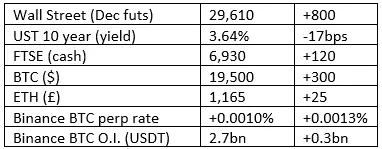

# 好奇的密码评论 2022 年 10 月 4 日

> 原文：<https://medium.com/coinmonks/curious-cryptos-commentary-4th-october-2022-21a63e562d85?source=collection_archive---------32----------------------->

**TL；博士**

吉米和永久期货合约。

**市场抢购**

**市场包装**

随着媒体继续报道我们正被市场动荡吞没，我个人认为大多数资产类别都出现了积极的变化，包括长期国债的惊人反弹。我注意到 GBPUSD 现在比迷你前的预算要高。

我错过了什么？

**好奇的 Cryptos 评论——金·卡戴珊**

我知道这不太可能，但请原谅我。

金米(我们面对面交谈时，我习惯这样称呼她)因推广 EMAX (EthereumMax)被罚款 126 万美元，这是一个 ERC 20 代币，它与 ETH 的唯一关系是它是一个 ERC 20 代币。

我必须承认，我对社交媒体和影响者的角色知之甚少，尽管我知道这份工作确实存在。我可以自豪地告诉你，我确实在 C4 看了《老大哥》的第一集。

我发誓再也不看电视真人秀了，这个承诺我一直坚持着。我希望我能在我生活的所有其他领域应用这一承诺。

吉米因宣传 EMAX 获得了 25 万美元，但她并没有向她的毒理专家和 Instas 之类的人透露这一事实。她被美国证券交易委员会扇了一巴掌，但在你我之间，我不认为她在乎一百万美元。这对她来说是很好的宣传。

现在我在 Medium 上总共有六个追随者，我的网站博客有时一天有多达十个人阅读，我期待着得到 2.50 美元来推广一些* * * *硬币。

吉米没有抓到我的把柄。

**好奇的 Cryptos 评论——无端使用吉米的照片作为点击诱饵**

**好奇的 Cryptos 评论——Cryptos 如何影响 TradFi**

永久期货合约的概念仍然只是一个概念——除了我记得很多个月前使用黄金的短暂试验——直到 cryptos 的出现。

尽管许多传统交易所都有传统的期货合约交易，但新型加密货币市场将加密货币上的永久期货发展成了一种独立的重要资产类别。

杠杆既可以是好的力量，也可以是贫困的力量。在加密领域，后者最有可能占上风。

现在，永久期货的概念被用于美元现货指数。

FTX 加密交易所没有出现在 CCC 交易所的批准名单上，这可能是因为我从未发现有必要使用它。该交易所推出了一篮子永久期货合约，旨在“跟踪一篮子 4 种主要全球货币对美元的表现:欧元、日元、加元和英镑。”

一个人应该亲自使用杠杆的唯一时间是购买一所房子，因为这是任何人的唯一选择，而不是因为一个简单的社交媒体代言而获得 25 万美元。但 TradFi 是建立在杠杆基础上的，否则无法存在。如果永久期货开始取代当前期货合约的传统月度或季度滚动，这将是加密的一个妙招。

**合规材料**

触发警报警告——如果任何读者在读完我的评论后，觉得自己“真的在颤抖”(正如一名达勒姆大学的学生所声称的，他无法在情绪上应对 Rod Liddle 提出的不同观点),那么我只能建议你不要读，或者不要颤抖。这完全取决于你。

Cryptos——我的任何评论都不应该被视为参与 cryptos 的建议。我可能在不知道的情况下胡说八道。任何加密投资都必须被视为极高的风险，并被视为在出售前价值为零。

股票——只是为了说明这不是股票咨询服务。CCC 团队不提供任何形式的财务建议。本注释中对资产价格的任何引用都是为了简单地给出注释的上下文，并为与密码相关的某些股票的表现增添色彩。

为避免疑问，本通讯不是煽动购买密码，购买股票，甚至出售家庭成员希望购买密码或股票。

请注意，所有版权归好奇密码有限公司所有。

礼貌地请求分享和复制，你的愿望就会实现。

这封信或我们网站的新订户总是最受欢迎的。

www.curiouscryptos.com

 [## 马克·蒂姆西-中号

### 阅读马克·蒂姆西在媒体上的文章。每天，马克·蒂米斯和成千上万的其他声音都在阅读、写作和分享…

medium.com](/@mark_curiouscryptos) 

> 交易新手？试试[密码交易机器人](/coinmonks/crypto-trading-bot-c2ffce8acb2a)或[复制交易](/coinmonks/top-10-crypto-copy-trading-platforms-for-beginners-d0c37c7d698c)