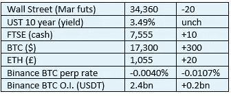

# 好奇密码 2022 年 12 月 5 日评论—杠杆和相关性第 2 部分

> 原文：<https://medium.com/coinmonks/curious-cryptos-commentary-5th-december-2022-leverage-and-correlation-part-2-e1464c085864?source=collection_archive---------45----------------------->

**TL；博士**

让我们看看杠杆和相关性的恶性组合是如何在过去的一个月里干掉两个大玩家的。

**市场抢购**

**市场包装**

本周末，随着永久期货融资利率的大幅上升，杠杆化的孩子们又开始活跃起来。对一些围绕加密领域运营的集中化实体的流动性的担忧，正在推动做空 BTC 的需求。更多信息请见下文。

**好奇密码的评论——杠杆和相关性第二部分**

市面上有成千上万的山寨币，其中一些是彻头彻尾的骗局，另一些毫无用处，只有少数有真正的价值主张。

中央加密货币交易所币安于 2017 年 7 月推出了自己的硬币 BNB，最早记录的价格为 0.10 美元，而今天的价格为 295 美元。如果你足够幸运，在早期购买了 1000 美元的 BNB，尽管 2022 年是熊市，你现在的储备价值 295 万美元。

BNB 与币安的健康与否有着千丝万缕的联系，但它的价值并不来自交易。BNB 被用来支付币安智能连锁 BSC 的天然气费用。BSC 是一个可编程的区块链，与以太坊网络兼容，允许开发人员使用智能合约构建 DeFi(去中心化金融)应用。

BNB 的价值取决于 BSC 的成功。

犯罪诈骗犯萨姆·班克曼·弗里德(Sam Bankman-Fried)是 FTX 的前首席执行官，这家中央加密货币交易所最近在短短几天内发生了内爆，他注意到了 BNB 积累的价值。FTX 发行了自己的硬币——FTT。

就像 BNB 一样，FTT 的价格与 FTX 的健康与否密不可分。

呃，就这样。

或者大部分就是这样。如果你用 FTT 在 FTX 交易，你支付的费用会减少。FTT 也赋予了持有者一些投票权，但我不确定这有什么不同。

FTT 的持有者，除非他们在 FTX 执行大量的高价值交易，否则只是在推测 FTX 还在运营。看看结果如何。

…

Bankman-Fried 金字塔计划的对冲基金 Alameda Research 声称拥有大量储备，将用于为其交易头寸建立杠杆，其中一些头寸位于 FTX。

警钟已经敲响。

但这个故事还有两个进一步的转折，其中一个在公开后引起了 FTT 价格的抛售。第二个保证了 FTX 会感受到痛苦。

2022 年 11 月 2 日，CoinDesk 披露，阿拉米达的 50 亿美元储备在 FTT，这些储备正被用于担保阿拉米达在 FTX 开立的数十亿美元头寸，这是一个记者独家报道的经典例子。

这就是你的相关性。

在接下来的几天里，那些在 FTX 持有资金的人试图从这些资金中撤出 60 亿美元，导致 FTX 出现流动性危机，阿拉米达被要求追加保证金。这些追加保证金的要求得到了 FTT 的支持。卖出会带来更多的卖出，这就是为什么相关性永远不能被低估。

…

BlockFi 的崩溃在很多方面都是相似的。

BlockFi 是采矿业最大的贷方之一。贷款总是涉及杠杆，这就是生活的现实。

显然，今年矿工们的日子不好过。一些银行已经倒闭，另一些银行则在疯狂抛售手中的 BTC 储备，因为以这些价格计算，目前业务的现金流对 BTC 来说是负数。

对矿商来说，这就是杠杆的危险——他们被迫以低价出售 BTC，以维持运营，并偿还投资采矿设备的贷款。

随着贷款变坏的前景，BlockFi 将转向这些贷款的抵押品来偿还本金。至少可以说，BlockFi 的贷款模式很激进。他们会贷款给矿工，让他们投资钻井平台，而这些钻井平台就是抵押品。

这就是你的相关性。

随着矿商倒闭，新进入者参与进来的兴趣降低，钻机价格上涨至少暂时成为过去。事实上，据报道，自去年 12 月以来，ASIC 机器的平均价格已经下降了 80%。

让事情变得更加困难的是——将相关性推到极限——这些贷款中有许多是无追索权的。这意味着，如果抵押品不足以偿还债务，贷款人只能用抵押品来偿还贷款，而对借款人没有进一步的索偿权。

这简直是疯了，毫无意义。这是我所知道的最不负责任的借贷形式。

…

我们最近讨论了我们今年看到的破产的传染效应。

在 2021 年牛市期间积累的过度杠杆被冲掉之前，加密价格几乎没有复苏的前景。

但一旦这种情况发生(只有在回顾时才可能知道)，恐惧因素将再次被热情取代，而且必须承认，有些贪婪。

**合规材料**

触发警报警告。

如果任何读者在读完我的评论后觉得他们“真的在颤抖”(这是一名达勒姆大学的学生提出的说法，他无法在情感上——当然也无法在智力上——应对罗德·利德尔表达的不同观点)，那么我只能建议你不要读，或者不要颤抖。这取决于你。

Cryptos——我的任何评论都不应该被视为参与 cryptos 的建议。我可能在不知道的情况下胡说八道。任何加密投资都必须被视为极高的风险，并被视为在出售前价值为零。

股票——只是为了说明这不是股票咨询服务。CCC 团队不提供任何形式的财务建议。本注释中对资产价格的任何引用都是为了简单地给出注释的上下文，并为与密码相关的某些股票的表现增添色彩。

为避免疑问，本通讯不是煽动购买密码，购买股票，甚至出售家庭成员希望购买密码或股票。

请注意，所有版权归好奇密码有限公司所有。

礼貌地要求偶尔分享和复制，你的愿望就会实现。

这封信或我们网站的新订户总是最受欢迎的。

[www.curiouscryptos.com](http://www.curiouscryptos.com)

medium.com/@mark_curiouscryptos

> *交易新手？试试* [*密码交易机器人*](/coinmonks/crypto-trading-bot-c2ffce8acb2a) *或* [*复制交易*](/coinmonks/top-10-crypto-copy-trading-platforms-for-beginners-d0c37c7d698c)
> 
> *加入 Coinmonks* [*电报频道*](https://t.me/coincodecap)*[*Youtube 频道*](https://www.youtube.com/c/coinmonks/videos) *获取每日* [*加密新闻*](http://coincodecap.com/)*

# *另外，阅读*

*   *[复制交易](/coinmonks/top-10-crypto-copy-trading-platforms-for-beginners-d0c37c7d698c) | [加密税务软件](/coinmonks/crypto-tax-software-ed4b4810e338)*
*   *[网格交易](https://coincodecap.com/grid-trading) | [加密硬件钱包](/coinmonks/the-best-cryptocurrency-hardware-wallets-of-2020-e28b1c124069)*
*   *[密码电报信号](/coinmonks/top-3-telegram-channels-for-crypto-traders-in-2021-8385f4411ff4) | [密码交易机器人](/coinmonks/crypto-trading-bot-c2ffce8acb2a)*
*   *[最佳加密交易所](/coinmonks/crypto-exchange-dd2f9d6f3769) | [印度最佳加密交易所](/coinmonks/bitcoin-exchange-in-india-7f1fe79715c9)*
*   *面向开发人员的最佳加密 API*