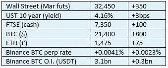

# 《好奇的密码》2022 年 11 月 5 日评论—加里·詹斯勒

> 原文：<https://medium.com/coinmonks/curious-cryptos-commentary-5th-november-2022-gary-gensler-875e6ed437bd?source=collection_archive---------27----------------------->

**TL；博士**

证交会主席加里·詹斯勒(Gary Gensler)感受到了压力。

**市场抢购**

**市场包装**

这是一个惊人的一夜之间的举动。

**好奇的 Cryptos 评论——证券交易委员会主席加里·詹斯勒**

CCC 的老读者完全知道 Gensler 和 SEC 的阴谋，他们笨拙而完全不恰当的方法试图对除 BTC 以外的所有 cryptos 宣称监管霸权。

最突出的例子是关于 XRP (Ripple)是否如 SEC 声称的那样是一种证券，还是如 Ripple Labs，Inc .声称的那样是一种商品的持续法律战。

美国证券交易委员会专员赫斯特·皮尔斯(Hester Pierce)最近加大了对 Gensler 的压力(见 CCC 2022 年 11 月 1 日)，他将该机构的做法描述为“……这不是一种好的监管方式。”

还有更多的事情要发生。

四名美国众议院议员致信詹斯勒，称他在担任证交会主席期间“……一直以监管虚伪和不一致为特征”。

真的很痛。

这封信声称，当 Gensler 担任 CFTC(商品和期货交易委员会)主席时，他使用个人电子邮件处理公务超过 7000 次。既然他执掌了证交会:

“最近的报告表明，SEC 官员正在使用‘非渠道’通信平台，如 Signal、Whatsapp、Teams 和 Zoom，用于公务，而没有根据公开记录的要求提供这些记录。”

问问仍然担任英国内政大臣的苏埃拉·布雷弗曼(Suella Braverman)就知道了，一个人是否应该在公务中使用个人电子邮件。

Gensler 和 SEC 其他成员的这一判断错误因 SEC 针对私营部门(不仅仅是 cryptos)公司在这方面的失误而采取的监管行动而被放大:

“虽然证交会未能遵守联邦透明度和记录保存法律，但证交会正在积极地对私营企业实施记录保存法律。SEC 最近指控 16 家公司未能维护和保存电子通信，总额超过 11 亿美元。

虽然这封信在本质上是公开的政治性的(它似乎试图通过关联来玷污乔·拜登，充其量是一个脆弱的联系)，但这些指控如果属实，将打击 Gensler 的权威和声誉。

全世界的密码爱好者都热切期待着这个故事的下一部分。

**好奇的 Cryptos 评论——SEC 和 XRP (Ripple)**

Ripple Labs 公司首席执行官布拉德·加林豪斯在推特上声称:

“如果你们一直在数，12(！提交了法庭之友书状。这是前所未有的(我被告知)，有这种情况发生在这个阶段。他们每个人都以自己独特的方式解释了——如果美国证交会得逞，将对美国秘密经济的方方面面造成不可挽回的伤害。”

然而，Gensler 和他的滑稽动作面临更大的压力。

**合规材料**

触发警惕警告——如果任何读者在读完我的评论后，觉得自己“真的在颤抖”(正如一名达勒姆学生所声称的，他无法在情绪上应对不同的观点)，那么我只能建议你不要读，或者不要颤抖。这取决于你。

Cryptos——我的任何评论都不应该被视为参与 cryptos 的建议。我可能在不知道的情况下胡说八道。任何加密投资都必须被视为极高的风险，并被视为在出售前价值为零。

股票——只是为了说明这不是股票咨询服务。CCC 团队不提供任何形式的财务建议。本注释中对资产价格的任何引用都是为了简单地给出注释的上下文，并为与密码相关的某些股票的表现增添色彩。

为避免疑问，本通讯不是煽动购买密码，购买股票，甚至出售家庭成员希望购买密码或股票。

请注意，所有版权归好奇密码有限公司所有。

礼貌地要求偶尔分享和复制，你的愿望就会实现。

这封信或我们网站的新订户总是最受欢迎的。

【www.curiouscryptos.com 号

【medium.com/@mark_curiouscryptos 

> 交易新手？尝试[加密交易机器人](/coinmonks/crypto-trading-bot-c2ffce8acb2a)或[复制交易](/coinmonks/top-10-crypto-copy-trading-platforms-for-beginners-d0c37c7d698c)