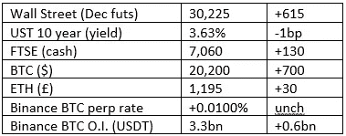

# 好奇的密码评论 2022 年 10 月 5 日

> 原文：<https://medium.com/coinmonks/curious-cryptos-commentary-5th-october-2022-4445376b1837?source=collection_archive---------41----------------------->

**TL；博士**

为欧洲议会鼓掌。

**市场抢购**

**市场包装**

我知道我一直在重复自己，但有一天我们将最后一次突破 2 万美元的上限(*)。

这是未平仓合约(O.I .)的一大变化，尽管它并没有伴随着买方和卖方的错配。然而，这一名义总值偏高，如果我们看到市场引发的大幅波动，可能会迅速变得不稳定，从而进一步加剧这种波动。

GBPUSD 股市目前强劲反弹，较上周日上涨 6%，较周一上午亚洲执行柜台开放时的 groupthink 后续交易上涨 12%。全球的反向投资者——没有政治目的——正在获利。

我期待下一次 IMF 介入它一无所知的主权问题。

**好奇的 cryptos 评论——欧盟在 Cryptos 税收方面领先**

大多数国家适用于密码的税收规则有些不清楚。

在英国，cryptos 的收益或损失可能会根据正常的资本利得税规则征税，从纳税人的角度来看，这是更有利的税收待遇。

然而，如果交易频繁，以创造收入流为目的，来自密码的收益或损失可能要遵守所得税规则。

围绕押注收益的话题，甚至存在更多困惑。押注收益通常被描述为被动收入，一些人将其比作债券等固定收入工具或银行账户的利息，尽管我个人不同意这种比较。

这些传统产品总是作为收入征税，但很难看出每 2 到 3 天支付一次的萨伊 XTZ (Tezos)的收入如何适应同一框架。在这一点上，HMRC 自己也非常困惑，他们在指南的“标桩”一节中指出，“成功采矿”的奖励通常应作为收入征税。

伙计，我有消息告诉你。赌注奖励与采矿无关。这就是 PoS(利害关系证明)与 PoW(工作证明)共识机制的要点。

而“一般”这个词让整个过程变得更加不透明。

这是来自 HMRC 的指引。据我所知，目前没有立法框架。在此之前，我怀疑许多人会简单地将他们的利润(如果有的话)存放起来，留待以后处理。其结果将是一连串的法庭案件，尽管判例法的原则是解释议会通过的立法的有效手段，但它是一种非常糟糕的制定法律的方法。

…

欧洲议会(ep)站出来，他们理应受到称赞。

已经通过了一项决议，目的是就这个问题制定明确的规则和条例。

鉴于政客们试图尽可能攫取现金的倾向，本文中一个特别令人惊讶和受欢迎的评论讨论了应税事件的定义:

“将加密资产转换为法定货币可能是更合适的选择，它要求委员会具体评估这一选择，以及关于识别可能的应税事件的更一般的选择。”

还有这个:

“……加密资产必须接受公平、透明和有效的征税。然而，它也请当局考虑对临时或小商贩和小交易实行简化的税收待遇。”

看看这种负责任和成熟的方法，它必须承认这是一个被一群官僚们视为困难的课题。

生活充满了惊喜。

…

然而，我确实有两点批评。

首先，这是一项不具约束力的决议。

第二，欧洲议会希望在整个欧盟实行相同的税收监管。

但是我们现在不要吹毛求疵。正如我们需要适当和有针对性的监管来推动加密技术的大规模采用一样，我们需要透明和有效的税收制度。

欧洲议会帮了我们一个大忙。

(*)就连 BTC 的憎恨者也做出了同样的评论。

**合规材料**

触发警报警告——如果任何读者在读完我的评论后，觉得自己“真的在颤抖”(正如一名达勒姆大学的学生所声称的，他无法在情绪上应对 Rod Liddle 提出的不同观点),那么我只能建议你不要读，或者不要颤抖。这完全取决于你。

Cryptos——我的任何评论都不应该被视为参与 cryptos 的建议。我可能在不知道的情况下胡说八道。任何加密投资都必须被视为极高的风险，并被视为在出售前价值为零。

股票——只是为了说明这不是股票咨询服务。CCC 团队不提供任何形式的财务建议。本注释中对资产价格的任何引用都是为了简单地给出注释的上下文，并为与密码相关的某些股票的表现增添色彩。

为避免疑问，本通讯不是煽动购买密码，购买股票，甚至出售家庭成员希望购买密码或股票。

请注意，所有版权归好奇密码有限公司所有。

礼貌地请求分享和复制，你的愿望就会实现。

这封信或我们网站的新订户总是最受欢迎的。

【www.curiouscryptos.com 号

【https://medium.com/@mark_curiouscryptos 

> 交易新手？尝试[加密交易机器人](/coinmonks/crypto-trading-bot-c2ffce8acb2a)或[复制交易](/coinmonks/top-10-crypto-copy-trading-platforms-for-beginners-d0c37c7d698c)