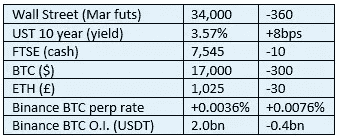
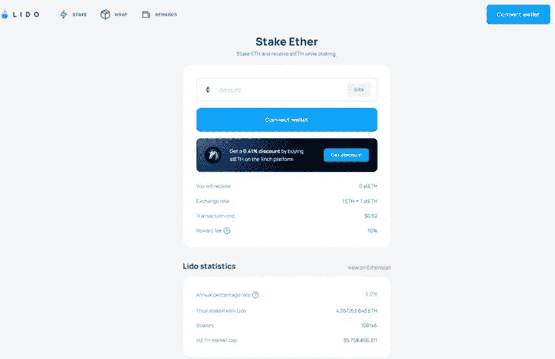

# 《好奇的密码》2022 年 12 月 6 日评论—加密赌注 6

> 原文：<https://medium.com/coinmonks/curious-cryptos-commentary-6th-december-2022-3951997bc2be?source=collection_archive---------19----------------------->

**TL；博士**

作为一个正在进行的关于打桩的系列的一部分，今天我们来看看 ETH 的液体打桩。

**市场抢购**

**市场包装**

渣打银行(Standard Chartered)预测 BTC 2023 年的价格为 5000 美元，这一负面市场情绪推动了该行的参与。我觉得奇怪的是，对于新兴技术和新兴资产类别的市场评估，这种精确的预测会被认为对任何人有任何价值。

**好奇密码解说——密码赌注第六部分**

既然 ETH 已经从工作证明(PoW)过渡到利益证明(PoS ),那么你首先应该考虑的是通过持有 ETH 获得被动收入的机会。

公平地说，这些机会在合并之前就已经存在，但现在是重新评估各种选择的时候了。

作为背景，PoS 硬币的所有者可以下注这些硬币来帮助保护网络，并增加该网络的去中心化。作为赌注的奖励，每个区块的交易费按照赌注者持有股份的比例奖励给他们。这类似于矿工在 PoW 共识机制中收取大宗费用。

但是有一个关键的区别。

例如，你可以开采 BTC，但永远不会拥有 BTC，除了从获得大宗奖励到将其出售给菲亚特之间的 10 分钟左右。

一个人可以拥有 BTC，但永远不会成为 BTC 的矿工。

一个人可以拥有自己的 ETH，但永远不要把它作为赌注。

但是你不能不拥有它就去赌。

…

假设你是一袋 ETH 的骄傲拥有者，你有几个赌注选择，我们将会以不同的细节来看。

第一步，也是最复杂的一步，是创建自己的定位节点。这需要最少 32 ETH(约 40k 美元)，这对于大多数人来说可能是一个不可逾越的障碍。但增加的技术复杂性将击败大多数非技术人员，并且存在相当大的被称为“削减”的负面风险，我们不需要在这里进行讨论。我们将假设这种选择在理论上是可能的，但实际上并非如此。

第二种选择是通过比特币基地或币安这样的集中交易所进行投资。这无疑是技术上最简单的途径，并且适合那些愿意在集中交易所持有密码的 ETH 持有者。

比特币基地和币安都以类似的方式工作，尽管币安给出了书面保证，赌注者不会支付验证机的运行费用，也不会遭受任何严厉的处罚。这显然是一种营销策略，但如果这对你的利润很重要的话，它会增加你在币安的赌注回报。

对于这两个交易所来说，在它们各自的网站上都有很容易识别的下注 ETH 的途径，并且在它们的帮助页面上可以很容易地找到进一步的细节。如果您确实有困难，或者只是需要帮助，整个 CCC 团队都可以帮助您完成这个过程。

…

这两种堆叠方法的最大问题是，您的堆叠 ETH 现在被锁定，并且在上海升级之前无法移除，上海升级将允许拆堆，一旦实施了分片。这计划在 2023 年初实现，但很可能会推迟。我深信所有的 CCC 爱好者都是 ETH 的长期持有者，但我确实明白，如果你愿意，在一段不确定的时间内不能出售你的 ETH 是一种令人不快的事情。

顺便提一下，这种情况的负面影响在 Terra 事件中暴露无遗。如果我没记错的话，LUNA original(现名为 LUNC，Luna Classic)的赌注者两周内无法提取资金，这让他们在面对硬币价格暴跌时无能为力。

其他一些标桩模型以类似的方式工作。

宇宙网络 CCC 在其中有相当规模的投资——有 21 天的平仓期，这是 Terra 惨败后的限制，将导致我比最初预想的更早退出这些投资。

…

当然，所有这些问题都可以通过去中心化金融(DeFi)轻松解决，这再次证明了 DeFi 注定是人类最具影响力的发明之一。解决非流动性赌注难题仅仅是个开始。

有几个不同的产品，但我们会看看丽都金融，他们现在显然拥有 30%的股权。尽管 Lido 本身就是一个 DAO(去中心化的自治组织),但这一统计数据无疑引发了一些关于去中心化的问题。

这个统计数据也让我们对 Lido Finance 在代码漏洞的概率和混乱的可能性方面有了一些信心——在与 DeFi 交互时，这两种风险都不应该被低估。

不管怎样，给你:

[https://lido.fi/#networks](https://lido.fi/#networks)

点击 Stake Ether，您将进入 DeFi 用户非常熟悉的屏幕:

如果那不是你，你被 DeFi 迷惑了，不要绝望。在我写这篇文章的时候，CCC towers 的培训团队正在为 DeFi interaction 开发课程模块。

连接你的钱包(可能是 MetaMask，希望使用分类账 Nano X 保护)，押上你的 ETH，批准交易，以及汽油费，然后你就可以走了。

你的 ETH 已经被钉死了。

…

但是等等，什么？上海升级前怎么拿回来？

在你的钱包里，你现在拥有 1:1 的 stETH (staked ETH)，但没有 ETH。

这一比率与上海邮政的比率为 1:1，它每天都在增加，年利率为 5%，但最重要的是它是流动的。

我的意思是，你可以在 DeFi 流动性池中使用 stETH 来进一步提高你的被动收入。

你可以在分散交易所(DEX)或集中交易所(CEX)用 stETH 交换其他 cryptos 或 fiat。

可以用来买 NFT。

你可以像使用 ETH 一样使用它，但如果你只是一个 ETH 持有者，你现在赚取的是一小笔被动收入，如果你愿意的话，还可以获得完全的退出流动性。

**合规材料**

触发警报警告。

如果任何读者在读完我的评论后觉得他们“真的在颤抖”(这是一名达勒姆大学的学生提出的说法，他无法在情感上——当然也无法在智力上——应对罗德·利德尔表达的不同观点)，那么我只能建议你不要读，或者不要颤抖。这取决于你。

Cryptos——我的任何评论都不应该被视为参与 cryptos 的建议。我可能在不知道的情况下胡说八道。任何加密投资都必须被视为极高的风险，并被视为在出售前价值为零。

股票——只是为了说明这不是股票咨询服务。CCC 团队不提供任何形式的财务建议。本注释中对资产价格的任何引用都是为了简单地给出注释的上下文，并为与密码相关的某些股票的表现增添色彩。

为避免疑问，本通讯不是煽动购买密码，购买股票，甚至出售家庭成员希望购买密码或股票。

请注意，所有版权归好奇密码有限公司所有。

礼貌地要求偶尔分享和复制，你的愿望就会实现。

这封信或我们网站的新订户总是最受欢迎的。

www.curiouscryptos.com

【medium.com/@mark_curiouscryptos 

> 交易新手？尝试[加密交易机器人](/coinmonks/crypto-trading-bot-c2ffce8acb2a)或[复制交易](/coinmonks/top-10-crypto-copy-trading-platforms-for-beginners-d0c37c7d698c)
> 
> 加入 Coinmonks [电报频道](https://t.me/coincodecap)和 [Youtube 频道](https://www.youtube.com/c/coinmonks/videos)获取每日[加密新闻](http://coincodecap.com/)

## 另外，阅读

*   [复制交易](/coinmonks/top-10-crypto-copy-trading-platforms-for-beginners-d0c37c7d698c) | [加密税务软件](/coinmonks/crypto-tax-software-ed4b4810e338)
*   [电网交易](https://coincodecap.com/grid-trading) | [加密硬件钱包](/coinmonks/the-best-cryptocurrency-hardware-wallets-of-2020-e28b1c124069)
*   [密码电报信号](/coinmonks/top-3-telegram-channels-for-crypto-traders-in-2021-8385f4411ff4) | [密码交易机器人](/coinmonks/crypto-trading-bot-c2ffce8acb2a)
*   [最佳加密交易所](/coinmonks/crypto-exchange-dd2f9d6f3769) | [印度最佳加密交易所](/coinmonks/bitcoin-exchange-in-india-7f1fe79715c9)
*   [面向开发人员的最佳加密 API](/coinmonks/best-crypto-apis-for-developers-5efe3a597a9f)
*   最佳[密码借贷平台](/coinmonks/top-5-crypto-lending-platforms-in-2020-that-you-need-to-know-a1b675cec3fa)
*   [免费加密信号](/coinmonks/free-crypto-signals-48b25e61a8da) | [加密交易机器人](/coinmonks/crypto-trading-bot-c2ffce8acb2a)
*   杠杆代币的终极指南