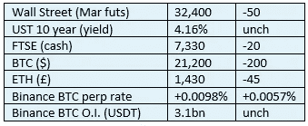
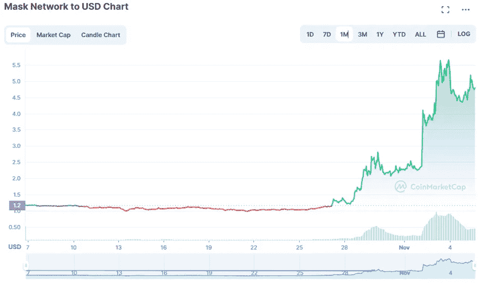

# 《好奇的密码》2022 年 11 月 6 日评论——面具网

> 原文：<https://medium.com/coinmonks/curious-cryptos-commentary-6th-november-2022-mask-network-9ed160738e83?source=collection_archive---------33----------------------->

**TL；博士**

Mask Network 是迈向 Web3 的一小步，但却很重要。

**市场抢购**

**市场包装**

ARK Invest 的密码分析师 Yassine Elmandjra 指出:

"有史以来，比特币的波动性首次低于标准普尔 500 和纳斯达克."

有趣的是，她补充道:

“上一次波动性如此之低时，比特币在不到一年的时间里从 9000 美元升至 6 万美元。”

只是说说而已。

**偶遇系列—勇敢的浏览器**

Brave 比所有其他浏览器都有很多优势，包括隐私保护、零广告或定向广告，以及以 BAT(基本注意力令牌)形式获得加密的机会。对我来说，通过浏览获得报酬听起来很划算。

从今天起，Brave 现在屏蔽那些烦人的“接受所有 cookies”警报，这些警报是在欧盟通过一些极其误导和毫无意义的立法后生效的，但仍被英国抛弃。

请点击此处:

[https://brave.com/download/](https://brave.com/download/)

**好奇 Cryptos 评论—面具网**

面具网络([https://mask.io/](https://mask.io/))是 Web3 未来的一瞥。

Mask Network 是允许我们拥有自己的数据的第一步。关于社交网络，你的面具角色可以链接到，比如说，你的脸书账户，允许你向有限的受众发送加密信息，这严重限制了 Meta 为了自身利益将你的数据货币化的能力。这听起来让我很高兴。

它还有助于轻松使用专注于加密领域的 Web3 应用程序——越来越多的 DeFi(分散金融)功能可以通过 Mask 网络直接访问。

面具网有自己的硬币，惊险地叫面具。

…

Elon Musk 现在是 Twitter 的骄傲所有者，他宣扬将 cryptos 引入 Twitter 平台的想法。鉴于他对 cryptos 的公开支持，以及特斯拉在其国库中拥有 crypto 的事实，如果这种情况不会很快发生，我会感到非常惊讶。

自从接管 Twitter 以来，多吉一直在努力重整旗鼓，马斯克也是如此:

…

世界上最大的中央加密交易所币安向 Twitter 投资了 5 亿美元，使其成为仅次于埃隆本人的第二大股东。公平地说，币安知道任何将 cryptos 整合到 Twitter 的计划，并且处于领先这样一个倡议的有利位置。币安首席执行官赵昌鹏自己也说过:

“支持十几种、几百种加密货币作为支付手段非常容易。我们已经有了一个解决方案:币安付费。”

特别是与 Twitter 相关的:

“我们有所有的技术，我们有专业知识，我们有产品，所以我们随时准备提供帮助。”

有趣的是，Twitter 现在已经暂停了自己旨在开发内部加密钱包的项目，这表明来自币安的现成解决方案被证明更有吸引力。

…

这还不是全部。情节变得更加复杂了。

就在几天前，币安推出了一个新的密码指数，旨在跟踪三种密码的价格表现——BNB、DOGE 和……等等……面具。在撰写本文时，MASK 的市值仅为 1.39 亿美元，不在 100 大加密公司之列，将 MASK 纳入这一新指数的决定似乎有些令人费解，导致许多人猜测 Twitter 已经决定使用 BNB、DOGE 和 MASK 作为其加密产品。

…

所有这些都是纯粹的猜测。我当然不是建议任何读者都应该接触《面具》。

我的意思是，Twitter 可能很快就会采用 cryptos，这将是一个大新闻。我们必须牢记这一点。

仅出于披露的目的，我最近在我的加密组合中添加了 MASK。我留了一些备用子弹，以防其最近的优异表现被收回，这给了我潜在的机会将 DCA(美元成本平均法)转化为比现在更好的进场价格。

**合规材料**

触发警惕警告——如果任何读者在读完我的评论后，觉得自己“真的在颤抖”(正如一名达勒姆学生所声称的，他无法在情绪上应对不同的观点)，那么我只能建议你不要读，或者不要颤抖。这取决于你。

Cryptos——我的任何评论都不应该被视为参与 cryptos 的建议。我可能在不知道的情况下胡说八道。任何加密投资都必须被视为极高的风险，并被视为在出售前价值为零。

股票——只是为了说明这不是股票咨询服务。CCC 团队不提供任何形式的财务建议。本注释中对资产价格的任何引用都是为了简单地给出注释的上下文，并为与密码相关的某些股票的表现增添色彩。

为避免疑问，本通讯不是煽动购买密码，购买股票，甚至出售家庭成员希望购买密码或股票。

请注意，所有版权归好奇密码有限公司所有。

礼貌地要求偶尔分享和复制，你的愿望就会实现。

这封信或我们网站的新订户总是最受欢迎的。

www.curiouscryptos.com

【medium.com/@mark_curiouscryptos 

> 交易新手？试试[加密交易机器人](/coinmonks/crypto-trading-bot-c2ffce8acb2a)或者[复制交易](/coinmonks/top-10-crypto-copy-trading-platforms-for-beginners-d0c37c7d698c)