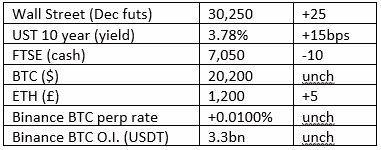

# 好奇的密码评论 2022 年 10 月 6 日

> 原文：<https://medium.com/coinmonks/curious-cryptos-commentary-6th-october-2022-f4615d46162?source=collection_archive---------41----------------------->

**TL；博士**

央行数字货币(CBDCs)正大步向我们走来。

**市场抢购**

**市场包装**

彭博的一个标题将英国描述为“不可投资”。

**好奇密码评论——中央银行数字货币**

世界各国政府对能够推出自己的 CBD 的前景垂涎三尺。

澄清一下，CBDCs 不是密码，也永远不会是，尽管许多人错误地认为是这样。

CBD 是中央集权的，远非一成不变。它们将让政府在支出习惯上变得过于清晰，并将让官僚们做出本应由个人做出的道德和政治决定。

政府对私有财产的盗窃，也就是税收，只要按一下按钮就可以实现。

难怪政客们如此支持这一荒谬的想法。

毫不奇怪，习主席和他凶残的同僚们确保了中国迄今为止取得了最大的进步。

…

SWIFT(环球银行金融电信协会)是不同货币间国际支付结算的主要参与者。

SWIFT 与咨询公司 Capgemini 合作，宣布成功试用了跨不同 CBDC 的 cbdc 结算和 CBDC 支付网络。SWIFT 首席创新官 Tom Zschah 说:

“数字货币和代币有巨大的潜力来塑造我们未来的支付和投资方式。但是，只有当正在探索的不同方法有能力相互联系和协同工作时，这种潜力才能得到释放。我们将包容性和互操作性视为金融生态系统的核心支柱，我们的创新是释放数字未来潜力的重要一步。”

许多商业银行正在进行更大规模的试验。

用不了多久，CBD 就会成为我们生活的一部分。

**合规的东西**

触发警报警告——如果任何读者在读完我的评论后，觉得自己“真的在颤抖”(正如一名达勒姆大学的学生所声称的，他无法在情绪上应对 Rod Liddle 提出的不同观点),那么我只能建议你不要读，或者不要颤抖。这完全取决于你。

Cryptos——我的任何评论都不应该被视为参与 cryptos 的建议。我可能在不知道的情况下胡说八道。任何加密投资都必须被视为极高的风险，并被视为在出售前价值为零。

股票——只是为了说明这不是股票咨询服务。CCC 团队不提供任何形式的财务建议。本注释中对资产价格的任何引用都是为了简单地给出注释的上下文，并为与密码相关的某些股票的表现增添色彩。

为避免疑问，本通讯不是煽动购买密码，购买股票，甚至出售家庭成员希望购买密码或股票。

请注意，所有版权归好奇密码有限公司所有。

礼貌地请求分享和复制，你的愿望就会实现。

这封信或我们网站的新订户总是最受欢迎的。

[www.curiouscryptos.com](http://www.curiouscryptos.com)

 [## 马克·蒂姆西-中号

### 阅读媒体上马克·蒂姆西的作品。每天，马克·蒂米斯和成千上万的其他声音都在阅读、写作和分享…

medium.com](/@mark_curiouscryptos) 

> 交易新手？试试[密码交易机器人](/coinmonks/crypto-trading-bot-c2ffce8acb2a)或者[复制交易](/coinmonks/top-10-crypto-copy-trading-platforms-for-beginners-d0c37c7d698c)