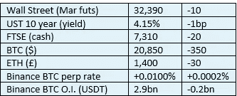

# 《好奇的密码》2022 年 11 月 7 日评论——集中化。

> 原文：<https://medium.com/coinmonks/curious-cryptos-commentary-7th-november-2022-centralisation-66589525403d?source=collection_archive---------53----------------------->

**TL；博士**

集权的黑暗力量在起作用。

**市场抢购**

**市场包装**

今天早上 5 点 30 分，我非常失望地看到我们丢失了 21 号把手。

**好奇的 Cryptos 评论——云计算和索拉纳**

Solana 是第 1 层区块链，设计用于托管 dApps(分散式应用程序)。它使用历史证明共识机制，由其本机令牌 SOL 提供支持。

该产品 2017 年才推出，市值相当可观，达到 130 亿美元，尽管在上一轮牛市的巅峰时期，其市值是这一数字的近 6 倍。

验证器使用云计算功能运行 Solana 节点。其中一家供应商 Hetzner Online GmbH 几天前关闭了 1000 个这样的节点。这些节点占所有验证器的 40%和总网络份额的 20%。

公平地说，Hetzner 今年早些时候警告说，其产品不应用于加密挖掘或验证:

“不允许将我们的产品用于任何与采矿相关的应用，即使是远程相关的应用。这包括以太坊。它包括股权证明和工作证明及相关申请。包括交易。除了主机托管之外，我们的所有产品都是如此。即使您只是运行一个节点，我们也认为这违反了我们的 ToS。”

目前还不清楚为什么海兹纳采取这种立场，但他们完全有权这样做，他们真的不需要向我证明他们的决定是正确的——无论这是多么短视和错误。

尽管之前由 Hetzner 托管的大多数节点都在竞争对手的云平台上备份和运行，但这是一个有益的教训，无论网络可能变得多么分散，都几乎不可能避免依赖集中式结构，强大的 BTC 是一个明显的例外。

这也顺便解释了为什么没有密码能够真正挑战 BTC 的霸权。

**好奇密码解说——龙卷风现金和以太坊**

Tornado Cash 是一款隐私混合器，已经得到 OFAC(外国资产办公室)的批准，正如 CCC 此前报道的那样，它已经恢复运行。

Flashbots 免费提供开源 MEV(最大可提取价值)软件，这将验证者的每块盈利能力提高了 135%。这一成本是由像你我这样的 ETH 用户承担的，这是我们将返回的主题。但对于今天的 CCC，我们需要知道的是 Flashbots 遵守 OFAC 对 Tornado Cash 的制裁。

据报道，高达 75%的验证机现在拒绝来自 Tornado Cash 的交易，这个数字每周都在增加。

集中力量的臂膀确实很长。

**合规的东西**

触发警惕警告——如果任何读者在读完我的评论后，觉得自己“真的在颤抖”(正如一名达勒姆学生所声称的，他无法在情绪上应对不同的观点)，那么我只能建议你不要读，或者不要颤抖。这取决于你。

Cryptos——我的任何评论都不应该被视为参与 cryptos 的建议。我可能在不知道的情况下胡说八道。任何加密投资都必须被视为极高的风险，并被视为在出售前价值为零。

股票——只是为了说明这不是股票咨询服务。CCC 团队不提供任何形式的财务建议。本注释中对资产价格的任何引用都是为了简单地给出注释的上下文，并为与密码相关的某些股票的表现增添色彩。

为避免疑问，本通讯不是煽动购买密码，购买股票，甚至出售家庭成员希望购买密码或股票。

请注意，所有版权归好奇密码有限公司所有。

礼貌地要求偶尔分享和复制，你的愿望就会实现。

这封信或我们网站的新订户总是最受欢迎的。

[www.curiouscryptos.com](http://www.curiouscryptos.com)

medium.com/@mark_curiouscryptos

> 交易新手？试试[密码交易机器人](/coinmonks/crypto-trading-bot-c2ffce8acb2a)或[复制交易](/coinmonks/top-10-crypto-copy-trading-platforms-for-beginners-d0c37c7d698c)