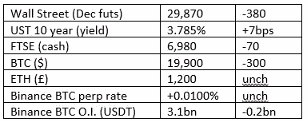
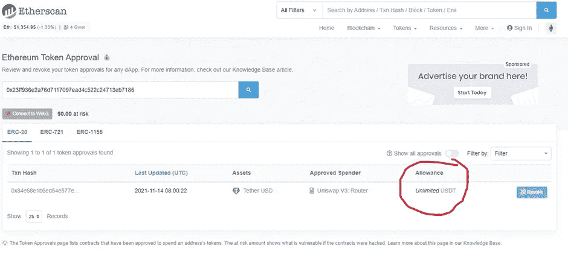
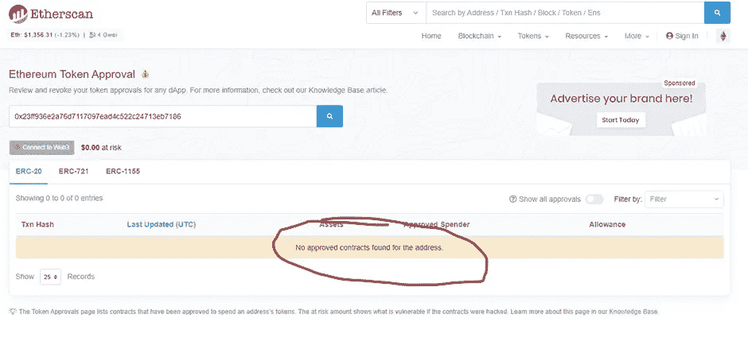
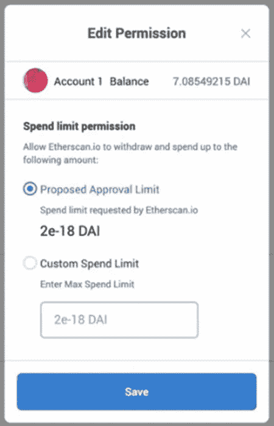

# 好奇的密码评论 2022 年 10 月 7 日

> 原文：<https://medium.com/coinmonks/curious-cryptos-commentary-7th-october-2022-e5a4313b55d0?source=collection_archive---------40----------------------->

**TL；博士**

使用分散金融(DeFi)时保持安全的便捷工具和提示。

**市场抢购**

**市场包装**

随着 10 年期国债收益率再次飙升至 4%，英国养老基金的痛点正在迅速逼近，这些基金过度暴露于债务驱动型投资(LDI)。他们将再次恳求英国央行(BoE)以更多量化宽松(QE)的形式进行另一次救助。

LDI 问题的出现首先是因为 QE，所以官僚们认为这也是解决方案，这似乎很奇怪。值得注意的是，在过去五年中，监管机构和英国央行就这些产品发出了多次警告。在让富人更富、穷人更穷的狂热中，所有这些警告都被忽视了。

**偶发性系列——对此我很恼火**

我不敢相信我错过了这个。

国家足球队 NFTs 在过去的一个季度里上涨了 1000%左右。用现金来说，100 美元的投资现在价值超过 1100 美元…

自 8 月初以来，巴西球迷代币(BFT)上涨了 10 倍。阿根廷球迷托肯(ARG)5 月以来的表现甚至更好。自 7 月以来，西班牙球迷代币(SNFT)上涨了 15 倍。自 5 月份以来，葡萄牙球迷人数的涨幅略低于西班牙。

你可能会注意到这里的一个南美主题，似乎中央加密货币交易所 MEXC 是这些硬币交易的领导者。我徒劳地寻找沃特福德球迷的令牌，但这只是一个时间问题。

但是其中两个可以在 gate.io 上获得，尽管它没有 CCC 的批准，但在第二级集中交易中排名很高。

在这一点上，我可能已经错过了机会，但世界杯的兴奋只会从现在开始(不是投资建议，只是一个评论)。

总之，我控制不住自己。

这确实意味着，有史以来我第一次希望阿根廷获胜，当然，除非我们在四分之一决赛或半决赛相遇。

请注意，大部分球迷代币的市值仍然很小(ARG 不到 900 万美元),这可能导致世界杯期间有趣的波动。

**好奇的 Cryptos 评论——非常有用的分散金融(DeFi)工具**

对于那些勇于和 DeFi 互动的人来说，我偶然发现了这个非常有用的工具，应该会派上用场。

作为背景，当使用 DeFi 时，签署对智能合约的访问权有时会使那些智能合约能够花掉你钱包中的资金。默认情况下，大多数智能合约都设置为“无限制”，如果代码是恶意的或后来被黑客攻击，这种设置可能会导致明显的问题。

作为一个用户，你可以设置一个特定的限制，我们很快就会谈到。在此之前，这里有一个用于检查您当前令牌批准情况的工具:

[https://etherscan.io/tokenapprovalchecker](https://etherscan.io/tokenapprovalchecker)

弹出你的公共地址，你会看到如下结果:

过去，我允许 Uniswap V3 使用我持有的任何 USDT 股票，目前我持有的股票正好为零。尽管如此，让我们去掉这个权限。

按下“连接到 Web3”按钮，在这是一个测试版的警告上单击“确定”，选择你的钱包(可能是 MetaMask)，“连接到 Web3”现在显示“已连接”，并带有绿色勾号。

在这个屏幕的右边是一个“撤销”按钮。点击这个，你就会看到你的钱包。对于一小笔 ETH 作为汽油费(在撰写本文时为 16 美分), Uniswap 不能再花费我将来可能在这里持有的任何 USDT:

为了在下次使用 DeFi 时避免这些潜在的问题，在“权限”下有一个设置，允许用户设置批准限制:

我敦促 DeFi 的所有用户今后使用这一选项。

**合规玩意儿**

触发警报警告——如果任何读者在读完我的评论后，觉得自己“真的在颤抖”(正如一名达勒姆大学的学生所声称的，他无法在情绪上应对 Rod Liddle 提出的不同观点),那么我只能建议你不要读，或者不要颤抖。这完全取决于你。

Cryptos——我的任何评论都不应该被视为参与 cryptos 的建议。我可能在不知道的情况下胡说八道。任何加密投资都必须被视为极高的风险，并被视为在出售前价值为零。

股票——只是为了说明这不是股票咨询服务。CCC 团队不提供任何形式的财务建议。本注释中对资产价格的任何引用都是为了简单地给出注释的上下文，并为与密码相关的某些股票的表现增添色彩。

为避免疑问，本通讯不是煽动购买密码，购买股票，甚至出售家庭成员希望购买密码或股票。

请注意，所有版权归好奇密码有限公司所有。

礼貌地请求分享和复制，你的愿望就会实现。

这封信或我们网站的新订户总是最受欢迎的。

【www.curiouscryptos.com 

 [## 马克·蒂姆西-中号

### 阅读媒体上马克·蒂姆西的作品。每天，马克·蒂米斯和成千上万的其他声音都在阅读、写作和分享…

medium.com](/@mark_curiouscryptos) 

> 交易新手？尝试[加密交易机器人](/coinmonks/crypto-trading-bot-c2ffce8acb2a)或[复制交易](/coinmonks/top-10-crypto-copy-trading-platforms-for-beginners-d0c37c7d698c)