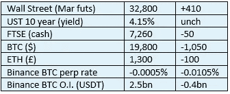

# 《好奇的密码》2022 年 11 月 8 日评论——桑坦德。

> 原文：<https://medium.com/coinmonks/curious-cryptos-commentary-8th-november-2022-santander-51bcc6f787e2?source=collection_archive---------44----------------------->

**TL；博士**

桑坦德银行确实是一家传统金融机构。

**市场抢购**

**市场包装**

现在我们失去了双把手。又来了。见下文关于 FTX。

**偶遇系列——FTX**

FTX 是一个大型的中央加密货币交易所——2021 年，FTX 和币安约占全部交易量的 30%，合计 27.5 万亿美元。

过去两周，FTX 的稳定币储备下降了 91%。

FTX 的主要钱包一直在流失资产，目前价值 20 亿美元，其中一半以上是其自己的令牌——FTT(FTX 令牌)。

FTX 的 ETH 余额在周末下降了 70%。

所有数据都来自牛奶路。

[**https://www.milkroad.com/subscribe?ref=o5CmCFhBAK**](https://elink.milkroad.com/ss/c/AX1lEgEQaxtvFxLaVo0GBo_geajNrlI1TGeIcmMViR0wcokHjNzTzaqPbHl_BdWV4Qcy7xUyH6JkUxYmOZJS0Q/3qv/p7wFbha5RlmZKYGClgHyaw/h21/I5Tqe9zL-kuseeW-nMKzBtu7Nl2b5VB8EvmOLvIg_6E)

如果你是 FTX 的用户，并且你有 cryptos 或 fiat 存储在那里，你应该在你可以的时候把它们从平台上移走。资不抵债的威胁越来越大，这意味着你的资产将大幅缩水，而且你可能会在数年内无法获得所剩无几的资产。

…

阿拉米达也发生了有趣的事情，它是 FTX 的姐妹公司，就像对冲基金一样。资产负债表声称拥有超过 140 亿美元的资产，但其中 40%在 FTT——大约 60 亿美元。然而，FTT 的总市值只有 24 亿美元，这表明阿拉米达的审计人员需要投资一个新的计算器。**好奇的 Cryptos 评论—桑坦德**

桑坦德银行宣布，从 2022 年 11 月 15 日起，零售客户向比特币基地等中央加密货币交易所转账的法定金额将受到限制，每次转账总额为 1000 英镑，每 30 天滚动期的总转账价值为 3000 英镑:

[https://www . Santander . co . uk/personal/support/fraud-and-security/cryptocurrency](https://www.santander.co.uk/personal/support/fraud-and-security/cryptocurrency)

这一举动的理由如下:

“最近几个月，我们看到英国客户成为加密货币欺诈受害者的人数大幅增加。

金融行为监管局(FCA)警告消费者投资加密资产的风险，因为如果出现问题，客户加密钱包中的钱不太可能受到金融调查官服务和金融服务补偿计划的保护。

我们希望尽一切努力保护我们的客户，我们认为限制加密货币交易所的支付是确保您的资金安全的最佳方式。"

原则上，这听起来有些合理，但新闻稿证实，桑坦德银行的高级管理层非常缺乏加密知识。

为什么我会做出这样的声明？

声明说:

“我们将继续停止向币安汇款。这是继 [FCA 向消费者](https://www.fca.org.uk/news/news-stories/consumer-warning-binance-markets-limited-and-binance-group)发出关于这种加密货币交易的警告之后，帮助保护你免受欺诈。”

它包括以下链接:

[https://www . FCA . org . uk/news/news-stories/consumer-warning-币安市场有限公司和币安集团](https://www.fca.org.uk/news/news-stories/consumer-warning-binance-markets-limited-and-binance-group)

此链接是 FCA 对币安市场有限公司的警告，该公司的业务是在 cryptos 上提供杠杆产品。币安市场有限公司没有也从来没有在英国开展任何业务，这使得这一警告在原则上和实践上都是多余的。

该声明还明确指出，FCA 不监管除被视为证券的密码之外的任何密码，但没有澄清它将哪些密码视为证券(如果有的话)。

桑坦德银行的高级管理层既没有正确阅读 FCA 的警告，也没有彻底理解密码如何适应监管环境。

如果我是桑坦德银行的客户，我现在会感到非常不舒服，把我的银行账户交给这些不知情的人。

**好奇的 Cryptos 评论—桑坦德第二部**

路透社报道称，从 2023 年的一个尚未确定的日期开始，桑坦德银行将禁止向所有中央加密货币交易所支付所有款项:

[https://www . Reuters . com/business/finance/Santander-block-uk-transfers-crypto-exchange-2023-2022-11-04/](https://www.reuters.com/business/finance/santander-block-uk-transfers-crypto-exchanges-2023-2022-11-04/)

我注意到路透社的记者犯了和桑坦德银行高级管理层同样的错误，混淆了币安市场有限公司和币安，中央加密货币交易所。老实说，财务报告的质量似乎越来越差。

很明显，桑坦德银行并不重视人类有史以来最伟大的技术进步——加密革命。

…

桑坦德银行是一家上市公司，完全有权决定不为加密货币交易所的支付提供便利。希望参与加密世界的客户将简单地把他们的业务带到别处。

但这个例子说明了 CBDCs(央行数字货币)固有的诸多危险之一。

人们可以很容易地想象这样一个场景:英国政府禁止使用英镑 cbdc 进行赌博，法国政府禁止使用欧元 cbdc 进行合法色情网站，美国政府禁止使用美元 cbdc 购买酒类，或者一天购买三个以上的麦当劳汉堡。

现在你可能会同意这些潜在禁令背后的情绪，但如果我们赋予政府代表我们做出价值和道德判断的能力，这将迅速导致一场由一群不知名的官僚实施强制和控制的反乌托邦噩梦。

**合规材料**

触发警惕警告——如果任何读者在读完我的评论后，觉得自己“真的在颤抖”(正如一名达勒姆学生所声称的，他无法在情绪上应对不同的观点)，那么我只能建议你不要读，或者不要颤抖。这取决于你。

Cryptos——我的任何评论都不应该被视为参与 cryptos 的建议。我可能在不知道的情况下胡说八道。任何加密投资都必须被视为极高的风险，并被视为在出售前价值为零。

股票——只是为了说明这不是股票咨询服务。CCC 团队不提供任何形式的财务建议。本注释中对资产价格的任何引用都是为了简单地给出注释的上下文，并为与密码相关的某些股票的表现增添色彩。

为避免疑问，本通讯不是煽动购买密码，购买股票，甚至出售家庭成员希望购买密码或股票。

请注意，所有版权归好奇密码有限公司所有。

礼貌地要求偶尔分享和复制，你的愿望就会实现。

这封信或我们网站的新订户总是最受欢迎的。

www.curiouscryptos.com

【medium.com/@mark_curiouscryptos 

> 交易新手？尝试[加密交易机器人](/coinmonks/crypto-trading-bot-c2ffce8acb2a)或[复制交易](/coinmonks/top-10-crypto-copy-trading-platforms-for-beginners-d0c37c7d698c)