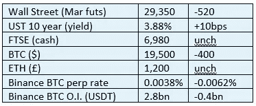

# 好奇的密码 2022 年 10 月 8 日评论

> 原文：<https://medium.com/coinmonks/curious-cryptos-commentary-8th-october-2022-3989a0f33c07?source=collection_archive---------21----------------------->

**TL；博士**

第一个 BTC 市场。

**市场抢购**

**市场包装**

作为对 NFP 数据的反应，长期利率损害了风险资产。随着我们接近合并后的一个月，我们将很快发现 CCC 的观点，即使用 DCA(美元成本平均法)之前出售，之后回购——与其他所有评论者形成鲜明对比——是否是明智之举。

**偶发系列——电子邮件格式问题解决**

像往常一样，我们的生产主管珍妮解决了我们所有的问题。

**好奇的 Cryptos 评论——喜欢《牛奶之路》中的这个**

普通读者已经知道，牛奶之路比我的日常信件有趣得多(*)。

我无耻地从他们那里偷了这个——2009 年 12 月 28 日第一个列出 BTC 出价和报价的网站:

我喜欢在没有其他市场信息的情况下，价格由用电价格决定的想法。这个小伙子或女人正在疯狂地挖矿，可以有把握地假设他现在正住在某个炎热地方的一艘超级游艇上。

更值得注意的是每 1 美元只有 0.02 BTC 的紧俏买价。非同寻常。

我知道经验丰富的金融老手会立即指出出价方缺乏流动性，但嘿，我怀疑他的出价是否被击中。

正如 Milk Road 指出的那样，那一天 1 美元的投资现在价值 3000 万美元，按照 BTC 的高价(我可以补充一下，这是迄今为止的高价)计算，价值超过 1 亿美元。

…

这让我开始思考那天我是如何花掉 1 美元的。作为一个非常不靠谱的人，我可以从我的记录中告诉你:

54.30 座机和宽带费用

21.31 建筑物保险

21.24 手机费用

118.00 议会税

1，328.77 电影投资的贷款费用

59.86 张滑雪通行证

77.13 Les Hou ches 的 Shoppi 杂货店

169.75 在 Brevent 与我可爱的好朋友 Stuey & Kate，他们的两个孩子和我的女儿共进午餐

斜坡上各种热巧克力和啤酒的 30 欧元现金

布朗热里酒店 4 欧元

1 欧元停车费

以当时 1 英镑兑 1.60 美元左右的汇率(哇！)我在那一天的这些花费可以买下将近 500 万英镑的 BTC，现在价值 950 亿美元(**)。

嗬哼。

…

(*)立即注册。你会喜欢的。

[https://www.milkroad.com/subscribe?ref=o5CmCFhBAK](https://www.milkroad.com/subscribe?ref=o5CmCFhBAK)

(**)我知道报价方的流动性只有 15，100 BTC，5 毫米 BTC 当时还不存在，但这封信仅供娱乐。

**合规材料**

触发警惕警告——如果任何读者在读完我的评论后，觉得自己“真的在颤抖”(正如一名达勒姆学生所声称的，他无法在情绪上应对不同的观点)，那么我只能建议你不要读，或者不要颤抖。这取决于你。

Cryptos——我的任何评论都不应该被视为参与 cryptos 的建议。我可能在不知道的情况下胡说八道。任何加密投资都必须被视为极高的风险，并被视为在出售前价值为零。

股票——只是为了说明这不是股票咨询服务。CCC 团队不提供任何形式的财务建议。本注释中对资产价格的任何引用都是为了简单地给出注释的上下文，并为与密码相关的某些股票的表现增添色彩。

为避免疑问，本通讯不是煽动购买密码，购买股票，甚至出售家庭成员希望购买密码或股票。

请注意，所有版权归好奇密码有限公司所有。

礼貌地要求偶尔分享和复制，你的愿望就会实现。

这封信或我们网站的新订户总是最受欢迎的。

[www.curiouscryptos.com](http://www.curiouscryptos.com)

medium.com/@mark_curiouscryptos

> 交易新手？试试[密码交易机器人](/coinmonks/crypto-trading-bot-c2ffce8acb2a)或[复制交易](/coinmonks/top-10-crypto-copy-trading-platforms-for-beginners-d0c37c7d698c)