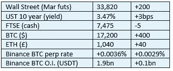

# 好奇密码评论 2022 年 12 月 9 日—上海

> 原文：<https://medium.com/coinmonks/curious-cryptos-commentary-9th-december-2022-shanghai-f35c2704c445?source=collection_archive---------43----------------------->

**TL；博士**

简要回顾迈向 ETH 2.0 的下一步进展。

**市场抢购**

**市场包装**

大众媒体暗示，这种小幅的隔夜波动是由于短期挤压，但我没有看到多少证据。永久期货融资利率在相当长的一段时间内一直处于低位，因此平均法则告诉我们，我们应该预计很快会出现大规模清算。但我认为这还没有发生。

彭博报告称，投资经理预计 2023 年股票收益将达到两位数，这与反向收益率曲线有些不符。我知道这两个选项中我更喜欢哪个是正确的。

**好奇密码解说——以太坊 2.0 更新**

随着最近几个月合并的成功，以太坊开发团队一直在努力进行上海的升级。

我得到可靠消息，上海——其官方名称是 EIP(以太坊改进协议)4844——将在网络中引入“原始丹麦协议”。

嗯。

我还得到可靠消息，上海将引入“Blobs”(二进制大对象)。

又来了。

显然，你们中有编程爱好的人——特别是 JavaScript 或 Python——已经熟悉了后者，但我怀疑你们大多数人和我一样，对此一无所知。

我觉得试图写一些我一无所知的东西有点愚蠢(哈哈，后面很有趣)，于是我开始寻找知识。我发现这是一个相对容易获得的资源，让我们这样的非技术人员对这些问题有一些肤浅的见解:

[https://www.alchemy.com/overviews/danksharding](https://www.alchemy.com/overviews/danksharding)

…

对我们来说重要的是，上海现在定于 2023 年 5 月或 6 月发射。它的最后期限通常会错过，所以没有人会承诺一个这么远的日期，但进展正在取得。

上海的直接影响是，第二层解决方案将变得更快，具有更大的可扩展性，并将变得更便宜。ETH 费用目前不会受到负面影响。

Blobs 还将有助于抑制 MEV(最大可提取价值)的有害影响，在 MEV 中，一种算法自动帮助矿商提前进行交易，有效地将价值从用户转移到矿商，而不仅仅是代表区块奖励的天然气费。

这显然是一件好事，符合所有人的利益，包括矿工，尽管他们可能不这么认为。

最后，所有在 ETH 赌注池中下注的人——如 11 月 26 日 CCC 中所讨论的——将能够取消下注以获得他们的赌注奖励。由于目前超过 10%的 ETH 供应被锁定在非流动性赌注上，这一事件有望增加 ETH 的流动性，这也是一个积极因素。

> 交易新手？试试[加密交易机器人](/coinmonks/crypto-trading-bot-c2ffce8acb2a)或者[复制交易](/coinmonks/top-10-crypto-copy-trading-platforms-for-beginners-d0c37c7d698c)