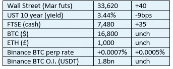

# 《好奇的密码》2022 年 12 月 8 日评论——欧洲央行

> 原文：<https://medium.com/coinmonks/curious-cryptos-commentary-9th-december-2022-the-ecb-7b6cc8d2bfec?source=collection_archive---------33----------------------->

**TL；博士**

然而，欧洲央行的一名成员做出了更多片面的分析和批评。

**市场抢购**

**市场包装**

风险市场全线平静，尽管 10 年期美国国债似乎正处于令人愉快的下行趋势，远离 4 把手。即使我们即将迎来圣诞节，消费支出的缩减也会对那些有缺陷且不可靠的通胀数据产生负面影响。

**好奇的 Cryptos 评论——欧洲央行执行委员会成员法比奥·帕内塔**

普通读者听到帕内塔和我很少在所有加密问题上意见一致时，不会感到惊讶。老实说，在很少的其他主题上也是如此，但那不是今天要讨论的。

昨天，帕内塔在伦敦商学院举行的一次会议上发表了演讲，让我们深入了解了他对 cryptos 的个人观点，这些观点很可能表明了 ECB(欧洲央行)所持的机构观点。

它不适合阅读:

[https://www . ECB . Europa . eu/press/key/date/2022/html/ECB . sp 221207 _ 1 ~ 7 dcbb 0 E1 d 0 . en . html](https://www.ecb.europa.eu/press/key/date/2022/html/ecb.sp221207_1~7dcbb0e1d0.en.html)

我们开始吧。

…

值得注意的是，就在他抨击的几分钟后，帕内塔发表了一个我们都由衷赞同的评论:

“因此，我们应该专注于保护缺乏经验的投资者，维护金融体系的稳定。

确保加密资产受到适当的监管和征税是实现这一目标的途径之一。在这方面，我们需要迅速从辩论转向决策，然后是实施。"

不幸的是，事情从这里开始迅速走下坡路。他最直接的结论是最让我们这些珍惜自由的人不寒而栗的:

“为了利用数字技术的可能性，我们必须为更广泛的数字金融生态系统提供坚实的基础。

这需要一种无风险、可靠的数字结算资产，只有央行的钱才能提供这种资产。这就是为什么欧洲央行在研究数字欧元的同时，也在考虑未来央行货币大规模结算的新技术。"

即使我们忽略 CBDCs(央行数字货币)固有的可怕之处，因为这正是他在这里所称赞的，从什么时候开始，央行的支持导致了无风险和可靠的资产？远在津巴布韦、委内瑞拉和塞浦路斯的近代史表明，帕内塔要么无知，要么不诚实。

…

然后，他继续提出三个未经证实的主张，他认为这使得 cryptos 从根本上存在缺陷。

首先，“无后盾的加密资产对社会没有任何好处”。

在这个广泛的标题下，他重复了同样的古老比喻，即密码仅仅是关于投机的，在这个领域之外，它们最有用的功能是资助犯罪和恐怖活动，以及逃税。

他声称，由于密码不会产生资金流(这根本不是真的，正如我们在 CCC 最近的一系列赌注文章中看到的那样)，它们没有价值，因为未来的收入不能贴现到现在。这对所有黄金和其他贵金属的投资者来说都是一个惊喜。

当然，有义务提及密码对环境的影响，没有任何背景。

第二，“稳定的硬币暴露于运行”。

在这一点上，帕内塔处于更有利的地位，尤其是考虑到 UST 算法稳定性的崩溃。算法稳定是一场等待发生的灾难，任何明智的人都不会卷入其中。

拥有经审计的现金储备或现金等价物(通常是短期、有期限的美国国债)的稳定账户具有与货币市场基金增值相同的价值。帕内塔拒绝从事任何合理的外表，并再次跳转到他喜欢的(只有？)结论:

“在缺乏无风险数字锚(只有数字央行的钱才能提供)的情况下，stablecoins 代表着一种过于雄心勃勃的尝试，即创建一种由风险资产支持的无风险数字资产。”

第三，“加密市场高度杠杆化且相互关联”。

这是所有投资市场的现实。如果适用于传统集中式零售市场的相同规则和规定也适用于加密集中式零售市场，那么这个问题就变成了一个公平的竞争环境。缺乏监管不是 cryptos 的错，而是包括帕内塔本人在内的政治和金融精英缺乏领导力的错。

…

他为减轻他所看到的风险而采取的一系列行动涉及加强监管和协调税收，后者是欧洲央行最喜欢的项目之一，将永远受到世界上两个最大的避税天堂列支敦士登和爱尔兰共和国的强烈抵制。

哦，当然，欧元 CBDC 的实施，因为他陷入了一个错误的信念，即公众对密码的渴望只是对他们对 cbdc 的渴望的歪曲。

**合规材料**

触发警报警告。

如果任何读者在读完我的评论后觉得他们“真的在颤抖”(这是一名达勒姆大学的学生提出的说法，他无法在情感上——当然也无法在智力上——应对罗德·利德尔表达的不同观点)，那么我只能建议你不要读，或者不要颤抖。这取决于你。

Cryptos——我的任何评论都不应该被视为参与 cryptos 的建议。我可能在不知道的情况下胡说八道。任何加密投资都必须被视为极高的风险，并被视为在出售前价值为零。

股票——只是为了说明这不是股票咨询服务。CCC 团队不提供任何形式的财务建议。本注释中对资产价格的任何引用都是为了简单地给出注释的上下文，并为与密码相关的某些股票的表现增添色彩。

为避免疑问，本通讯不是煽动购买密码，购买股票，甚至出售家庭成员希望购买密码或股票。

请注意，所有版权归好奇密码有限公司所有。

礼貌地要求偶尔分享和复制，你的愿望就会实现。

这封信或我们网站的新订户总是最受欢迎的。

[www.curiouscryptos.com](http://www.curiouscryptos.com)

medium.com/@mark_curiouscryptos

> 交易新手？试试[密码交易机器人](/coinmonks/crypto-trading-bot-c2ffce8acb2a)或[复制交易](/coinmonks/top-10-crypto-copy-trading-platforms-for-beginners-d0c37c7d698c)