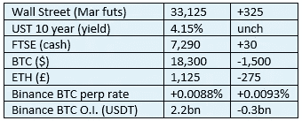
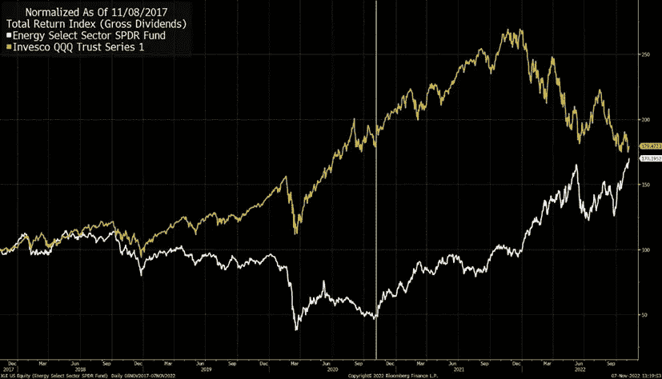
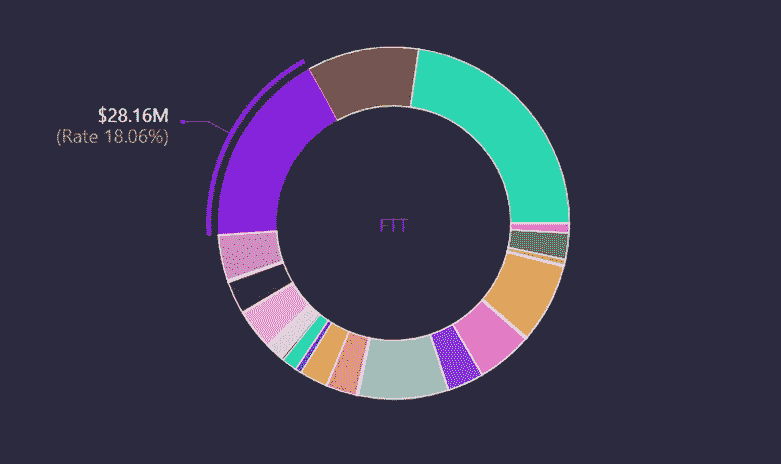
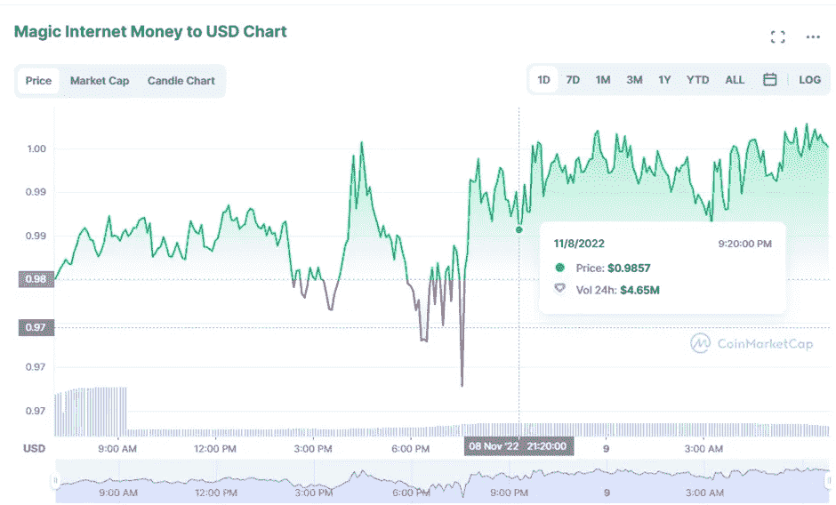

# 《好奇的密码》2022 年 11 月 9 日评论——FTX

> 原文：<https://medium.com/coinmonks/curious-cryptos-commentary-9th-november-2022-ftx-9c5d6251b750?source=collection_archive---------48----------------------->

**TL；博士**

FTX 的崩溃会带来短期的痛苦。

**市场抢购**

**市场包装**

罗恩·德桑蒂斯昨晚获胜的优势表明，下届总统选举可能在初选中决定。CCC 仍然强烈地不关心政治，尽管它也公平地承认共和党人比他们的对手更热衷于 cryptos。

**偶遇系列——FTX**

就在 CCC 警告用户从 FTX 撤走所有资产的几个小时后，提款被叫停。这不是一个好兆头。

有人问我，如果 FTX 和阿拉米达被宣布破产，这意味着什么。

正如我们在今年早些时候看到的其他一些高调事件(LUNA、Celsius 和 Voyager)一样，最初的影响将是整个加密世界的痛苦价格行动，价格行动已经开始。

憎恨加密的人，尽管他们不知道他们想要什么，将会大规模的宣布 BTC 的死亡。英国《金融时报》、国际货币基金组织(IMF)和被判有罪的欧洲央行行长克里斯蒂娜拉加德(Christine Lagarde)将迎来他们为数不多的几天中的一天。我希望他们能在这期间享受，因为这只是暂时的。

与此同时，我会很高兴地用 DCA(美元成本平均法)获得更便宜的密码。

**偶然系列—石油和天然气**

彭博昨日发表了一篇有趣的文章，暗示乔拜登(Joe Biden)当选美国总统几乎肯定会有利于油气投资者自当选以来的回报:

谁会想到。

**好奇的 Cryptos 的评论——我们又来了**

我认为我们可以有把握地假设 FTX 已经尘埃落定，但与币安的交易是否会通过还不清楚。让我们假设 FTX 任由自己失败，这对我们所有人来说都是最坏的结果。

尽管 CCC 昨日发出警告，但在这个中央加密货币交易所离开 cryptos 或 fiat 的投资者将不得不等待多年，才能收回每一美元的价值。经常阅读的读者已经知道，把超过 10%的加密投资放在一个集中的交易所里只是一个小学生才会犯的错误。

这样一家大型知名加密公司的失败无疑会在短期内影响所有加密公司的价格情绪。

这一失败无疑将有助于比特币基地和币安进一步巩固他们在从菲亚特到 cryptos 的匝道上的统治地位。鉴于 cryptos 的去中心化哲学，这很讽刺。但这再次明确表明，cryptos 及其自由主义精神必须学会与金融遗产机构共存。

坦率地说，无论我多么喜欢 cryptos 以及它们在个人自由和自由方面所代表的东西，我认为这种适应——无论结果如何——都是最好的。

…

FTX 的崩溃再次显示了那些正在建设这场加密革命的人所固有的天真。

MIM——神奇的互联网货币——是那种可能会吸引那些喜欢玩龙与地下城的人的名字，但对于世界上其他成年人来说，它引发了某种程度上怀疑的情绪反应。

MIM 是由 Abracadabra Money(另一个荒谬的名字，几乎旨在摧毁投资者对项目的信心)发行的稳定货币，这是一个 DeFi(分散金融)项目，允许个人以每张 1 美元的价格铸造 MIM，以换取超额抵押贷款。

这在原则上是很好的。

但是，无论是特定的还是系统性的金融问题，相关性风险常常被忽视，也是引发金融问题的原因。

根据该协议自己的数据，FTT——这个源自 FTX 的符号，可能会迅速走向零——占了 MIM 背后抵押品的近五分之一:

随着 FTT 的价值下跌，这些贷款开始被收回，立即增加了 FTT 的供应量。

抛售引发更多抛售，导致 FTT 价格螺旋式下降。

这使得 MIM 盯住美元的汇率制度面临风险。事实上，这就是昨天发生的事情:

相关性风险在 1998 年拖垮了 LTCM(长期资本管理公司)。

相关性风险在 2008 年摧毁了银行系统，导致大量印钞，导致今天我们所有人的贫困。

相关性风险在 2010 年几乎摧毁了欧元，现在仍然是这一政治项目的生存风险。

人们什么时候才能学会？

**合规材料**

触发警惕警告——如果任何读者在读完我的评论后，觉得自己“真的在颤抖”(正如一名达勒姆学生所声称的，他无法在情绪上应对不同的观点)，那么我只能建议你不要读，或者不要颤抖。这取决于你。

Cryptos——我的任何评论都不应该被视为参与 cryptos 的建议。我可能在不知道的情况下胡说八道。任何加密投资都必须被视为极高的风险，并被视为在出售前价值为零。

股票——只是为了说明这不是股票咨询服务。CCC 团队不提供任何形式的财务建议。本注释中对资产价格的任何引用都是为了简单地给出注释的上下文，并为与密码相关的某些股票的表现增添色彩。

为避免疑问，本通讯不是煽动购买密码，购买股票，甚至出售家庭成员希望购买密码或股票。

请注意，所有版权归好奇密码有限公司所有。

礼貌地要求偶尔分享和复制，你的愿望就会实现。

这封信或我们网站的新订户总是最受欢迎的。

[www.curiouscryptos.com](http://www.curiouscryptos.com)

medium.com/@mark_curiouscryptos

> 交易新手？试试[密码交易机器人](/coinmonks/crypto-trading-bot-c2ffce8acb2a)或[复制交易](/coinmonks/top-10-crypto-copy-trading-platforms-for-beginners-d0c37c7d698c)