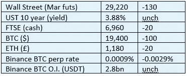

# 《好奇的密码》评论 2022 年 10 月 9 日

> 原文：<https://medium.com/coinmonks/curious-cryptos-commentary-9th-october-2022-4aa3ab91cfd5?source=collection_archive---------24----------------------->

**TL；博士**

也许官僚们还没有正确地思考过中央银行数字货币(CBDCs)。

**市场抢购**

**市场包装**

随着下一次会议加息 100 个基点的风险增加，市场预计收益率明天将再次攀升至 4%。在 LDI(负债驱动型投资)中过度杠杆化的英国养老基金正面临紧张的一周——随着针对这种衍生品敞口的保证金要求被提出，我们已经接近抛售引发更多抛售的痛点。

**好奇密码评论——中央银行数字货币**

很长时间以来，CCC 一直在警告 CBDCs 的潜在危险，以及它们可能(将会)如何？)侵犯我们的隐私权和财产权。

我已经尽力在讨论中保持冷静和理性。我没有诉诸不合理的主张和头条新闻，不像人们最近在大众媒体上读到的关于市场动荡的一切，这种动荡根本不存在。如果还有人认为是这样，请给我一个有交易数据支持的市场例子，因为我找不到。

与此同时，我昨天看到了这句关于 CBDCs 的话。这比我的评论更有力，也更有说服力。值得一读。交给你，Seth Hertlein，Ledger 的全球政策主管:

“CBDCs 是(原文如此)迄今为止人类发明的最强大的人类压迫工具。CBDCs 使(原文如此)中央政府能够直接看到和控制用户的每一笔交易。在社交媒体上说错话；你的钱包被冻结了。参加公众示威；你的钱包被掏空了。赚钱太多；恭喜——你的余额现在是负利率。你想买[肉/烟/酒/火器/一本书/一辆汽车/一架飞机/节育/堕胎/等等。]。];抱歉，拒绝购买。您想向[朋友/家人/慈善机构/等]发送[X 金额]。];抱歉，请到当地政府部门进行处理。与人工智能、面部识别、区块链分析和社交信用评分等其他新兴技术相结合，CBDCs 不仅代表了隐私的死亡，也在历史上第一次代表了政府完全征服其人口的权力。"

我知道你很害怕。

**好奇密码评论—中央银行数字货币(cbdc)**

另一种观点(ht Guy Hayward)认为，引入 cbdc 将使人们适应密码的概念，因此随着公众对 cbdc 隐私侵犯的认识不断增长，以及公众对私有区块链价值主张的认识不断增长，人们将更多地采用密码。

我们无法阻止 CBDCs 的引入，也无法阻止政府利用它们侵犯我们的个人空间。

但如果盖伊是对的，这将是最大的讽刺，政府获取我们个人财务细节的这种透明尝试导致了更大的隐私。

这将是一个令人难以置信的结果。

**合规材料**

触发警惕警告——如果任何读者在读完我的评论后，觉得自己“真的在颤抖”(正如一名达勒姆学生所声称的，他无法在情绪上应对不同的观点)，那么我只能建议你不要读，或者不要颤抖。这取决于你。

Cryptos——我的任何评论都不应该被视为参与 cryptos 的建议。我可能在不知道的情况下胡说八道。任何加密投资都必须被视为极高的风险，并被视为在出售前价值为零。

股票——只是为了说明这不是股票咨询服务。CCC 团队不提供任何形式的财务建议。本注释中对资产价格的任何引用都是为了简单地给出注释的上下文，并为与密码相关的某些股票的表现增添色彩。

为避免疑问，本通讯不是煽动购买密码，购买股票，甚至出售家庭成员希望购买密码或股票。

请注意，所有版权归好奇密码有限公司所有。

礼貌地要求偶尔分享和复制，你的愿望就会实现。

这封信或我们网站的新订户总是最受欢迎的。

www.curiouscryptos.com

【medium.com/@mark_curiouscryptos 

> 交易新手？尝试[加密交易机器人](/coinmonks/crypto-trading-bot-c2ffce8acb2a)或[复制交易](/coinmonks/top-10-crypto-copy-trading-platforms-for-beginners-d0c37c7d698c)