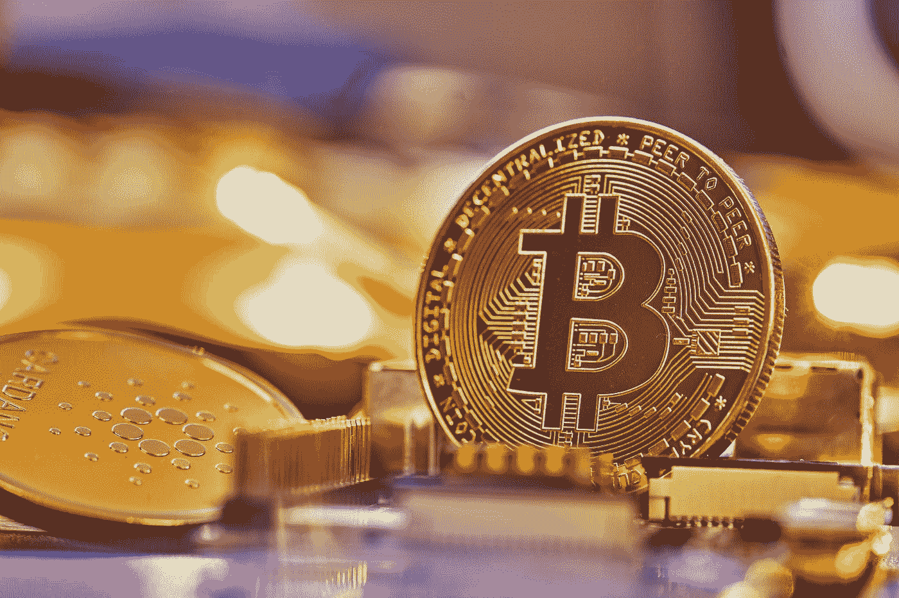

# 当前加密价格—2022 年 12 月 31 日

> 原文：<https://medium.com/coinmonks/current-crypto-prices-december-31-2022-d84f1e4062ef?source=collection_archive---------16----------------------->

加密货币是一个不稳定的市场，价格瞬息万变。然而，按市值排名的前 10 名加密货币通常相当稳定，排名仅偶尔变化。这种稳定性是由于这些硬币的大市值，这使它们具有更大的流动性，并使它们比较小的硬币更好地经受住市场波动。

# 按市场划分的加密货币…