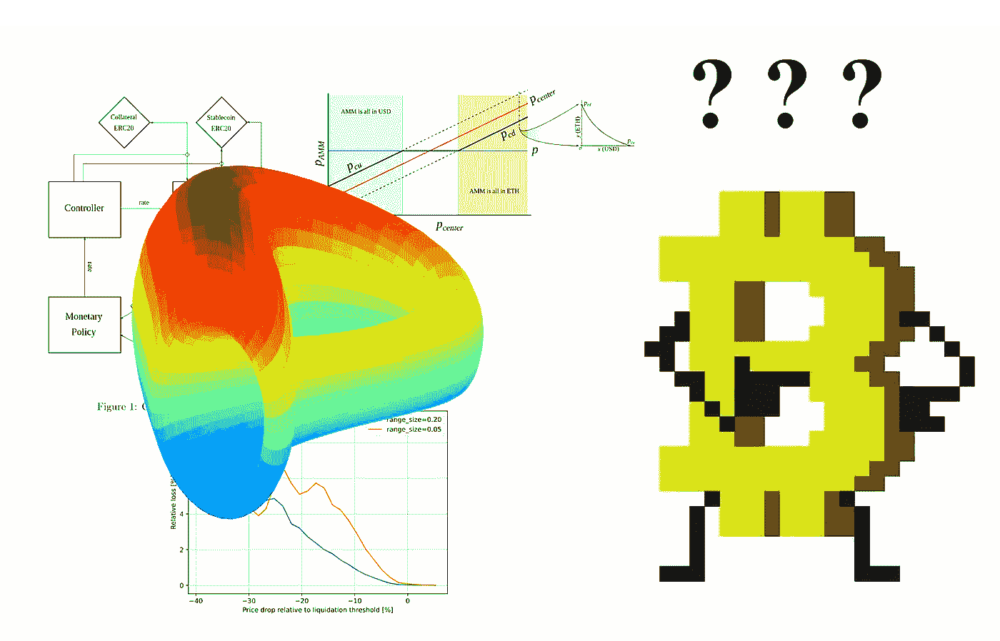
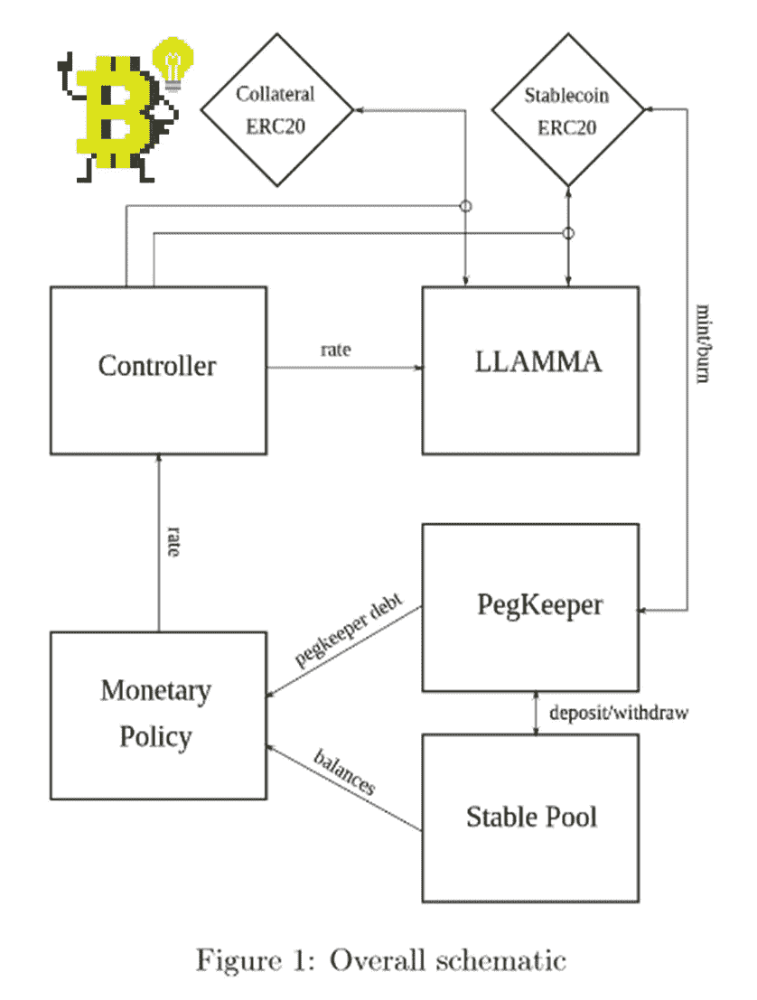
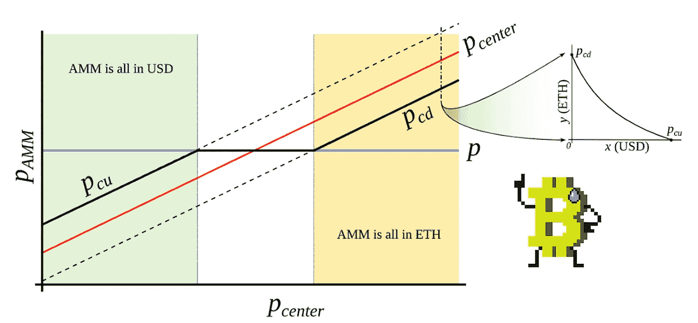
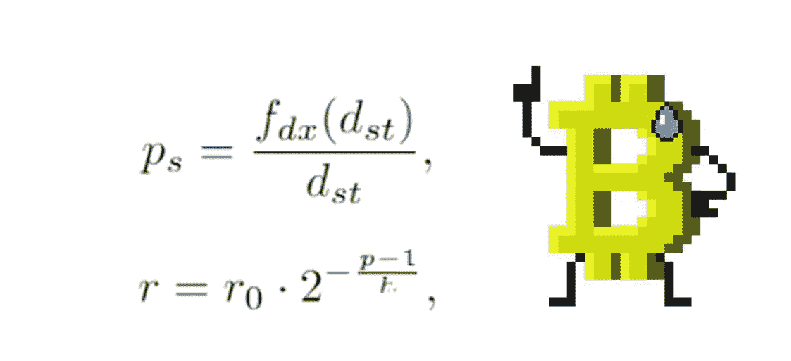
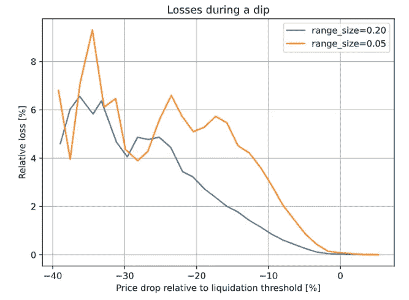

# Curve 的新 stablecoin 改变了游戏规则。原因如下。

> 原文：<https://medium.com/coinmonks/curves-new-stablecoin-is-a-game-changer-here-s-why-54322d0cd72f?source=collection_archive---------6----------------------->

世界第二大指数公司 Curve T1 发布了他们新的稳定币 T2 白皮书 T3 的第一次公开迭代。$crvUSD 旨在解决一些新颖的概念，白皮书中强调了其中的三个:借贷清算 AMM 算法——LLAMMA、PegKeeper 和整体货币政策。虽然整个模型还没有 100%弄清楚，但@newmichwill 对迄今为止这项工作所达到的实用水平感到足够[舒服](https://github.com/curvefi/curve-stablecoin/blob/master/doc/curve-stablecoin.pdf)来发表它。

$crvUSD 背后的主要思想是创建一个更可持续的稳定货币模型，该模型具有平稳和渐进的清算，而不是当前的最终所有所有模型，在该模型中，清算在相对瞬间发生。我将尽可能简短地介绍$crvUSD 的基础知识、它的模型和白皮书中的主要概念。

# 借贷清算 AMM 算法

可以说，借款人在参与货币市场时面临的最大风险是他们的抵押品跌破清算价格。由于绝大多数 DeFi 借入/借出协议目前都在运行，因此每当达到清算阈值时，抵押品都会在一次事件中被清算。不良借款人必须向贷款人付款，这本身当然是一件好事。然而，分散贷款市场的一个大问题是，抵押品的清算可能高于实际清算的流动性。

这就是为什么所有贷款协议都大量参与流动性池(LPs)、on Curve、Uniswap、Balancer 等。对于获取流动性来说非常好，但是在极端波动时期或在坏人寻找机会的情况下，它们会受到很大影响。芒果和索伦德最近都有不同形式的问题。

这是拉马突袭的地方。AMM 参与被[内部化](https://twitter.com/0xfoobar/status/1595085747413032960?s=20&t=jwPUxAsuiFeTE-1D5aPlMQ)，LP 令牌本身成为附属令牌。因此，按照白皮书的例子，在 ETH/USD 池中，随着 ETH 价格下跌，LP 逐渐将 ETH 卖出 USD。当价格回升时，情况正好相反，美元被卖出，买入瑞士法郎。如果 ETH 不再上涨，LP 手头有足够的美元来担保债务。

更重要的是，AMM 本身打算通过集中流动性来运作。这意味着流动性本身集中在一个范围内。当 LP 的比例过于偏向一边时，抵押品将完全转换为 ETH 或 USD。这与资产管理系统的正常工作方式相反，在资产管理系统中，LP 持有人总是因获得较少的升值资产和较多的贬值资产而遭受非永久性损失。

然而，一旦再次达到存款比例平价，损失就无形化了。正如@ defi cheat well[指出的那样](https://twitter.com/DeFi_Cheetah/status/1595639831396171776?s=20&t=7lhWjm20zVX-xT4ikbDKAw)，对 LLAMMA 来说，损失可能是永久性的，因为它的流动性只在一个范围内波动。这是白皮书中有待澄清的细节之一。<block quote class = " Twitter-tweet ">
4。非永久性损失对于正常 AMM 来说是非永久性的，因为如果价格水平恢复到 LP 将资产放入池中的水平，资产价值没有变化。对于 LLAMMA 来说，逻辑是相反的，这种损失可能是永久性的。具体情况现在还不清楚。

然而，如果这个问题得到解决，这种模式可能会改变游戏规则:逐步清算意味着对风险的更高容忍度，这反过来可能意味着更多的资本投入市场。更多的细节将在适当的时候公布。从根本上说，拉马似乎从马克道的戴稳定币过度抵押模式中获得了灵感。

# PegKeeper

PegKeeper 本质上是一个算法市场操作控制器(AMO ),它将$crvUSD 值与 1 美元绑定。它通过两个动作来实现:

1.  如果 1$crvUSD>1$USD，则 PegKeeper 自动合约将铸造无抵押稳定币，并将其存入稳定 wap 池。这增加了供给，因此导致价格下跌并重新挂钩。
2.  如果 1$crvUSD<1$USD，则赌注登记员将提取稳定币并烧掉它。这减少了供给，从而增加了稀缺性，导致价格上涨并重新挂钩。

$crvUSD 本质上是一种算法，在稀缺和丰富之间进行交换，以保持稳定的货币……嗯……稳定。与去年奥林巴斯道或坟墓的象征经济学相比，这并不是一个陌生的概念。虽然这些项目存在一系列问题，但我一直认为这种货币政策风格背后有其优点，我认为像 Curve 这样的项目着眼于基本的数学应用来做出最佳决策，而不是仅仅做流行的事情，这对 crypto 来说是很好的。

# 货币政策及其影响

尽管仍有许多细节有待确定和公开发布，但目前看来，美元 crvUSD 将有效地成为某种程度上的算法稳定器，加上内部 AMM，创造一个过度抵押的国库，帮助它在动荡的市场条件下保持其盯住汇率。该模型相对类似于 FRAX，但是有一些显著的不同:在$crvUSD 将铸造更多稳定的硬币以减少其稀缺性的地方，FRAX 通过从其曲线库中取出 USDC 来这样做。FRAX 也将国债作为保持其联系汇率的主要工具，而$crvUSD 控制着自己的供应。

货币政策在这个模型中的工作方式对 LP 参与者来说代表了一个非常有趣的机会:随着$crvUSD 的铸造，用户被收取浮动利率。请注意，即使铸币厂没有抵押，稳定币本身似乎被稳定币池中的流动性隐含抵押。当系统稳定时，它的利润最大。因此，当$ crv USD > 1 美元时，利率会降低，以激励用户借贷。这增加了供应，因此价格回落到挂钩。如果$crvUSD

Curve really has the potential to break into new ground with its novel approach to stablecoin tokenomics. I sincerely believe that models such as Curve’s, FRAX, DAI or any other overcollateralized stablecoin, especially those heading towards decentralization, will do good not only to crypto, but eventually to the real world. A more fair economic system is desperately needed and I am pretty sure it will be born out of the degen brains of DeFi builders and apes.

> New to trading? Try [加密交易机器人](/coinmonks/crypto-trading-bot-c2ffce8acb2a)或[复制交易](/coinmonks/top-10-crypto-copy-trading-platforms-for-beginners-d0c37c7d698c)则情况相反